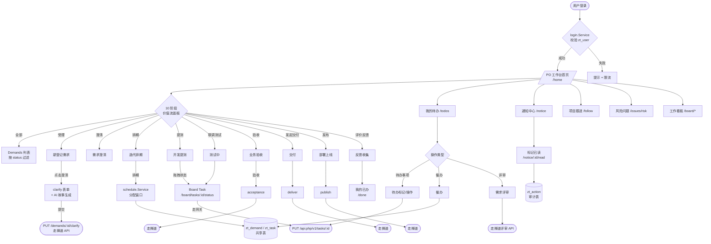
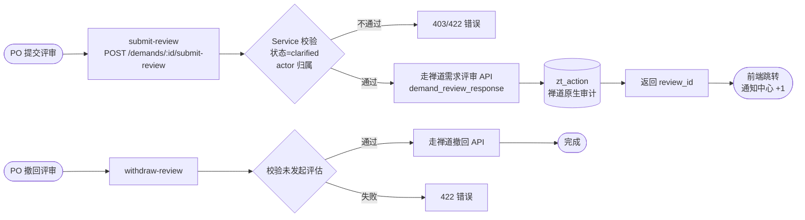
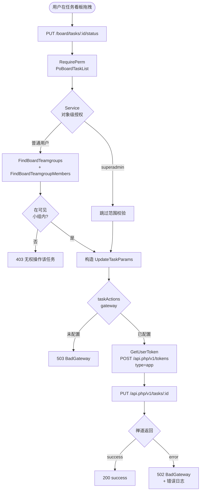
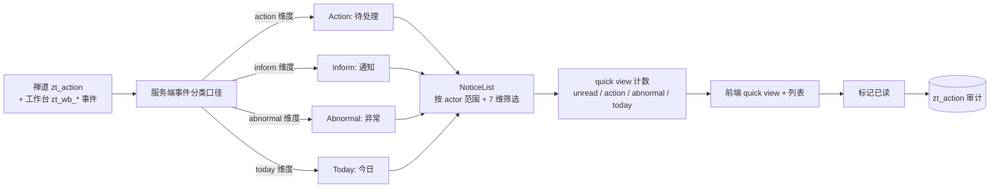

# 研发工作台架构评审材料 — 第一阶段(PO 视角)

> 受众:架构评审委员会
> **本次评审范围:工作台第一阶段交付目标 — PO 视角**(`internal/module/po/` 主模块,`release/po-integrate-main-202609` 分支,HEAD `d0ef844e`)。后续阶段(团队管理 / 项目管理 / 敏捷教练 / 研发团队视角)的整体蓝图在第 1.0 章交代,本次评审**不**展开。
> 草稿日期:2026-09-14
> 起草依据:工作台代码库 `AGENTS.md` / `docs/engineering/` / `internal/server/routes.go` / `internal/module/**` / `internal/pkg/zentao/` 的实际源码。

---

## 0. 阅读提示

- 第 1.0 章交代**工作台整体路线图(5 个角色视角)**与本次评审聚焦的 PO 视角边界。
- 第 1.1-1.3 章交代**项目背景**与**工作台 vs 禅道的定位关系**,先建立业务认知。
- 第 2 章是**业务流**总览(价值流 10 阶段)。
- 第 3 章是**功能模块图**与**功能模块列表**(两列)。
- 第 4 章是**数据流向图**。
- 第 5 章是**业务流程图**(主流程 + 三个关键子流程)。
- 第 7 章是**评审要点**,含后续阶段的扩展性提示。
- 附录是**代码定位引用**,便于评审委员按图索骥。

---

## 1.0 工作台整体路线图(5 个角色视角)

工作台采用**分阶段、按角色视角渐进交付**的策略,围绕"禅道已有的业务模型,补足角色视角的高频工作面板"展开。每个阶段对应一个高频角色的工作面板,代码层面对应一个或一组领域模块。所有阶段共享同一份基础能力(认证、权限、审计、与禅道的集成网关、数据库访问层)。

| 阶段 | 角色视角 | 状态 | 核心模块 | 核心场景 |
|---|---|---|---|---|
| **第一阶段(本次评审)** | **PO 视角** | 在交付中,本次评审 | `internal/module/po/` | 价值流总览、待办/已办/通知/跟进、需求评审/澄清/交付/催办、PO 工作看板 V1.3 |
| 第二阶段 | **团队管理** | 后续规划 | `internal/module/agileteam/`(已部分实现,可继续深化)+ 新增 | 敏捷团队拓扑调整、跨团队成员变更审批、团队产能与人力视图 |
| 第三阶段 | **项目管理** | 后续规划 | `internal/module/schedule/`(已部分实现)+ `internal/module/build/`(已部分实现)+ 新增 | 排期/版本窗口、项目周报、项目风险与里程碑视图 |
| 第四阶段 | **敏捷教练** | 后续规划 | 新增 | 跨项目度量、雷达图(`internal/module/metrics/` 已铺垫)+ 团队健康度、流程瓶颈识别 |
| 第五阶段 | **研发团队视角** | 后续规划 | `internal/module/query/`(已部分实现)+ 新增 | 个人/小组维度的需求/任务入口、研发侧价值流推进 |

**本次评审聚焦的边界**:
- ✅ 评审范围 = 第一阶段(PO 视角)的代码 + 设计 + 业务流。
- ✅ 评审**也包含**对"工作台与禅道边界 / 共享数据库 / 禅道 REST 网关 / 5 阶段共享基础能力"的设计判断 — 这是后续阶段共同依赖的,提前评审可避免后续返工。
- ⏸ **不**评审第二~五阶段的具体业务流,因为它们尚未进入交付(对应模块仅有骨架或部分能力,不是本次 PR-scope)。
- 🔁 后续阶段会以独立子模块 + 独立评审批次推进,不在本次材料中铺开。

### 1.0.1 第一阶段(PO 视角)交付清单

对应代码 `internal/module/po/`,已覆盖 PO 视角的高频工作面板:

- **价值流总览**:`/home`(首页 10 阶段统计 + KPI + 版本窗口)
- **个人工作面板**:`/todos`(待办)/`/done`(已办)/`/notice`(通知中心)
- **需求推进**:`/demands/:id/...`(review / clarify / acceptance / deliver / urge / detail)
- **PO 工作看板 V1.3**:`/board/demand`(需求树)/`/board/task`(任务看板 4 列)/`/board/issues`(问题栏)/`/board/group/metrics`(小组效能 8 指标)
- **项目跟进**:`/follow`(项目周报 + 需求清单 + 导出)
- **风险问题**:`/issues/risk`(跨页面风险聚合)

**未在本次 PO 视角范围**(已显式排除):
- 第二~五阶段对应的角色专属面板(团队管理 / 项目管理 / 敏捷教练 / 研发团队)
- admin 后台的部分增删改(`/admin/*` 中的 user / dept / role 等基础数据维护,作为基础设施保留,但**不**是本次评审的"业务能力"焦点)

---

## 1. 项目背景

### 1.1 现状与痛点

公司核心研发协作跑在禅道(ZenTao)上,经过多年沉淀已经具备完整的"需求 → 任务 → 提测 → 验收 → 发布"流水线。但站在多个日常高频角色(PO / 团队负责人 / 项目经理 / 敏捷教练 / 研发成员)看,禅道原生页面存在三类共性体感问题:

1. **视角偏开发,各角色负担都重。** 禅道列表以"故事/任务"为粒度,每个角色(尤其 PO / 团队负责人 / 敏捷教练)都要在多个页面之间来回跳转,缺一个"今日行动 + 全局价值流"的总入口。**本次(PO 视角)直接解决 PO 的体感问题,后续阶段(团队管理 / 项目管理 / 敏捷教练 / 研发团队)按相同思路补足其他角色。**
2. **跨产品、跨团队的横向视图缺失。** 部门/PMO 视角关心"哪些需求在哪个阶段卡了多久"、"哪个小组本周产能如何",禅道需要多次自定义查询才能拼出来。
3. **状态变更没有统一动作网关。** 业务上对"任务拖拽改状态"、"问题解决/关闭/激活"等动作分散在多个原生 action,缺乏统一鉴权与失败处理。本次 PO 视角建立的"禅道 REST 网关 + 失败关闭 + 审计闭环"模式,后续 4 个阶段直接复用。

### 1.2 工作台的定位

研发工作台(Workbench)是一个 **"跑在禅道之上的、按 5 个角色视角渐进交付的研发协作增强层"**,**不是独立的研发协作产品**。它的核心策略是:

- **不重建业务模型。** 需求、故事、任务、Bug、产品、部门、用户、角色,完全复用禅道的 `zt_*` 表,只读或按禅道原生 API 写。
- **不重建权限体系。** 复用 `zt_user` / `zt_role` / `zt_role_permissions`,以 `perm.<Capability>` 形式由 Service 层强校验。
- **分阶段、按角色视角渐进交付。** 第一阶段 = PO 视角(本次评审),后续 4 个阶段 = 团队管理 / 项目管理 / 敏捷教练 / 研发团队视角,各阶段共享基础能力(认证、权限、审计、禅道集成网关、数据库访问层)。
- **关键状态变更走禅道 REST 网关**,保留禅道原生审计与并发语义(`docs/engineering/database.md` 强制约束:共享写入必须在主库事务内,锁顺序与并发更新策略有明确规范)。该网关在第一阶段建立,后续 4 个阶段直接复用,避免每个阶段重复实现。

### 1.3 工作台与禅道的关系(关键)

| 维度 | 工作台(Workbench) | 禅道(ZenTao) | 关系 |
|---|---|---|---|
| 部署形态 | Go SSR 单体(本仓库) | ZenTao 站点 + MySQL | **共用同一 MySQL 实例**(`zt_*` 表共享) |
| 业务数据 | 大部分表为 `zt_*` 共享,Workbench 仅新增 `zt_wb_*` 前缀的少量自有表 | 全部业务表(`zt_demand` / `zt_story` / `zt_task` / `zt_bug` / `zt_issue` / `zt_user` / `zt_dept` / `zt_teamgroup` / `zt_team` / `zt_product` / `zt_action` / `zt_login_logs` / `zt_operation_logs` / `zt_menus` / `zt_roles` / `zt_role_permissions` 等) | **Workbench 读为主,写为辅** |
| 身份 | 复用 `zt_user` 账号 + `Workbench` 自身的 `zt_wb_profile_prefs` 偏好 | ZenTao 账号 + 禅道 Session(`zentaosid` Cookie) | 同一账号体系 |
| 认证 | `internal/module/login`(`login.Service`,Session Manager 维护) | ZenTao 自身登录 | Workbench 不代理禅道登录,但通过 Cookie 透传 `zentaosid` 给禅道 API |
| 读操作 | 直连同一 MySQL,Read-Replica(按 `docs/engineering/database.md` 第 7 条约束) | 同库 | **共享 DB** |
| 写操作 - 状态变更类(任务状态、Bug 解决/关闭) | **不直写** `zt_task` / `zt_issue`,走 `internal/pkg/zentao.Client` 调 `PUT /api.php/v1/tasks/:id` 等 | 禅道原生 API | **走禅道 REST 网关**(`type=app` 内部免密令牌) |
| 写操作 - 工作台自有(PO 偏好、敏捷团队调整) | 写入 `zt_wb_agileteam_*` / `zt_wb_profile_prefs` | N/A | Workbench 自有 |
| 写操作 - 共享表(需求评审状态等) | 在 Service 层定义事务边界,Repo 用主库连接执行(`docs/engineering/database.md` 第 2-6 条约束) | 禅道原生命令 | **共用主库 + 锁顺序约束** |
| 审计 | `zt_login_logs` / `zt_operation_logs` (Workbench `internal/middleware` 自动落库) | 同表 | 共享审计 |

**一句话总结**:工作台是禅道之上的"分阶段 5 角色视角研发协作增强层",**没有独立业务模型**,所有写操作要么走禅道 REST 网关,要么落在 `zt_wb_*` 自己的表里。本次(第一阶段)聚焦 PO 视角,后续 4 个视角(团队管理 / 项目管理 / 敏捷教练 / 研发团队)将基于本次打下的"基础能力 + 禅道集成网关 + 共享数据库访问层"逐步展开。

### 1.4 技术栈

- 语言/框架:Go 1.22+ / Gin / GORM
- 模板/前端:服务端模板渲染(server-side render)+ 浏览器原生 JS(部分页面用 Alpine / jQuery 风格小段脚本)
- 数据库:MySQL(共享 ZenTao 库),`docs/engineering/database.md` 强制主从分离与锁顺序
- 外部依赖:ZenTao 原生 REST API(`/api.php/v1/...`)+ ZenTao 站点页面(`/m-f-id.html` 或 `index.php?m=&f=`)
- 入口:`cmd/server/main.go` → `internal/bootstrap.Run()` → `internal/server/server.go` → `internal/server/routes.go`(`registerRoutes`)

---

## 2. 业务流总览(价值流 10 阶段)

工作台首页 `/home` 渲染的价值流 10 阶段(`internal/module/po/service.go:29-43` 的 `valueStreamStages` 定义,所有 PO 视角页面都围绕这 10 阶段对齐):

| 序号 | 阶段 | 状态码 | 业务含义 | 阶段归属方 |
|---|---|---|---|---|
| 1 | 全部 | `all` | 其余 9 阶段去重并集,首页默认 | — |
| 2 | 受理 | `accept` | 业务需求已登记,等待产品澄清 | 业务方 |
| 3 | 澄清 | `clarify` | 需求澄清中(可能由 QD 主导) | 产品(QD) |
| 4 | 排期 | `schedule` | 已澄清,排入迭代/版本窗口 | PM |
| 5 | 提测 | `developing` | 开发完成,转测试 | RD |
| 6 | 联调测试 | `testing` | 测试中 | QA |
| 7 | 验收 | `waitacceptance` | 待业务方/产品验收 | 业务方/产品 |
| 8 | 发起交付 | `acceptanced` | 验收通过,发起交付 | 产品 |
| 9 | 发布 | `publish` | 部署上线 | 运维/产品 |
| 10 | 评价反馈 | `released` | 已发布,收集反馈 | 业务方 |

阶段推进的核心规则(`internal/module/po/owner.go:25-60` 的 `DeriveCurrentHandler`):

- 阶段 2-3(draft/wait/active/clarified):当前办理人 = `assignedTo` / `pm` / `qd`
- 阶段 5-7(developing/testing/waitacceptance):当前办理人 = `rd`
- 阶段 8-9(waitdeliver/acceptanced):显示"待确认",**不**使用下一责任人 BRA
- 其余:显示"待分配"

阶段定义真源在禅道 `zt_demand` / `zt_story` 表的 `status` 字段,工作台只读,推进通过禅道原生 API 完成。

---

## 3. 功能模块图

> 模块按"所属阶段"打标:`[S1]` 第一阶段 PO 视角(本次评审) / `[S2]` 第二阶段 团队管理(已部分实现) / `[S3]` 第三阶段 项目管理(已部分实现) / `[S4]` 第四阶段 敏捷教练(已部分实现) / `[S5]` 第五阶段 研发团队视角(已部分实现) / `[Infra]` 5 阶段共享基础设施。

```mermaid
graph TB
    subgraph Client[浏览器 5 角色]
        User[用户:PO / 团队负责人 / 项目经理 / 敏捷教练 / 研发成员]
    end

    subgraph Entry[应用入口 - 5 阶段共享]
        Main[cmd/server/main.go]
        Boot[internal/bootstrap]
        Srv[internal/server/server.go<br/>中间件: RequireLogin / RecordOperationLog / SQLRequestContext / RateLimit]
    end

    subgraph Routes[internal/server/routes.go - 5 阶段共享]
        Admin[/admin/* 路由组/]
        PO[/根路径 工作台路由组/]
        Debug[/debug/* 路由组/]
    end

    subgraph S1Modules["S1 第一阶段:PO 视角(本次评审)"]
        POMod[po<br/>价值流/待办/已办/通知/跟进/看板]
    end

    subgraph S2Modules["S2 第二阶段:团队管理(已部分实现)"]
        AgileteamMod[agileteam<br/>敏捷团队拓扑调整]
    end

    subgraph S3Modules["S3 第三阶段:项目管理(已部分实现)"]
        ScheduleMod[schedule<br/>排期/需求分配]
        BuildMod[build<br/>构建/版本]
        TesttaskMod[testtask<br/>测试任务]
    end

    subgraph S4Modules["S4 第四阶段:敏捷教练(已部分实现)"]
        MetricsMod[metrics<br/>指标定义/快照/雷达]
    end

    subgraph S5Modules["S5 第五阶段:研发团队视角(已部分实现)"]
        QueryMod[query<br/>只读业务/研需列表]
    end

    subgraph InfraModules["Infra 5 阶段共享基础设施"]
        AuthMod[login<br/>认证与 Session]
        ProfileMod[profile<br/>自助 profile 与偏好]
        DeptMod[dept<br/>部门树]
        RoleMod[role<br/>角色与能力]
        UserMod[user<br/>用户管理 - legacy]
        MenuMod[menu<br/>导航]
        LoginLogMod[loginlog<br/>登录审计]
        OpLogMod[operationlog<br/>操作审计]
        DebugMod[debug<br/>SQL 性能遥测 superadmin]
    end

    subgraph Infra[基础设施 internal/pkg/ - 5 阶段共享]
        ZentaoPkg[zentao<br/>REST 客户端 + URL 构造]
        PermPkg[perm<br/>能力/权限]
        RenderPkg[render<br/>模板渲染]
        ErrorxPkg[errorx<br/>业务错误码]
    end

    subgraph Data[数据层]
        DB[(MySQL zt_* 共享 + zt_wb_* 自有)]
        ZTSite[禅道站点页面]
        ZTAPI[禅道 REST API<br/>/api.php/v1/...]
    end

    User -->|HTTP/模板/JSON| Main
    Main --> Boot --> Srv
    Srv --> Admin
    Srv --> PO
    Srv --> Debug

    Admin --> AuthMod & UserMod & DeptMod & RoleMod & MenuMod & LoginLogMod & OpLogMod
    PO --> POMod & ScheduleMod & BuildMod & TesttaskMod & AgileteamMod & MetricsMod & QueryMod & ProfileMod
    Debug --> DebugMod

    POMod -->|读 zt_demand/zt_task/zt_story/zt_issue/zt_action 等| DB
    POMod -->|状态变更 任务/问题| ZentaoPkg
    POMod -->|侧边跳转链接| ZentaoPkg
    POMod -->|读 zt_wb_profile_prefs 等| DB
    ZentaoPkg -->|PUT/POST/GET| ZTAPI
    ZentaoPkg -->|URL 拼接| ZTSite
    ScheduleMod --> DB
    BuildMod --> DB
    TesttaskMod --> DB
    AgileteamMod -->|读 zt_teamgroup/zt_team/zt_user + 写 zt_wb_agileteam_*| DB
    MetricsMod -->|只读快照| DB
    QueryMod -->|只读列表| DB
    ProfileMod -->|写 zt_wb_profile_prefs| DB
    AuthMod --> DB
    DeptMod & RoleMod & MenuMod & UserMod --> DB
    DebugMod -.->|仅 file log, 不读 DB| FS[(本地日志文件)]

    style POMod fill:#fef3c7,stroke:#d97706,stroke-width:3px
    style ZentaoPkg fill:#dbeafe,stroke:#1d4ed8
    style DB fill:#fee2e2,stroke:#b91c1c
    style S1Modules fill:#fffbeb,stroke:#d97706
    style S2Modules fill:#f0f9ff,stroke:#0284c7
    style S3Modules fill:#f0fdf4,stroke:#16a34a
    style S4Modules fill:#faf5ff,stroke:#9333ea
    style S5Modules fill:#fff7ed,stroke:#ea580c
    style InfraModules fill:#f8fafc,stroke:#64748b
```



---

## 4. 功能模块列表(两列)

> 真源来自 `docs/engineering/module-index.md` + `internal/server/routes.go` 注册结果。每个模块标注**所属阶段**:
> - `[S1]` 第一阶段 **PO 视角(本次评审)**
> - `[S2]` 第二阶段 **团队管理**(已部分实现,后续深化)
> - `[S3]` 第三阶段 **项目管理**(已部分实现,后续深化)
> - `[S4]` 第四阶段 **敏捷教练**(已部分实现,后续深化)
> - `[S5]` 第五阶段 **研发团队视角**(已部分实现,后续深化)
> - `[Infra]` 5 阶段**共享基础设施**

| # | 阶段 | 需求功能模块 | 需求功能模块描述 |
|---|---|---|---|
| **A. 应用基础设施** | | | |
| A1 | `[Infra]` | **应用入口与启动** | `cmd/server/main.go` → `internal/bootstrap.Run()` 启动服务,加载配置(`WORKBENCH_MODE=dev` 读 `configs/config.dev.yaml`,其他读 `configs/config.yaml`),初始化 DB / Session / 中间件,挂载路由。`go run ./cmd/server` 为开发入口。 |
| A2 | `[Infra]` | **认证与会话** (`login`) | 账号登录、Session 创建、登出;基于 `alexedwards/scs` SessionManager,Session 存服务器端;登录限流。读 `zt_user`。 |
| A3 | `[Infra]` | **权限与能力码** (`perm`) | 以 `perm.PoHomeList` / `perm.PoBoardDemandList` 等常量形式定义能力码;`middleware.RequirePerm` / `RequireAnyPerm` 在路由层校验;Service 层再做对象级授权(actor / scope / ownership)。 |
| A4 | `[Infra]` | **菜单树** (`menu`) | 根据当前用户能力码动态构建导航菜单,源数据 `zt_menus`。 |
| A5 | `[Infra]` | **登录审计** (`loginlog`) | 记录登录/登出事件,源表 `zt_login_logs`。 |
| A6 | `[Infra]` | **操作审计** (`operationlog`) | `middleware.RecordOperationLog` 自动落库,源表 `zt_operation_logs`。 |
| A7 | `[Infra]` | **禅道集成客户端** (`zentao`) | 封装禅道 REST 客户端(`/api.php/v1/...`)与站点 URL 构造器(`/m-f-id.html` / `index.php?m=&f=`);含 `IssueActionGateway` / `taskStatusGateway` 抽象,未配置时显式 `UnavailableGateway` 失败关闭,不伪造成功。**该网关是 5 阶段共享基础,本次(PO)建立,后续 4 阶段直接复用。** |
| **B. 管理后台** (`/admin/*`,需登录) | | | |
| B1 | `[Infra]` | **用户管理** (`user`) | 用户增删改查,角色绑定;**legacy / reference-not-authoritative**,与当前工程规范存在偏差(password MD5、ZenTao schema 直接耦合),新代码不应照搬。源表 `zt_user` / `zt_gf_user_roles`。 |
| B2 | `[Infra]` | **部门管理** (`dept`) | 部门树 CRUD。源表 `zt_depts`。 |
| B3 | `[Infra]` | **角色与能力** (`role`) | 角色定义、能力分配。源表 `zt_roles` / `zt_role_permissions`。 |
| **C. 工作台主路由** (根路径,需登录) | | | |
| C1 | `[S1]` | **工作台首页** (`/home`) | 价值流 10 阶段统计 + KPI + 当前版本窗口;Service `Home()` 渲染。源 `zt_demand` / `zt_task` / `zt_action`。 |
| C2 | `[S1]` | **我的待办** (`/todos`,`/todos/items`) | 个人责任事项清单,7 维筛选,支持分组、Facet 聚合;列表分页 + 计数,JSON 输出。 |
| C3 | `[S1]` | **我的已办** (`/done`,`/done/items`,`/done/detail/:actionId`) | 由当前用户推进/确认/流转/结项的历史事项;按 action 维度聚合,支持筛选元数据 `done/meta`,详情含邻近时间线。 |
| C4 | `[S1]` | **通知中心** (`/notice`,`/notice/items`) | 聚合"与我有关"的业务动态、待处理、风险提醒;支持单条已读、批量全部已读(以当前筛选范围为界);quick view 计数:未读/待处理/异常/今日。源:从禅道 `zt_action` 与工作台自有事件聚合。 |
| C5 | `[S1]` | **项目跟进** (`/follow`,`/follow/demands/export`,`/follow/project-weeklies`,`/follow/project-weeklies/:id`,`/follow/project-weeklies/:id/history`) | 长期关注的项目周报/需求列表;支持需求清单导出 CSV。 |
| C6 | `[S1]` | **风险问题** (`/issues/risk`,`/issue-risk`,`/issue-risk/items`) | 跨页面的风险问题聚合视图(双路径兼容)。 |
| C7 | `[S1]` | **需求详情与动作** (`/demands/:id/...`) | `/review` 评审 / `withdraw-review` 撤回评审 / `submit-review` 提交评审 / `clarify` 澄清(支持 `/clarify/ai-generate` AI 生成用户故事) / `acceptance` 验收 / `urge-preview` 催办预览 / `urge` 催办 / `deliver` 交付 / `detail` 详情 / `/demands/:id` 详情页。 |
| C8 | `[S1]` | **PO 工作看板 V1.3** (`/board/*`) | 需求看板 `/board/demand`(需求树 + primaryAction 派生) + 任务看板 `/board/task`(4 列 + 拖拽状态变更) + 问题栏 `/board/issues` + 小组效能 `/board/group/metrics`(8 项真实指标);任务状态变更走禅道 REST `PUT /tasks/:id`,问题状态变更走禅道原生动作网关。 |
| C9 | `[S3]` | **排期** (`schedule`) | 排期窗口、需求分配;读 `zt_demand` / `zt_task`,依赖 `internal/pkg/zentao` 构造禅道链接。**本次已具备基础能力,后续 PM 视角深化。** |
| C10 | `[S1]` | **测试任务** (`testtask`) | 测试任务相关视图;源表 `zt_testtask`(禅道原生)。**服务于 PO 视角的"提测 / 联调"阶段。** |
| C11 | `[S3]` | **构建/版本** (`build`) | 构建版本相关视图;对接禅道 `zt_build` 表。**后续 PM 视角深化。** |
| C12 | `[S5]` | **业务/研需列表** (`query`) | 只读业务需求、研发需求列表;源表 `zt_demand` / `zt_story` / `zt_user` / `zt_product`。**后续研发团队视角深化。** |
| C13 | `[S4]` | **指标定义/快照** (`metrics`) | 指标定义 + 只读禅道快照 + 雷达图辅助;源表 `zt_story` / `zt_bug` / `zt_task`。**后续敏捷教练视角深化。** |
| C14 | `[Infra]` | **自助 profile** (`profile`) | 个人资料、密码修改、首选角色、主团队设置;源表 `zt_user` / `zt_dept` / `zt_teamgroup` / `zt_team` / `zt_wb_profile_prefs` / `zt_gf_user_roles` / `zt_roles`。 |
| C15 | `[S2]` | **敏捷团队拓扑** (`agileteam`) | 团队/小组调整申请、确认/拒绝、历史;源表 `zt_teamgroup` / `zt_team` + Workbench 自有 `zt_wb_agileteam_adjustment` / `zt_wb_agileteam_adjustment_item` / `zt_wb_agileteam_history` / `zt_user`。**本次已具备基础能力,后续团队管理视角深化。** |
| **D. 调试** (`/debug/*`,需 superadmin) | | | |
| D1 | `[Infra]` | **SQL 性能遥测** (`debug`) | 仅 superadmin;记录 SQL 慢查询、性能到本地文件,**不读 DB**(只写本地日志),由 `middleware.SQLRequestContext` 配合埋点。 |

---

## 5. 数据流向图

> 描述一次典型"用户在工作台发起任务状态变更"涉及的全部数据流动。

```mermaid
sequenceDiagram
    autonumber
    actor U as 用户浏览器
    participant G as Gin Engine<br/>(internal/server/server.go)
    participant M as 中间件链<br/>RequireLogin / RecordOperationLog /<br/>RequirePerm(PoBoardTaskList)
    participant H as Handler<br/>(internal/module/po/handlerboard.go)
    participant S as Service<br/>(internal/module/po/serviceboard.go)
    participant R as Repo<br/>(internal/module/po/repoboard*.go)
    participant DB as MySQL<br/>(zt_task / zt_user / zt_team)
    participant Z as zentao.Client<br/>(internal/pkg/zentao/client.go)
    participant ZT as ZenTao API<br/>(/api.php/v1/...)

    U->>G: HTTP PUT /board/tasks/123/status<br/>JSON { status: "done", finishedBy, finishedDate }<br/>Header: Cookie (workbench sid + zentaosid)
    G->>M: 1. SQLRequestContext 2. Recovery 3. RateLimit<br/>4. RequireLogin 5. RecordOperationLog 6. RequirePerm
    M->>H: 解析路径参数 + JSON Bind
    H->>S: svc.TransitionBoardTask(ctx, actor, taskID, req)
    Note over S: 对象级授权<br/>1. FindBoardTaskForTransition → 校验任务存在<br/>2. FindBoardTeamgroups → 取 actor 可见小组<br/>3. FindBoardTeamgroupMembers → 校验 actor 是任务所属小组成员<br/>(superadmin 跳过)
    S->>R: FindBoardTaskForTransition
    R->>DB: SELECT ... FROM zt_task WHERE id=? AND deleted='0'
    DB-->>R: task row
    R-->>S: *Task
    S->>R: FindBoardTeamgroups / FindBoardTeamgroupMembers
    R->>DB: SELECT ... FROM zt_team / zt_teamgroup ...
    DB-->>R: teams
    R-->>S: teamgroups
    Note over S: 鉴权通过 → 构造 UpdateTaskParams
    S->>Z: taskActions.UpdateTask(ctx, UpdateTaskParams{TaskID, Account, Status, FinishedBy, FinishedDate})
    Z->>ZT: 1. POST /api.php/v1/tokens {account, type:"app"}<br/>(内部免密令牌)
    ZT-->>Z: { token }
    Z->>ZT: 2. PUT /api.php/v1/tasks/123<br/>Header: Token=<token><br/>Body: UpdateTaskParams
    ZT-->>Z: { status: "success" }
    Z-->>S: nil
    S-->>H: nil
    H-->>U: 200 { success: true }

    Note over U,ZT: 旁路:读路径不走禅道 API,直接读 MySQL;<br/>H 触发 Service 读时,直接 Repo → DB(共享 zt_* 表)。
    Note over U,ZT: 失败模式:禅道 API 不可达/失败 → 502 Bad Gateway;<br/>对象级授权失败 → 403;任务不存在 → 404;<br/>禅道原生问题动作未配置 → 503 zentao_unavailable
```

### 5.1 关键约束(摘自 `docs/engineering/database.md`)

1. **环境/所有权**:`config.Zentao.URL` / `API` / DSN 不是权限,需在受批准的目标环境运行;Workbench **不做 schema 自动迁移**。
2. **原子性**:Service 定义原子边界,Repo 在主库事务连接上执行;`docs/engineering/database.md` 第 2-6 条明文约束锁顺序、并发更新、可重试性。
3. **共享表的写**:`zt_demand` / `zt_task` 等共享表的状态变更**必须走禅道 REST 网关**,避免工作台直写绕过禅道审计与并发控制。
4. **Workbench 自有表的写**:`zt_wb_*` 走 Service → Repo → DB 标准链路。

---

## 6. 业务流程图

### 6.1 价值流主流程(PO 视角)



### 6.2 需求评审子流程



### 6.3 工作看板任务状态变更子流程



### 6.4 通知中心事件分类子流程



---

## 7. 评审要点(请委员重点关注)

### 7.1 第一阶段(PO 视角)交付质量

1. **数据所有权边界**:Workbench 是否对 `zt_*` 共享表的所有写操作都经过禅道 REST 网关?是否在 Service 层定义了事务边界与锁顺序?
2. **对象级授权是否完整**:路由级 `RequirePerm` 之外,Service / Repo 层是否对每个对象(任务/问题/需求/通知)做了 actor 归属校验?
3. **禅道 API 失败处理**:IssueActionGateway / taskStatusGateway 在禅道 API 不可达或会话失效时是否显式失败(`ErrIssueActionUnavailable` / `zentao_unavailable`),不伪造成功?
4. **审计完整性**:关键写操作是否经过 `middleware.RecordOperationLog` 自动落库 `zt_operation_logs`?
5. **未交付的工程债**:`internal/module/user/` 标记为 `legacy/reference-not-authoritative`,与现行规范存在 password MD5 / 写协议 / 文件长度偏差;新代码是否规避照搬?
6. **性能与 N+1 风险**:首页价值流、看板树、待办聚合是否做了 SQL filter → sort → count → limit 流水线?是否走 `docs/engineering/database.md` 第 5-6 条的批量化派生(primaryAction 已采用 IN (?) 批量派生)?

### 7.2 5 阶段路线图的扩展性(为后续阶段把关)

7. **共享基础能力的解耦边界**:本次 PO 视角实现的"认证 / 权限 / 审计 / 禅道 REST 网关 / 共享数据库访问层"是否**以明确接口/抽象暴露**(`IssueActionGateway` / `taskStatusGateway` / `Repo` interface),而不是把 PO 的 Service 直接耦合到禅道 client?后续 4 阶段接入时能否**不修改 PO 模块代码**?
8. **能力码(`perm.*`)的命名空间是否预留扩展**:`PoHomeList` / `PoBoardDemandList` 等以 `Po*` 为前缀,后续 S2-S5 是否需要按 `TeamLead*` / `Pm*` / `Coach*` / `Dev*` 命名空间平行扩展?当前能力码注册表是否便于这种扩展?
9. **数据库 schema 增量**:`zt_wb_*` 自有表的设计是否**与业务阶段正交**(即不与 PO 业务强绑定,后续 S2-S5 可直接复用前缀)?`zt_wb_agileteam_*` / `zt_wb_profile_prefs` 的命名规范是否定下了"按业务域 + 实体名"的范式?
10. **价值流 10 阶段与角色视角的映射**:价值流 10 阶段是 PO 视角的拉通口径(`internal/module/po/service.go:29-43`),后续 PM / 敏捷教练 / 研发团队视角需要看到"自己负责的那几个阶段",当前的 10 阶段定义是否便于按角色切片,还是需要重构?
11. **菜单与权限的动态性**:`menu.Service` 根据当前用户能力码动态构建导航,后续 5 阶段都开起来后,PO 看 PO 菜单、PM 看 PM 菜单,这套机制是否撑得住多视角并存?

### 7.3 评审结论的产出

评审结论请委员按以下三档明示:
- **A. 第一阶段可推进** — PO 视角代码可进入合并 / 发布流程,后续阶段按既定路线图推进。
- **B. 第一阶段有条件通过** — 列出必须先解决的 P0/P1 项(可能是数据边界、对象级授权、网关失败处理),修完后即可合并。
- **C. 重新设计** — 第一阶段方向有根本性问题,需先回到路线图层重新设计,暂缓合并。

---

## 附录:代码定位引用(供委员按图索骥)

| 主题 | 文件:行 | 说明 |
|---|---|---|
| **应用骨架(5 阶段共享)** | | |
| 应用入口 | `cmd/server/main.go:17-22` | `main()` → `bootstrap.Run()` |
| 启动与中间件装配 | `internal/server/server.go:172-184` | 中间件链 |
| 路由注册 | `internal/server/routes.go:62-131` | admin / po / debug 三组 |
| 架构真源 | `docs/engineering/architecture.md:1-127` | 边界、层、契约 |
| 工程总则 | `AGENTS.md:88-172` | 16 条 MUST |
| **第一阶段:PO 视角(本次评审重点)** | | |
| 价值流 10 阶段定义 | `internal/module/po/service.go:29-43` | `valueStreamStages` |
| 下一责任人推导 | `internal/module/po/owner.go:25-60` | `DeriveCurrentHandler` |
| PO 路由挂载 | `internal/module/po/handler.go:46-96` | `RegisterRoutes` |
| 工作看板路由 | `internal/module/po/handlerboard.go:29-39` | `BoardHandler.RegisterRoutes` |
| 任务状态变更 Service | `internal/module/po/serviceboard.go:96-158` | `TransitionBoardTask` |
| 问题状态变更 Service | `internal/module/po/serviceboard.go:75-93` | `TransitionBoardIssue` |
| **基础设施:禅道集成网关(5 阶段共享)** | | |
| 禅道 REST 客户端 | `internal/pkg/zentao/client.go:23-67` | `Client` / `apiURL` |
| 禅道 Token 换取 | `internal/pkg/zentao/client.go:92-` | `GetUserToken` |
| 任务状态网关 | `internal/pkg/zentao/task_client.go:13-62` | `UpdateTaskParams` / `UpdateTask` |
| 问题动作网关 | `internal/pkg/zentao/issue_action_gateway.go:25-61` | `IssueActionGateway` / `UnavailableIssueActionGateway` |
| 共享数据库约束 | `docs/engineering/database.md:65-124` | 8 条 MUST 约束 |
| **第二~五阶段已铺垫模块(本次评审次要关注)** | | |
| 模块清单(真源) | `docs/engineering/module-index.md:15-30` | 14 个模块 + 表归属 |
| 排期(S3 铺垫) | `internal/module/schedule/` | `zt_demand` / `zt_task` |
| 敏捷团队(S2 铺垫) | `internal/module/agileteam/` | `zt_teamgroup` / `zt_team` + `zt_wb_agileteam_*` |
| 指标/快照(S4 铺垫) | `internal/module/metrics/` | `zt_story` / `zt_bug` / `zt_task` |
| 业务/研需列表(S5 铺垫) | `internal/module/query/` | `zt_demand` / `zt_story` / `zt_user` / `zt_product` |
| 构建/版本(S3 铺垫) | `internal/module/build/` | `zt_build` |
| 测试任务(S1 辅助) | `internal/module/testtask/` | `zt_testtask` |
