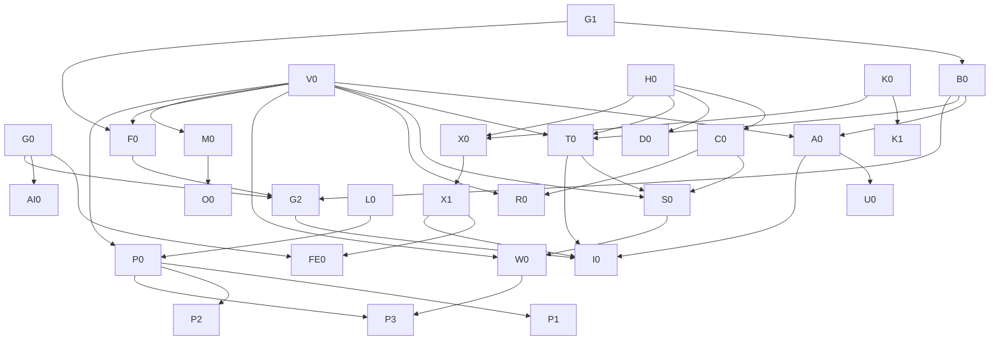

# Workbench Executable Engineering Remediation Plan
版本：2.0；规划日期：2026-09-05。用途：模型无关的治理施工契约。

**当前状态：PLAN DELIVERED，REMEDIATION NOT EXECUTED。本交接包不授权 commit、push、部署或数据库写操作。**
本轮仅只读核对与产出项目外计划；不修改仓库现存文件。原 Astra Plan 保留作历史规划，本版在执行颗粒度、证据分级、条件任务和验收边界上替代其粗阶段描述；不悄悄覆盖原文。

## 1. Executive Summary

保留 Go/Gin/GORM/MySQL SSR 模块化单体。正常调用为 Handler → Service → Repo → DB；跨模块通过公开 Service。Service定义业务与权限/原子边界，Repo实现受约束读写与事务。前端是展示交互，不是业务真源。

本轮完成的是详细施工计划。执行者不得把任务卡中的待确认政策变成默认选择。技术不变量、已有用户决定、当前代码行为、待业务决定分别标明。任务卡通常只有一个风险面；已知必须同时修改的调用链视为单一横切问题，不按“每卡只能一层”机械拆出不安全中间态。

**范围冻结**：不重写框架、不微服务化、不新增通用CRUD/权限引擎/UnitOfWork/缓存平台；本轮AI仅边界文档。权限结果、事务结果、范围和测试标准被冻结；局部SQL写法、命名和helper由执行者在边界内选择。

**对原提示词的修正**：
- “当前schema”必须区分仓库DDL和真实部署DDL；未接获准实例时明确UNKNOWN。
- “所有模型直接执行”不等于允许猜业务。WAIT卡已列问题与推荐选项，批准后才能施工。
- 普通代码任务默认不能改rules/baseline；已修复精确债的删除在卡中显式授权，不需要为每次减债重建治理流程。
- 回退不能重新暴露安全漏洞；卡虽可独立评审/逻辑提交，发布回退还必须保留访问封锁或采用前向修复。
- 固定24项模板中的无关项写N/A及原因，避免为文档任务凭空引入DB/HTTP测试。
- 独立卡必须随附本文件的全局约束；每张卡也内嵌最小安全约束。不能只截取“Suggested Direction”给执行者。

## 2. Current Truth Snapshot

| 项 | 当前证据 |
|---|---|
| 仓库 | /Users/yuyan9923/GitHub/workbench-claude-po |
| BRANCH | Claude-PO；禁止main/master写入 |
| HEAD | f5f97a42b802b2eadabb393f18a88bb8fcb1aeec |
| WIP | README.md已修改；.exec.log、docs/engineering/phase2-audit.md、governance-plan.md、governance-progress.md未跟踪；均为本轮开始前状态 |
| GitHub目标 | 本次get-url核验github → https://github.com/Cetto9923/workbench-claude-po.git |
| Upstream | status为origin/Claude-PO ahead3；它不是push目标授权，禁止依赖默认upstream |
| RULES | 当前AGENTS.md；architecture/database/frontend/testing/quality专题；hash见source-manifest.json |
| Schema | 仓库db/install.sql已读；真实实例DDL/引擎/索引/并发writer UNKNOWN |
| 语言环境 | go1.26.1 darwin/arm64 |
| Tests | 本次GOCACHE=$PWD/tmp/gocache go test -count=1 ./... PASS；没有tests目录；没有真实DB/E2E证据 |
| Regression | 本次make check PASS；git diff --check PASS |
| Raw vet | FAIL：basemodel.go:17 struct tag缺引号；BLOCKED BY EXISTING BASELINE |
| Debt | gofmt6文件、vet1诊断、超500行20文件、advisory67/0新增、secret3指纹、architecture1文件；不是清零 |
| Remote CI | 本次未push、未重新跑远端CI，UNKNOWN；历史绿灯不能覆盖当前dirty内容 |
| 数据库/浏览器 | 本轮未连接业务库、未启动服务、未做登录验收 |

完整源码hash清单在 source-manifest.json；只含路径和hash，无源码或秘密。它用于判断证据漂移，不要求后续所有HEAD等于起点。每卡开始必须比对“自己依赖的文件”的变化，并引用已验收前置卡的新SHA。若只是前置修复造成变化，重新定位对应符号；若合同变化则STOP。

### 过时材料

- 旧phase2-audit“debug无登录保护”：STALE；当前group有RequireLogin。仍缺superadmin是另一问题。
- “用户批量创建无事务”：STALE；Repo.BatchCreate已有Transaction。现存问题是逐行查重及待验唯一性。
- “app.js是唯一脚本/优先表单”：STALE注释，不覆盖当前AGENTS新写协议。
- governance-progress旧阶段0–4状态是历史任务划分，不代表本29卡已实施。
- 旧报告、历史记忆、原型只能提供线索；工程真源与当前用户业务决策优先。原型不能证明权限正确。

## 3. Confirmed Findings

| 类别 | 事实 | 处理 |
|---|---|---|
| CONFIRMED | E01模型与安装SQL软删冲突 | V0确认部署后A0；不能猜deletedAt |
| CONFIRMED | E09权限查询未过滤删除边 | A0；具体谓词依schema |
| CONFIRMED | E12排期15路由无cap | C0 |
| CONFIRMED | E13debug登录但无superadmin | D0 |
| CONFIRMED | E14任务按ID写无父归属约束 | T0 |
| CONFIRMED | E15–18请求产品/现存对象/读端范围缺口 | S0/R0；业务范围依D2 |
| CONFIRMED | E19删除窗口Service缺关联约束 | W0；关联定义依D3 |
| CONFIRMED | E25CSRF未挂且默认关闭 | X0→X1 |
| CONFIRMED | E21环境来源不一致 | K0 |
| CONFIRMED | E22/23敏感配置指纹及构建复制路径 | K1；不声称已验证真实凭证有效性 |
| CONFIRMED | E26Service直接GORM | F0 |
| CONFIRMED | E27运行时AutoMigrate | M0 |
| CONFIRMED | E28原SQL/error写日志；E29无界审计goroutine和吞错 | L0/O0；不声称已证实外泄 |
| CONFIRMED INEFFICIENCY | E30用户逐项查重；E31全量通知/待办分页；E32窗口N+1 | U0/P0/P1/P2/P3 |
| CONFIRMED | E03入口导入问题；E06空基线退出风险；E07tag错误；E34/35门禁覆盖不足 | G0/G1/B0/G2/I0 |

每个E编号在卡中含文件、符号、观察结果。行号辅助定位，以起点HEAD和符号为准；文件变化后不能继续套旧行号。

## 4. Needs Verification

| 项 | 验证方法 | 未验证前禁止 |
|---|---|---|
| 部署RBAC软删/租户/索引 | V0 SHOW CREATE TABLE及owner确认 | 自动改model/迁移 |
| 生产是否存在失效grant仍生效 | 获准环境只读聚合+专用账号撤销测试 | 声称所有员工都受影响 |
| SQL是否慢/容量SLO | P0固定数据/硬件/query/EXPLAIN/P50/P95/alloc | 加缓存/索引后称“优化完成” |
| 每个写请求真实调用方 | X0 route↔caller↔token清单 | 开CSRF后豁免失败路由 |
| ZenTao密码兼容是否仍需要 | D6登录来源/写入方/现有账户政策 | 一次性替换MD5致已有登录坏掉 |
| 五工具及Jules实际加载 | G0版本+新会话证据 | 文件存在即兼容认证 |
| 窗口关联外部writer | V0全writer盘点 | 只锁本应用却保证全系统并发 |
| 远端权限/保护/CI | I0获准后核验当前remote/ref/run | 把历史Pro限制当永久事实 |
| 首页统计是否可等价合并 | 测量每指标数据源/过滤/重叠/错误行为 | 把不同业务scope统一聚合 |

## 5. Decision Gates

下面推荐值不是用户已批准值；没有答复保持WAIT。执行模型不得自行选择。

| Gate | Question / Why | Options & recommended | 风险 | Blocked / Unblocked |
|---|---|---|---|---|
| D1 | 哪个环境/现有schema文档可作为结构真源，哪个隔离库可做集成？避免误连业务库 | 推荐获准schema副本+一次性隔离MySQL；或owner提供DDL后本地合成 | 直接业务库测试可能污染；副本需确认版本 | DB最终验收/A0/W0/M0等阻塞；G0/G1/B0/H0/D0/合成测试准备可做 |
| D2 | 排期业务对象授权矩阵是什么？不能从UI/请求product猜 | 推荐复用已确认业务责任范围并在读取/写入一致执行；或用户明确新的范围 | 过窄阻断员工；过宽越权 | S0/R0阻塞；task.story不变量T0不依赖新业务范围 |
| D3 | “关联需求”是否包含无story的初排zt_demandwindow？关闭story和软删关系如何算？ | 推荐有效初排+有效planstory关联均阻止；已软删关系不阻止；关闭但有效story仍阻止。或仅明确列出的子集 | 只计story会遗漏初排；更严口径会收紧删除 | W0/P3相关标志阻塞；其他安全卡可做 |
| D4 | 获准配置注入方式、dev/prod值、TLS终止点和部署顺序？ | 推荐现有环境注入+prod HTTPS，先注入验证再切换；另选明确secret机制 | 名称变化会导致启动失败；不确定TLS会丢cookie或降安全 | K1/生产X1/M0发布验收阻塞；K0本地测试可做 |
| D5 | 审计失败时可用性与强制审计谁优先？具体超时/并发上限？ | 推荐先用同步有超时审计+可观察错误；若法规/业务要求强制审计，需要批准事务内或停止后续写入策略 | 业务已提交后假装失败会重复操作；强制审计降低可用性 | O0阻塞；M0/L0独立 |
| D6 | 账号大小写、已删账号复用、现存唯一约束、密码来源/轮换？ | 推荐按已批准ZenTao账户合同保留兼容并隔离；没有唯一约束时另批schema变更 | 改算法破坏登录；无DB唯一约束不保证并发 | U0最终并发/密码改造阻塞；不阻塞安全路由 |
| D7 | 等价基准暴露的重复计数/时区/同键歧义是否保持或修正？ | 推荐性能卡保持冻结业务结果；业务修正另卡 | 借性能改业务难回溯 | 仅对应P卡冲突行阻塞；其他fixture测量继续 |

D2必须逐行填入：demand读取/写入actor关系；父与子需求允许深度；story.fromDemand允许集合；独立story额外Stories能否提交；已存story迁移产品权限；project/execution与product关联政策及actor准入；窗口读/写/选择范围；superadmin业务范围是否短路；停用/关闭状态的读写许可。固定项：客户端身份不可信；既有对象与目标关系必须真实；superadmin不能绕过关系完整性；非法混批零持久化写。未填行不能用“执行时根据情况决定”。

## 6. Accepted / Deferred Debt

| 类别 | 决定 | 退出条件 |
|---|---|---|
| ACCEPT / DO NOT FIX | SSR单体、既有成熟组件、复杂SQL位于Repo、无全模块Golden Reference | 有当前业务边界证据并获批才改变 |
| ACCEPT / DO NOT FIX | capability-wide行政资源不强制owner；不因_ = actor判越权 | 明确业务范围存在才加Service对象规则 |
| DEFER | 首页所有指标重写 | 先逐指标测量与等价合同，另发小卡，不能伪装已优化 |
| DEFER | 全仓超长文件拆分 | 当前触及文件按责任局部拆；其余保留精确不增长债；不机械切500行 |
| DEFER | 全仓fetch/转义/分页去重 | FE0只认证能力；单页面有证据后独立卡 |
| DEFER WITH RISK | ZenTao兼容MD5写、历史秘密轮换 | D6/外部owner批准；未完成不得发布“全部安全关闭” |
| NEEDS VERIFICATION | 部门循环祖先、关联用户删除、状态祖先原子性等旁支 | 单独只读核实业务和schema再出卡，不夹F0 |
| ACCEPT / DO NOT FIX | 暂不购买Pro、不建治理平台 | 当前远端保护能力由I0核验，绝不虚称无法绕过 |
| DEFER | 通用幂等协议、全仓并发覆盖、跨模块架构重整 | 每个高风险实际动作独立合同；不以此为由提前造总框架 |
| ACCEPT / DO NOT FIX | 本轮不开发AI | 首实际只读AI需求另发有参数/预算/测试的任务卡 |

未关闭安全债必须存在风险表；“延后”不等于“已接受可上线”。最终发布遇到高风险OPEN需用户显式接受具体风险或继续封锁相关能力；不能笼统批准“一切存量债”。

## 7. Execution Dependency Graph



图外业务Gate同样强制：D1→V0采集；D2→S0/R0；D3→W0；D4→K1/M0真实发布；D5→O0；D6→U0；D7→对应P卡。

**可并行不代表本轮已派Agent。** 只有明确分配后才并行。共享工作区默认一个写入者；用户批准隔离worktree/checkout后，可分配不重叠卡：
- G0文档与H0代码可并行；G1脚本与D0路由可并行；L0日志与T0任务可并行。
- C0/D0都改server测试/路由：串行；H0/X1共享middleware语义：按依赖串行。
- T0/S0/R0/W0/P3触同schedule文件：严格串行。
- K0/K1/X1共享配置合同：先K0，之后只在不重叠副本并行准备，集成验收串行。
- M0/O0触同审计文件：串行；G1/G2/I0涉及门禁/Makefile：串行。
- P1/P2同po模块且可能共享helper：默认串行；独立副本也要逐卡集成重验。
- 任何baseline修改、共享文档索引合并只允许一个整合者。不能同时让两个Agent重写全局规则。

## 8. Detailed Executable Phases

29张完整卡位于 phases/；每卡含24项施工模板、难度、风险、执行者级别、前置与状态。这里只是导航；不能跳过卡中的WAIT。

- [V0 — 真实 schema 与业务决策封板（只读）](phases/V0.md) · READ-ONLY READY；数据库读取 WAIT D1 · MEDIUM/HIGH
- [G0 — 多 Agent 入口与模块导航](phases/G0.md) · READY · LOW/LOW
- [G1 — 门禁在空基线下正确退出](phases/G1.md) · READY · MEDIUM/MEDIUM
- [B0 — 修复确定性的 tag 与格式基础债](phases/B0.md) · READY AFTER G1 · LOW/LOW
- [A0 — RBAC 失效关系不再加载](phases/A0.md) · WAIT SCHEMA · MEDIUM/HIGH
- [H0 — JSON 鉴权失败保留正确 HTTP 语义](phases/H0.md) · READY · MEDIUM/MEDIUM
- [C0 — 排期15条路由能力权限](phases/C0.md) · READY AFTER H0 · MEDIUM/HIGH
- [D0 — debug仅超级管理员可访问](phases/D0.md) · READY AFTER H0 · LOW/HIGH
- [T0 — 现存任务必须属于数据库中的父需求](phases/T0.md) · WAIT SCHEMA；父子校验政策已冻结 · HIGH/CRITICAL
- [S0 — 业需/独立研发需求/目标关联授权](phases/S0.md) · WAIT D2，禁止直接施工 · HIGH/CRITICAL
- [R0 — 排期只读详情与级联选项授权](phases/R0.md) · WAIT D2 READ POLICY · HIGH/HIGH
- [W0 — 窗口关联与删除互斥](phases/W0.md) · WAIT D3 · HIGH/HIGH
- [K0 — 配置来源与环境覆盖](phases/K0.md) · READY FOR ISOLATED TESTS · MEDIUM/HIGH
- [K1 — 仓库与部署包不包含真实凭证](phases/K1.md) · WAIT D4 · MEDIUM/CRITICAL
- [X0 — CSRF 调用方清单与token传递准备](phases/X0.md) · READY AFTER DEPENDENCIES · MEDIUM/HIGH
- [X1 — 真实 HTTP 链默认启用 CSRF](phases/X1.md) · READY AFTER X0 · HIGH/HIGH
- [F0 — 部门事务回到持久层](phases/F0.md) · WAIT DEPT SCHEMA · MEDIUM/MEDIUM
- [M0 — 显式迁移替代运行时建表](phases/M0.md) · WAIT SCHEMA/DEPLOYMENT · MEDIUM/HIGH
- [L0 — SQL日志不包含原始参数](phases/L0.md) · READY · MEDIUM/HIGH
- [O0 — 有界且可观察的请求审计](phases/O0.md) · WAIT D5 · HIGH/HIGH
- [U0 — 用户批量查重与并发唯一性](phases/U0.md) · WAIT SCHEMA/D6 · MEDIUM/HIGH
- [P0 — 性能测量和结果等价夹具](phases/P0.md) · READY FOR SYNTHETIC PREPARATION · MEDIUM/MEDIUM
- [P1 — 通知SQL过滤计数分页](phases/P1.md) · READY AFTER P0 · HIGH/MEDIUM
- [P2 — 待办数据库统一排序分页](phases/P2.md) · WAIT P0 CONTRACT FIXTURE · HIGH/HIGH
- [P3 — 窗口统计批量读取](phases/P3.md) · READY AFTER DEPENDENCIES · MEDIUM/MEDIUM
- [FE0 — 共享前端能力只认证不大改](phases/FE0.md) · READY AFTER DEPENDENCIES · LOW/LOW
- [G2 — 检查入口与架构门禁增强](phases/G2.md) · READY AFTER DEPENDENCIES · HIGH/MEDIUM
- [I0 — 隔离测试接入 GitHub CI](phases/I0.md) · READY AFTER TEST SUITES · MEDIUM/HIGH
- [AI0 — 冻结未来员工AI能力边界](phases/AI0.md) · READY DOCUMENTATION ONLY · MEDIUM/HIGH

## 9. Global Executor Rules

1. 先核对真源/文件hash/前置报告，再执行一张明确指定卡。读本文件、AGENTS与相关专题；输入合同不一致则STOP AND REPORT，不默默改计划。
2. 执行者可选择局部函数名/SQL结构；不得创造业务范围、soft-delete列、状态流、幂等结果或HTTP语义。
3. Allowed是白名单。测试新增仅在卡列目录/责任内。Forbidden默认是除Allowed以外所有文件，尤其AGENTS、其他专题、schema、baseline、CI、其他业务模块。卡中特许减债只删已解决的精确行，或下调本卡已缩短文件的行数上限；不提高上限。
4. 每批开始记录existing WIP。与用户WIP重叠时先读diff，无法区分所有权则停止该文件；不能覆盖、stash或宽泛staging。
5. 两类错误区分：对象授权拒绝(403)、有权对象不存在(404)。未知范围的对象不通过404返回额外详情。并发冲突409；绑定400、现有字段校验422；内部500安全文本。未触及接口保留legacy；不全仓响应重写。
6. 安全卡必须先构造能击中旧漏洞的测试。记录OLD FAIL及NEW PASS；若旧实现也通过，要检查测试是否只测helper、错误路径未到达或mock过度。测试数据构造不得依赖真实秘密。Secret scanner反例在临时fixture动态构造合成值，不把匹配secret签名的常量提交到被扫描目录，不增加测试目录大范围豁免。
7. 并发/唯一性/rollback使用真实隔离MySQL两连接及屏障确定交错；不能用sleep概率竞态或sqlmock冒充数据库证据。
8. Go package测试旁置；集成tests/integration且integration tag；E2E tests/e2e。新路径是计划交付，不是现存工具。缺suite/fixture就实现指定测试，不只写不存在命令然后报告通过。
9. 测试连接统一未来使用WB_TEST_MYSQL_DSN（运行时注入，不打印）；必须指向批准的临时数据库，schema名建议workbench_test_前缀，并验证隔离身份，不靠前缀独自证明安全。缺连接本地可SKIP但卡状态PARTIAL；CI要求集成的job缺连接必须FAIL。
10. 性能先P0，后P1–P3；同机同数据对比，不能把基准优化百分比当生产SLO。保留结果正确性/权限/排序优先于速度。
11. Required validation每卡包括git diff --check、make check及卡专属命令。原始vet现存失败单列；不把baseline PASS解释为零债。
12. 文档、迁移和测试不能以“通常N/A”省略适用风险。Manual只在卡需要UI/真实DB时做，记录环境/身份类别/资产版本而不保留token。
13. 发现新的问题只追加本卡报告Out-of-scope，不能顺手修。任何越界需求形成修订卡并由计划owner确认；不是让执行模型重新猜架构。
14. 单卡COMPLETE要求所有该卡required证据通过；本地实现完成但远端/手工条件缺失为PARTIAL。整项目交付COMPLETE另需I0与用户验收。独立复核由未参与实现的reviewer执行，不把自评标独立评审。

## 10. Global Git Safety Rules

每卡继承以下协议，单独卡中也复制最小约束：
```sh
git rev-parse --show-toplevel
git branch --show-current
git rev-parse HEAD
git status --short
git remote -v
```
最后命令仅在remote URL不嵌入凭证时输出；如存在凭证，报告脱敏host/path，先不要输出秘密。

禁止写main/master；禁止branch create/switch、merge、rebase、cherry-pick、reset、clean、stash、force/force-add、bare push，除非当前任务明确单独授权。允许commit不等于允许push，允许push不等于允许merge/发布。未来获准push必须显式 `git push github Claude-PO`，并再次验证github指向。保留origin不作本轮发布目标。

卡的Commit Boundary只是逻辑建议，不是授权。无commit填NOT COMMITTED；无push填NOT PUSHED；没有对应run填NOT RUN。禁止以“计划要求可提交”推断用户要求现在提交。

回退：不执行reset/revert除非明确授权。文档/等价性能卡可提议单卡回退；安全卡不能回到开放漏洞状态，先限制对应能力/停止暴露接口并采用前向修复。已应用SQL不DROP审计表；凭证回退不能恢复泄露密码。

## 11. Final Execution Order

推荐单写入者顺序（遇WAIT跳到不依赖该项的下一张）：
G0 → G1 → B0 → V0 → H0 → D0 → C0 → A0 → T0 → S0 → R0 → W0 → K0 → X0 → X1 → K1 → F0 → M0 → L0 → O0 → U0 → P0 → P1 → P2 → P3 → FE0 → G2 → AI0 → I0。

K0/L0可提前以解锁其他任务；优先级不允许突破依赖。安全相关READ/WRITE矩阵、配置和日志优先于性能；文档不得长期阻塞已经确认的安全修复。不要把29卡一次发给弱模型要求“一口气全部完成”。

每卡结束：记录scope diff、测试旧红新绿、当前HEAD/工作树hash、DB/浏览器证据、失败/skips、下一张可执行卡。更新同一执行台账，不重复创建管理系统。

## 12. Final Definition of Done

计划成稿与治理完成分开：

**Plan成稿**：29卡各24项齐；证据/猜测/决策分类；无依赖循环；每个业务待定明确WAIT；scope不无限开放；测试能指出撤修后失败场景；不引入无证据框架。不能因此宣称应用安全。

**治理验收**：
- 所有MUST FIX confirmed问题有代码修复、旧失败/新通过、独立复核；WAIT项不能被标DONE。
- 原始vet/gofmt干净；规则豁免只精确减少，剩余债逐项理由和退出条件。
- 实际schema匹配；隔离MySQL并发/事务/撤销/CSRF/对象授权证据齐。
- 修改页面真实登录、正常与拒绝路径、Console/network、实际资源版本通过。
- 每个拟使用Agent冷启动可发现规则；未验工具不得自行承担无人复核任务。
- 配置/新包无秘密；已暴露凭证轮换及历史日志处置有真实外部结果或明确OPEN风险，不伪造关闭。
- GitHub交付SHA与CI一致；用户作最终合并决定。
- AI仅边界文档，实际功能/供应商/预算尚未实施。
- 仍需持续每次变更遵守同一流程；治理完成不等于后续零风险或免评审。

## 13. Official Tool Discovery References

以下仅支持入口格式判断，不替代真实冷启动：
- Claude：代码跨度内的@path不导入；使用真实导入并核对/context。[官方说明](https://code.claude.com/docs/en/memory)
- Cursor：用alwaysApply工程入口，仍需验证实际加载。[官方说明](https://cursor.com/docs/rules)
- Gemini：GEMINI.md为上下文入口；执行前按安装版本核实import格式。[官方说明](https://geminicli.com/docs/cli/gemini-md/)
- Hermes：项目上下文类型有优先顺序，较高入口可遮蔽AGENTS，根到工作目录链必须实测。[官方说明](https://hermes-agent.nousresearch.com/docs/user-guide/features/context-files)
- Jules：采用显式任务读入本契约，原生自动发现本轮未证实。[官方文档](https://jules.google/docs/)

Codex本卡使用用户当前提供的根AGENTS入口；其版本特定override/启动发现细节在G0实际工具验证时记录，不凭本轮未完成的新会话证明宣称认证。

## 14. 本轮自审结论

- EXECUTABILITY：READY卡可按限定scope/合同开始；WAIT卡只能完成其明示的只读/合成准备，不能替用户决策。
- AMBIGUITY：未用“合理/适当/根据情况”规定权限、schema或结果；未确定事项全部位于D1–D7。
- OVER-ENGINEERING：没有要求新通用框架、缓存或AI平台；AST工具仅为当前确定门禁漏洞，审计队列未未经决策指定。
- 复杂度例外：S0若D2导致多业务路径，必须先由计划owner拆卡；G2可按确定入口与AST分别评审；X0按冻结调用方清单小批执行。
- 本次为同一助手自审，**不是独立Agent评审**。下一执行者仍应让另一reviewer按卡验证。
