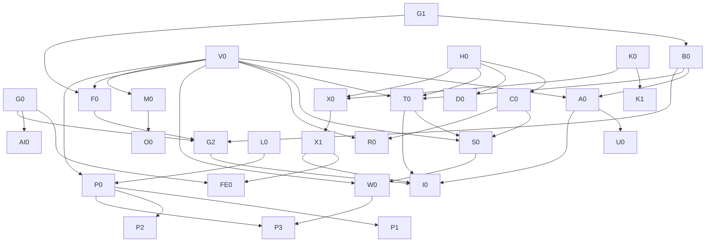

# Workbench Executable Engineering Remediation Plan
版本：2.0；规划日期：2026-09-05。用途：模型无关的治理施工契约。

**当前状态：PLAN DELIVERED，REMEDIATION NOT EXECUTED。本交接包不授权 commit、push、部署或数据库写操作。**
本轮仅只读核对与产出项目外计划；不修改仓库现存文件。原 Astra Plan 保留作历史规划，本版在执行颗粒度、证据分级、条件任务和验收边界上替代其粗阶段描述；不悄悄覆盖原文。

## 1. Executive Summary

保留 Go/Gin/GORM/MySQL SSR 模块化单体。正常调用为 Handler → Service → Repo → DB；跨模块通过公开 Service。Service定义业务与权限/原子边界，Repo实现受约束读写与事务。前端是展示交互，不是业务真源。

本轮完成的是详细施工计划。执行者不得把任务卡中的待确认政策变成默认选择。技术不变量、已有用户决定、当前代码行为、待业务决定分别标明。任务卡通常只有一个风险面；已知必须同时修改的调用链视为单一横切问题，不按“每卡只能一层”机械拆出不安全中间态。

**范围冻结**：不重写框架、不微服务化、不新增通用CRUD/权限引擎/UnitOfWork/缓存平台；本轮AI仅边界文档。权限结果、事务结果、范围和测试标准被冻结；局部SQL写法、命名和helper由执行者在边界内选择。

**对原提示词的修正**：
- “当前schema”必须区分仓库DDL和真实部署DDL；未接获准实例时明确UNKNOWN。
- “所有模型直接执行”不等于允许猜业务。WAIT卡已列问题与推荐选项，批准后才能施工。
- 普通代码任务默认不能改rules/baseline；已修复精确债的删除在卡中显式授权，不需要为每次减债重建治理流程。
- 回退不能重新暴露安全漏洞；卡虽可独立评审/逻辑提交，发布回退还必须保留访问封锁或采用前向修复。
- 固定24项模板中的无关项写N/A及原因，避免为文档任务凭空引入DB/HTTP测试。
- 独立卡必须随附本文件的全局约束；每张卡也内嵌最小安全约束。不能只截取“Suggested Direction”给执行者。

## 2. Current Truth Snapshot

| 项 | 当前证据 |
|---|---|
| 仓库 | /Users/yuyan9923/GitHub/workbench-claude-po |
| BRANCH | Claude-PO；禁止main/master写入 |
| HEAD | f5f97a42b802b2eadabb393f18a88bb8fcb1aeec |
| WIP | README.md已修改；.exec.log、docs/engineering/phase2-audit.md、governance-plan.md、governance-progress.md未跟踪；均为本轮开始前状态 |
| GitHub目标 | 本次get-url核验github → https://github.com/Cetto9923/workbench-claude-po.git |
| Upstream | status为origin/Claude-PO ahead3；它不是push目标授权，禁止依赖默认upstream |
| RULES | 当前AGENTS.md；architecture/database/frontend/testing/quality专题；hash见source-manifest.json |
| Schema | 仓库db/install.sql已读；真实实例DDL/引擎/索引/并发writer UNKNOWN |
| 语言环境 | go1.26.1 darwin/arm64 |
| Tests | 本次GOCACHE=$PWD/tmp/gocache go test -count=1 ./... PASS；没有tests目录；没有真实DB/E2E证据 |
| Regression | 本次make check PASS；git diff --check PASS |
| Raw vet | FAIL：basemodel.go:17 struct tag缺引号；BLOCKED BY EXISTING BASELINE |
| Debt | gofmt6文件、vet1诊断、超500行20文件、advisory67/0新增、secret3指纹、architecture1文件；不是清零 |
| Remote CI | 本次未push、未重新跑远端CI，UNKNOWN；历史绿灯不能覆盖当前dirty内容 |
| 数据库/浏览器 | 本轮未连接业务库、未启动服务、未做登录验收 |

完整源码hash清单在 source-manifest.json；只含路径和hash，无源码或秘密。它用于判断证据漂移，不要求后续所有HEAD等于起点。每卡开始必须比对“自己依赖的文件”的变化，并引用已验收前置卡的新SHA。若只是前置修复造成变化，重新定位对应符号；若合同变化则STOP。

### 过时材料

- 旧phase2-audit“debug无登录保护”：STALE；当前group有RequireLogin。仍缺superadmin是另一问题。
- “用户批量创建无事务”：STALE；Repo.BatchCreate已有Transaction。现存问题是逐行查重及待验唯一性。
- “app.js是唯一脚本/优先表单”：STALE注释，不覆盖当前AGENTS新写协议。
- governance-progress旧阶段0–4状态是历史任务划分，不代表本29卡已实施。
- 旧报告、历史记忆、原型只能提供线索；工程真源与当前用户业务决策优先。原型不能证明权限正确。

## 3. Confirmed Findings

| 类别 | 事实 | 处理 |
|---|---|---|
| CONFIRMED | E01模型与安装SQL软删冲突 | V0确认部署后A0；不能猜deletedAt |
| CONFIRMED | E09权限查询未过滤删除边 | A0；具体谓词依schema |
| CONFIRMED | E12排期15路由无cap | C0 |
| CONFIRMED | E13debug登录但无superadmin | D0 |
| CONFIRMED | E14任务按ID写无父归属约束 | T0 |
| CONFIRMED | E15–18请求产品/现存对象/读端范围缺口 | S0/R0；业务范围依D2 |
| CONFIRMED | E19删除窗口Service缺关联约束 | W0；关联定义依D3 |
| CONFIRMED | E25CSRF未挂且默认关闭 | X0→X1 |
| CONFIRMED | E21环境来源不一致 | K0 |
| CONFIRMED | E22/23敏感配置指纹及构建复制路径 | K1；不声称已验证真实凭证有效性 |
| CONFIRMED | E26Service直接GORM | F0 |
| CONFIRMED | E27运行时AutoMigrate | M0 |
| CONFIRMED | E28原SQL/error写日志；E29无界审计goroutine和吞错 | L0/O0；不声称已证实外泄 |
| CONFIRMED INEFFICIENCY | E30用户逐项查重；E31全量通知/待办分页；E32窗口N+1 | U0/P0/P1/P2/P3 |
| CONFIRMED | E03入口导入问题；E06空基线退出风险；E07tag错误；E34/35门禁覆盖不足 | G0/G1/B0/G2/I0 |

每个E编号在卡中含文件、符号、观察结果。行号辅助定位，以起点HEAD和符号为准；文件变化后不能继续套旧行号。

## 4. Needs Verification

| 项 | 验证方法 | 未验证前禁止 |
|---|---|---|
| 部署RBAC软删/租户/索引 | V0 SHOW CREATE TABLE及owner确认 | 自动改model/迁移 |
| 生产是否存在失效grant仍生效 | 获准环境只读聚合+专用账号撤销测试 | 声称所有员工都受影响 |
| SQL是否慢/容量SLO | P0固定数据/硬件/query/EXPLAIN/P50/P95/alloc | 加缓存/索引后称“优化完成” |
| 每个写请求真实调用方 | X0 route↔caller↔token清单 | 开CSRF后豁免失败路由 |
| ZenTao密码兼容是否仍需要 | D6登录来源/写入方/现有账户政策 | 一次性替换MD5致已有登录坏掉 |
| 五工具及Jules实际加载 | G0版本+新会话证据 | 文件存在即兼容认证 |
| 窗口关联外部writer | V0全writer盘点 | 只锁本应用却保证全系统并发 |
| 远端权限/保护/CI | I0获准后核验当前remote/ref/run | 把历史Pro限制当永久事实 |
| 首页统计是否可等价合并 | 测量每指标数据源/过滤/重叠/错误行为 | 把不同业务scope统一聚合 |

## 5. Decision Gates

下面推荐值不是用户已批准值；没有答复保持WAIT。执行模型不得自行选择。

| Gate | Question / Why | Options & recommended | 风险 | Blocked / Unblocked |
|---|---|---|---|---|
| D1 | 哪个环境/现有schema文档可作为结构真源，哪个隔离库可做集成？避免误连业务库 | 推荐获准schema副本+一次性隔离MySQL；或owner提供DDL后本地合成 | 直接业务库测试可能污染；副本需确认版本 | DB最终验收/A0/W0/M0等阻塞；G0/G1/B0/H0/D0/合成测试准备可做 |
| D2 | 排期业务对象授权矩阵是什么？不能从UI/请求product猜 | 推荐复用已确认业务责任范围并在读取/写入一致执行；或用户明确新的范围 | 过窄阻断员工；过宽越权 | S0/R0阻塞；task.story不变量T0不依赖新业务范围 |
| D3 | “关联需求”是否包含无story的初排zt_demandwindow？关闭story和软删关系如何算？ | 推荐有效初排+有效planstory关联均阻止；已软删关系不阻止；关闭但有效story仍阻止。或仅明确列出的子集 | 只计story会遗漏初排；更严口径会收紧删除 | W0/P3相关标志阻塞；其他安全卡可做 |
| D4 | 获准配置注入方式、dev/prod值、TLS终止点和部署顺序？ | 推荐现有环境注入+prod HTTPS，先注入验证再切换；另选明确secret机制 | 名称变化会导致启动失败；不确定TLS会丢cookie或降安全 | K1/生产X1/M0发布验收阻塞；K0本地测试可做 |
| D5 | 审计失败时可用性与强制审计谁优先？具体超时/并发上限？ | 推荐先用同步有超时审计+可观察错误；若法规/业务要求强制审计，需要批准事务内或停止后续写入策略 | 业务已提交后假装失败会重复操作；强制审计降低可用性 | O0阻塞；M0/L0独立 |
| D6 | 账号大小写、已删账号复用、现存唯一约束、密码来源/轮换？ | 推荐按已批准ZenTao账户合同保留兼容并隔离；没有唯一约束时另批schema变更 | 改算法破坏登录；无DB唯一约束不保证并发 | U0最终并发/密码改造阻塞；不阻塞安全路由 |
| D7 | 等价基准暴露的重复计数/时区/同键歧义是否保持或修正？ | 推荐性能卡保持冻结业务结果；业务修正另卡 | 借性能改业务难回溯 | 仅对应P卡冲突行阻塞；其他fixture测量继续 |

D2必须逐行填入：demand读取/写入actor关系；父与子需求允许深度；story.fromDemand允许集合；独立story额外Stories能否提交；已存story迁移产品权限；project/execution与product关联政策及actor准入；窗口读/写/选择范围；superadmin业务范围是否短路；停用/关闭状态的读写许可。固定项：客户端身份不可信；既有对象与目标关系必须真实；superadmin不能绕过关系完整性；非法混批零持久化写。未填行不能用“执行时根据情况决定”。

## 6. Accepted / Deferred Debt

| 类别 | 决定 | 退出条件 |
|---|---|---|
| ACCEPT / DO NOT FIX | SSR单体、既有成熟组件、复杂SQL位于Repo、无全模块Golden Reference | 有当前业务边界证据并获批才改变 |
| ACCEPT / DO NOT FIX | capability-wide行政资源不强制owner；不因_ = actor判越权 | 明确业务范围存在才加Service对象规则 |
| DEFER | 首页所有指标重写 | 先逐指标测量与等价合同，另发小卡，不能伪装已优化 |
| DEFER | 全仓超长文件拆分 | 当前触及文件按责任局部拆；其余保留精确不增长债；不机械切500行 |
| DEFER | 全仓fetch/转义/分页去重 | FE0只认证能力；单页面有证据后独立卡 |
| DEFER WITH RISK | ZenTao兼容MD5写、历史秘密轮换 | D6/外部owner批准；未完成不得发布“全部安全关闭” |
| NEEDS VERIFICATION | 部门循环祖先、关联用户删除、状态祖先原子性等旁支 | 单独只读核实业务和schema再出卡，不夹F0 |
| ACCEPT / DO NOT FIX | 暂不购买Pro、不建治理平台 | 当前远端保护能力由I0核验，绝不虚称无法绕过 |
| DEFER | 通用幂等协议、全仓并发覆盖、跨模块架构重整 | 每个高风险实际动作独立合同；不以此为由提前造总框架 |
| ACCEPT / DO NOT FIX | 本轮不开发AI | 首实际只读AI需求另发有参数/预算/测试的任务卡 |

未关闭安全债必须存在风险表；“延后”不等于“已接受可上线”。最终发布遇到高风险OPEN需用户显式接受具体风险或继续封锁相关能力；不能笼统批准“一切存量债”。

## 7. Execution Dependency Graph



图外业务Gate同样强制：D1→V0采集；D2→S0/R0；D3→W0；D4→K1/M0真实发布；D5→O0；D6→U0；D7→对应P卡。

**可并行不代表本轮已派Agent。** 只有明确分配后才并行。共享工作区默认一个写入者；用户批准隔离worktree/checkout后，可分配不重叠卡：
- G0文档与H0代码可并行；G1脚本与D0路由可并行；L0日志与T0任务可并行。
- C0/D0都改server测试/路由：串行；H0/X1共享middleware语义：按依赖串行。
- T0/S0/R0/W0/P3触同schedule文件：严格串行。
- K0/K1/X1共享配置合同：先K0，之后只在不重叠副本并行准备，集成验收串行。
- M0/O0触同审计文件：串行；G1/G2/I0涉及门禁/Makefile：串行。
- P1/P2同po模块且可能共享helper：默认串行；独立副本也要逐卡集成重验。
- 任何baseline修改、共享文档索引合并只允许一个整合者。不能同时让两个Agent重写全局规则。

## 8. Detailed Executable Phases

29张完整卡位于 phases/；每卡含24项施工模板、难度、风险、执行者级别、前置与状态。这里只是导航；不能跳过卡中的WAIT。

- [V0 — 真实 schema 与业务决策封板（只读）](phases/V0.md) · READ-ONLY READY；数据库读取 WAIT D1 · MEDIUM/HIGH
- [G0 — 多 Agent 入口与模块导航](phases/G0.md) · READY · LOW/LOW
- [G1 — 门禁在空基线下正确退出](phases/G1.md) · READY · MEDIUM/MEDIUM
- [B0 — 修复确定性的 tag 与格式基础债](phases/B0.md) · READY AFTER G1 · LOW/LOW
- [A0 — RBAC 失效关系不再加载](phases/A0.md) · WAIT SCHEMA · MEDIUM/HIGH
- [H0 — JSON 鉴权失败保留正确 HTTP 语义](phases/H0.md) · READY · MEDIUM/MEDIUM
- [C0 — 排期15条路由能力权限](phases/C0.md) · READY AFTER H0 · MEDIUM/HIGH
- [D0 — debug仅超级管理员可访问](phases/D0.md) · READY AFTER H0 · LOW/HIGH
- [T0 — 现存任务必须属于数据库中的父需求](phases/T0.md) · WAIT SCHEMA；父子校验政策已冻结 · HIGH/CRITICAL
- [S0 — 业需/独立研发需求/目标关联授权](phases/S0.md) · WAIT D2，禁止直接施工 · HIGH/CRITICAL
- [R0 — 排期只读详情与级联选项授权](phases/R0.md) · WAIT D2 READ POLICY · HIGH/HIGH
- [W0 — 窗口关联与删除互斥](phases/W0.md) · WAIT D3 · HIGH/HIGH
- [K0 — 配置来源与环境覆盖](phases/K0.md) · READY FOR ISOLATED TESTS · MEDIUM/HIGH
- [K1 — 仓库与部署包不包含真实凭证](phases/K1.md) · WAIT D4 · MEDIUM/CRITICAL
- [X0 — CSRF 调用方清单与token传递准备](phases/X0.md) · READY AFTER DEPENDENCIES · MEDIUM/HIGH
- [X1 — 真实 HTTP 链默认启用 CSRF](phases/X1.md) · READY AFTER X0 · HIGH/HIGH
- [F0 — 部门事务回到持久层](phases/F0.md) · WAIT DEPT SCHEMA · MEDIUM/MEDIUM
- [M0 — 显式迁移替代运行时建表](phases/M0.md) · WAIT SCHEMA/DEPLOYMENT · MEDIUM/HIGH
- [L0 — SQL日志不包含原始参数](phases/L0.md) · READY · MEDIUM/HIGH
- [O0 — 有界且可观察的请求审计](phases/O0.md) · WAIT D5 · HIGH/HIGH
- [U0 — 用户批量查重与并发唯一性](phases/U0.md) · WAIT SCHEMA/D6 · MEDIUM/HIGH
- [P0 — 性能测量和结果等价夹具](phases/P0.md) · READY FOR SYNTHETIC PREPARATION · MEDIUM/MEDIUM
- [P1 — 通知SQL过滤计数分页](phases/P1.md) · READY AFTER P0 · HIGH/MEDIUM
- [P2 — 待办数据库统一排序分页](phases/P2.md) · WAIT P0 CONTRACT FIXTURE · HIGH/HIGH
- [P3 — 窗口统计批量读取](phases/P3.md) · READY AFTER DEPENDENCIES · MEDIUM/MEDIUM
- [FE0 — 共享前端能力只认证不大改](phases/FE0.md) · READY AFTER DEPENDENCIES · LOW/LOW
- [G2 — 检查入口与架构门禁增强](phases/G2.md) · READY AFTER DEPENDENCIES · HIGH/MEDIUM
- [I0 — 隔离测试接入 GitHub CI](phases/I0.md) · READY AFTER TEST SUITES · MEDIUM/HIGH
- [AI0 — 冻结未来员工AI能力边界](phases/AI0.md) · READY DOCUMENTATION ONLY · MEDIUM/HIGH

## 9. Global Executor Rules

1. 先核对真源/文件hash/前置报告，再执行一张明确指定卡。读本文件、AGENTS与相关专题；输入合同不一致则STOP AND REPORT，不默默改计划。
2. 执行者可选择局部函数名/SQL结构；不得创造业务范围、soft-delete列、状态流、幂等结果或HTTP语义。
3. Allowed是白名单。测试新增仅在卡列目录/责任内。Forbidden默认是除Allowed以外所有文件，尤其AGENTS、其他专题、schema、baseline、CI、其他业务模块。卡中特许减债只删已解决的精确行，或下调本卡已缩短文件的行数上限；不提高上限。
4. 每批开始记录existing WIP。与用户WIP重叠时先读diff，无法区分所有权则停止该文件；不能覆盖、stash或宽泛staging。
5. 两类错误区分：对象授权拒绝(403)、有权对象不存在(404)。未知范围的对象不通过404返回额外详情。并发冲突409；绑定400、现有字段校验422；内部500安全文本。未触及接口保留legacy；不全仓响应重写。
6. 安全卡必须先构造能击中旧漏洞的测试。记录OLD FAIL及NEW PASS；若旧实现也通过，要检查测试是否只测helper、错误路径未到达或mock过度。测试数据构造不得依赖真实秘密。Secret scanner反例在临时fixture动态构造合成值，不把匹配secret签名的常量提交到被扫描目录，不增加测试目录大范围豁免。
7. 并发/唯一性/rollback使用真实隔离MySQL两连接及屏障确定交错；不能用sleep概率竞态或sqlmock冒充数据库证据。
8. Go package测试旁置；集成tests/integration且integration tag；E2E tests/e2e。新路径是计划交付，不是现存工具。缺suite/fixture就实现指定测试，不只写不存在命令然后报告通过。
9. 测试连接统一未来使用WB_TEST_MYSQL_DSN（运行时注入，不打印）；必须指向批准的临时数据库，schema名建议workbench_test_前缀，并验证隔离身份，不靠前缀独自证明安全。缺连接本地可SKIP但卡状态PARTIAL；CI要求集成的job缺连接必须FAIL。
10. 性能先P0，后P1–P3；同机同数据对比，不能把基准优化百分比当生产SLO。保留结果正确性/权限/排序优先于速度。
11. Required validation每卡包括git diff --check、make check及卡专属命令。原始vet现存失败单列；不把baseline PASS解释为零债。
12. 文档、迁移和测试不能以“通常N/A”省略适用风险。Manual只在卡需要UI/真实DB时做，记录环境/身份类别/资产版本而不保留token。
13. 发现新的问题只追加本卡报告Out-of-scope，不能顺手修。任何越界需求形成修订卡并由计划owner确认；不是让执行模型重新猜架构。
14. 单卡COMPLETE要求所有该卡required证据通过；本地实现完成但远端/手工条件缺失为PARTIAL。整项目交付COMPLETE另需I0与用户验收。独立复核由未参与实现的reviewer执行，不把自评标独立评审。

## 10. Global Git Safety Rules

每卡继承以下协议，单独卡中也复制最小约束：
```sh
git rev-parse --show-toplevel
git branch --show-current
git rev-parse HEAD
git status --short
git remote -v
```
最后命令仅在remote URL不嵌入凭证时输出；如存在凭证，报告脱敏host/path，先不要输出秘密。

禁止写main/master；禁止branch create/switch、merge、rebase、cherry-pick、reset、clean、stash、force/force-add、bare push，除非当前任务明确单独授权。允许commit不等于允许push，允许push不等于允许merge/发布。未来获准push必须显式 `git push github Claude-PO`，并再次验证github指向。保留origin不作本轮发布目标。

卡的Commit Boundary只是逻辑建议，不是授权。无commit填NOT COMMITTED；无push填NOT PUSHED；没有对应run填NOT RUN。禁止以“计划要求可提交”推断用户要求现在提交。

回退：不执行reset/revert除非明确授权。文档/等价性能卡可提议单卡回退；安全卡不能回到开放漏洞状态，先限制对应能力/停止暴露接口并采用前向修复。已应用SQL不DROP审计表；凭证回退不能恢复泄露密码。

## 11. Final Execution Order

推荐单写入者顺序（遇WAIT跳到不依赖该项的下一张）：
G0 → G1 → B0 → V0 → H0 → D0 → C0 → A0 → T0 → S0 → R0 → W0 → K0 → X0 → X1 → K1 → F0 → M0 → L0 → O0 → U0 → P0 → P1 → P2 → P3 → FE0 → G2 → AI0 → I0。

K0/L0可提前以解锁其他任务；优先级不允许突破依赖。安全相关READ/WRITE矩阵、配置和日志优先于性能；文档不得长期阻塞已经确认的安全修复。不要把29卡一次发给弱模型要求“一口气全部完成”。

每卡结束：记录scope diff、测试旧红新绿、当前HEAD/工作树hash、DB/浏览器证据、失败/skips、下一张可执行卡。更新同一执行台账，不重复创建管理系统。

## 12. Final Definition of Done

计划成稿与治理完成分开：

**Plan成稿**：29卡各24项齐；证据/猜测/决策分类；无依赖循环；每个业务待定明确WAIT；scope不无限开放；测试能指出撤修后失败场景；不引入无证据框架。不能因此宣称应用安全。

**治理验收**：
- 所有MUST FIX confirmed问题有代码修复、旧失败/新通过、独立复核；WAIT项不能被标DONE。
- 原始vet/gofmt干净；规则豁免只精确减少，剩余债逐项理由和退出条件。
- 实际schema匹配；隔离MySQL并发/事务/撤销/CSRF/对象授权证据齐。
- 修改页面真实登录、正常与拒绝路径、Console/network、实际资源版本通过。
- 每个拟使用Agent冷启动可发现规则；未验工具不得自行承担无人复核任务。
- 配置/新包无秘密；已暴露凭证轮换及历史日志处置有真实外部结果或明确OPEN风险，不伪造关闭。
- GitHub交付SHA与CI一致；用户作最终合并决定。
- AI仅边界文档，实际功能/供应商/预算尚未实施。
- 仍需持续每次变更遵守同一流程；治理完成不等于后续零风险或免评审。

## 13. Official Tool Discovery References

以下仅支持入口格式判断，不替代真实冷启动：
- Claude：代码跨度内的@path不导入；使用真实导入并核对/context。[官方说明](https://code.claude.com/docs/en/memory)
- Cursor：用alwaysApply工程入口，仍需验证实际加载。[官方说明](https://cursor.com/docs/rules)
- Gemini：GEMINI.md为上下文入口；执行前按安装版本核实import格式。[官方说明](https://geminicli.com/docs/cli/gemini-md/)
- Hermes：项目上下文类型有优先顺序，较高入口可遮蔽AGENTS，根到工作目录链必须实测。[官方说明](https://hermes-agent.nousresearch.com/docs/user-guide/features/context-files)
- Jules：采用显式任务读入本契约，原生自动发现本轮未证实。[官方文档](https://jules.google/docs/)

Codex本卡使用用户当前提供的根AGENTS入口；其版本特定override/启动发现细节在G0实际工具验证时记录，不凭本轮未完成的新会话证明宣称认证。

## 14. 本轮自审结论

- EXECUTABILITY：READY卡可按限定scope/合同开始；WAIT卡只能完成其明示的只读/合成准备，不能替用户决策。
- AMBIGUITY：未用“合理/适当/根据情况”规定权限、schema或结果；未确定事项全部位于D1–D7。
- OVER-ENGINEERING：没有要求新通用框架、缓存或AI平台；AST工具仅为当前确定门禁漏洞，审计队列未未经决策指定。
- 复杂度例外：S0若D2导致多业务路径，必须先由计划owner拆卡；G2可按确定入口与AST分别评审；X0按冻结调用方清单小批执行。
- 本次为同一助手自审，**不是独立Agent评审**。下一执行者仍应让另一reviewer按卡验证。


# 附录：完整任务卡（与 phases 同源生成）

# Phase V0 — 真实 schema 与业务决策封板（只读）

Complexity: MEDIUM
Risk: HIGH
Recommended Executor: Human-assisted
Planning Status: READ-ONLY READY；数据库读取 WAIT D1
Dependencies: 无；环境读取须 D1
Evidence Base: f5f97a42b802b2eadabb393f18a88bb8fcb1aeec / 2026-09-05

本卡独立交接时必须同时读取根 AGENTS.md、受影响的 docs/engineering/{architecture,database,frontend,testing,quality}.md 以及本包总计划。以当前用户要求和已批准业务决策为业务真源；历史代码只说明现状。
开工记录 repo root、branch、HEAD、status、脱敏remote和前置报告。main/master禁止写；禁止未授权branch create/switch、merge、rebase、cherry-pick、reset、clean、stash、force-add、bare push。保留全部既有WIP。Commit Boundary不构成commit/push授权。
只做本卡Allowed；除此以外默认Forbidden，尤其AGENTS、其他专题、baseline、CI、无关业务。每卡可更新自己的外部验收报告；不能顺手改全局工程规则。遇到合同/schema冲突或将覆盖WIP，STOP AND REPORT；停止受阻部分，其他卡必须重新获指派才执行。

## 1. Goal

给后续数据库与对象权限任务提供已确认的结构和决策附件，不执行修复。

## 2. Why This Phase Exists

安装 SQL 与模型已冲突；把模型当真实 schema 会生成不存在的条件。缺少业务对象范围会把技术修复变成权限策略改写。

## 3. Confirmed Evidence

E01 | db/install.sql:26–69；internal/model/{basemodel,role,userrole,rolepermission}.go | deleted 与 deletedAt 不一致；不是已确认线上 schema。
E02 | internal/module/schedule/service_scheduling_save.go:SaveScheduling/SaveStoryScheduling | 前置校验依赖请求产品；代码没有定义完整父子对象政策。

## 4. Current Behavior Contract

仓库只有 db/install.sql，未覆盖全部 ZenTao 表；当前未提供获准数据库、真实 DDL 或有效业务授权矩阵。历史报告不能补这个空白。

## 5. Target Behavior Contract

WHEN 环境获准 THEN 只读取表结构、索引、引擎、SQL mode、时区、版本及最小脱敏统计，记录采集时间和结构 hash。
WHEN DDL 与模型冲突 THEN 逐字段列差异，不自动迁移或选择其中之一。
WHEN 业务范围无决定 THEN 给 D2/D3 明确 WAIT，允许独立任务继续。

## 6. Allowed Change Scope

外部交接包 evidence/schema.md、decisions.md；未来归档只允许 docs/engineering/remediation-evidence/ 下同名文件。

## 7. Explicitly Forbidden Scope

除 Allowed 外全部禁止；尤其 AGENTS.md、无关 docs/engineering 规范、其他模块、CI及baseline。卡内明确列出的精确减债/专题更新为唯一例外。禁止连接或修改未批准环境。

## 8. Implementation Constraints

禁止导出整表、账号姓名、凭证、业务正文；不连接未经 D1 指定的库；不把 SHOW CREATE TABLE 的模型替代品当实测。

## 9. Suggested Implementation Direction

**RECOMMENDED, NOT MANDATORY**：使用已批准的 mysql login-path 或环境注入的只读连接；结构证据留文件名与 hash。

## 10. Data / Schema Contract

核验表组：zt_roles、zt_role_permissions、zt_gf_user_roles、zt_user；zt_versionwindow、zt_versionwindowproduct、zt_demandwindow；zt_demand、zt_story、zt_task、zt_project、zt_projectproduct、zt_projectstory、zt_planstory、zt_product、zt_productplan、zt_action；zt_operation_logs、zt_notify、zt_workbench_notify_reads。不存在的表明确记录。确认主键、逻辑关联、唯一约束、所有写入者；表名前缀不能判断所有权。

## 11. Authorization Contract

只读环境权限；无业务授权变更。确认管理员字段、租户语义及 role 关系删除语义，不输出生产 grants 的个人明细。

## 12. Transaction Contract

无事务写入，无 DDL。

## 13. Error / HTTP Contract

无接口变更。

## 14. Required Regression Tests

SchemaConflictDetected | 安装 SQL 和 model 使用不同软删列 | 比对 | 报差异且阻止 A | 若无差异报告则本验收失败。
EvidenceMissing | 不提供数据库 | 执行核验 | 标 WAIT，不能标 verified | 防伪造真实 schema。

## 15. Testing Level

只读审计，不冒充单元测试。

## 16. Validation Commands

从获准仓库根目录运行：
```sh
git rev-parse HEAD
rg -n 'deleted|TableName' internal/model/role*.go internal/model/userrole.go
mysql --login-path=workbench-audit --batch --execute="SELECT VERSION(), @@sql_mode, @@time_zone;"
mysql --login-path=workbench-audit --batch --execute="SHOW CREATE TABLE zt_roles; SHOW CREATE TABLE zt_role_permissions; SHOW CREATE TABLE zt_gf_user_roles;"
# workbench-audit 必须先由 D1 确认且指定数据库；未配置则命令 NOT RUN，不能创建猜测连接。其他表使用相同 SHOW CREATE TABLE 逐项执行。
```
新增路径/target属于本卡交付，当前未存在不能冒充已可运行。Go -run 表达式必须匹配真实测试：实现时测试总名采用本卡命令中的suite前缀，子测试使用第14项场景名；执行前用go test -list核对，零测试或SKIP不算PASS。所有需要integration的验收用批准的WB_TEST_MYSQL_DSN注入；不在命令参数/报告打印连接值。没有环境标PARTIAL/BLOCKED。

## 17. Manual Verification

用户或 schema owner 确认来源环境与写入者；只确认必要的结构和业务政策。

## 18. Acceptance Criteria

每个后继任务使用的表有 DDL 或明确 WAIT；D2/D3 有逐项状态；仓库无新增修改。

- [ ] 第5项每个WHEN结果满足，证据可定位。
- [ ] 第14项适用测试有OLD FAIL/NEW PASS；纯文档/测量任务明确N/A原因。
- [ ] make check 与 git diff --check 通过；存量债单列。
- [ ] 所有该卡必需人工/集成证据齐全，无SKIP冒充PASS。
- [ ] diff在白名单内；独立review结果记录。缺任何项不得COMPLETE。

## 19. Stop Conditions

无获准连接、DDL 含敏感默认值或当前实例与批准环境不符：停止对应采集并报告。
共同STOP：main/master、未知schema被当真源、工具失败被吞、为绿灯扩大baseline。基线已有失败记BLOCKED BY EXISTING BASELINE；可继续本卡独立准备，不能发布为完成。

## 20. Decision Gates

D1 环境；D2 父对象政策；D3 窗口关联口径；未答不选默认。

## 21. Out-of-Scope Findings

只写入本卡完成报告 Out-of-scope findings（路径、符号、现象、建议归属卡、证据等级），不顺手修。已有计划卡优先引用；未确认问题标 NEEDS VERIFICATION。

## 22. Expected Diff Shape

0 代码文件；2–3 个证据文档。

## 23. Commit Boundary

只读产物暂不提交；获准归档后 docs(audit): record schema and decision evidence
独立review和回退评估不等于自动发布。安全卡回退必须保留访问封锁或前向修复，不恢复已知越权/CSRF缺口。DB迁移不以DROP撤销审计记录。

## 24. Completion Report Template

```text
Phase:
Status: COMPLETE / PARTIAL / BLOCKED
Input HEAD / rules hash / schema evidence:
Files changed:
Behavior changed:
Regression tests (test name, old failure, new pass):
Commands run (exit code and evidence path):
make check (baseline debt listed):
git diff --check:
Commit SHA (NOT COMMITTED if absent):
Remote (NOT PUSHED if absent):
CI Run / tested SHA:
CI Result (NOT RUN if absent):
Manual verification:
Remaining risks:
Out-of-scope findings:
Next authorized task:
```
COMPLETE仅指本卡所有required验收通过；NOT COMMITTED/NOT PUSHED如实填写，不能伪造SHA或CI。最终交付另受总计划I0和用户验收约束。


---

# Phase G0 — 多 Agent 入口与模块导航

Complexity: LOW
Risk: LOW
Recommended Executor: General Coding Agent
Planning Status: READY
Dependencies: 无
Evidence Base: f5f97a42b802b2eadabb393f18a88bb8fcb1aeec / 2026-09-05

本卡独立交接时必须同时读取根 AGENTS.md、受影响的 docs/engineering/{architecture,database,frontend,testing,quality}.md 以及本包总计划。以当前用户要求和已批准业务决策为业务真源；历史代码只说明现状。
开工记录 repo root、branch、HEAD、status、脱敏remote和前置报告。main/master禁止写；禁止未授权branch create/switch、merge、rebase、cherry-pick、reset、clean、stash、force-add、bare push。保留全部既有WIP。Commit Boundary不构成commit/push授权。
只做本卡Allowed；除此以外默认Forbidden，尤其AGENTS、其他专题、baseline、CI、无关业务。每卡可更新自己的外部验收报告；不能顺手改全局工程规则。遇到合同/schema冲突或将覆盖WIP，STOP AND REPORT；停止受阻部分，其他卡必须重新获指派才执行。

## 1. Goal

每个获准使用的 Agent 能从根和模块目录找到同一工程真源及本任务卡。

## 2. Why This Phase Exists

存在入口不等于导入生效；Claude 的导入当前写在代码跨度内，Gemini 无入口，Cursor 文件规则非 alwaysApply。新 Agent 容易照历史代码复制。

## 3. Confirmed Evidence

E03 | CLAUDE.md | `@AGENTS.md` 在反引号内；按官方机制不导入。
E04 | .cursor/rules/conventions.mdc | alwaysApply:false；现有 .cursorrules 为文字导航。当前无 GEMINI.md。
E05 | docs/engineering | 缺模块能力/共享 UI 目录。

## 4. Current Behavior Contract

AGENTS 已定义两条真源链和三层边界；规则本身不重写。五工具此前未做冷启动验收。

## 5. Target Behavior Contract

WHEN 新会话启动 THEN 读 AGENTS 全文、相关专题和任务卡，正确复述边界并列出 scope。
WHEN 更高优先级本地上下文遮蔽工程真源 THEN 显式加载并记录，不能声称自动加载成功。
WHEN 工具不能运行 THEN compatibility=NOT VERIFIED；不能用另一工具结果代替。

## 6. Allowed Change Scope

CLAUDE.md、GEMINI.md（新增）、.cursor/rules/engineering-entry.mdc（新增）、README.md；docs/engineering/agent-onboarding.md、module-index.md、shared-frontend.md（新增）。保留 README 既有 WIP 后增量编辑。

## 7. Explicitly Forbidden Scope

除 Allowed 外全部禁止；尤其 AGENTS.md、无关 docs/engineering 规范、其他模块、CI及baseline。卡内明确列出的精确减债/专题更新为唯一例外。禁止连接或修改未批准环境。

## 8. Implementation Constraints

AGENTS 正文及现有 MUST 冻结；适配器不复制正文；不新增 .hermes.md。Jules 只给显式任务加载入口，不捏造未验证原生发现机制。模块目录只列职责、公开 Service、依赖、表归属、测试入口，不认证整个 legacy 模块。

## 9. Suggested Implementation Direction

**RECOMMENDED, NOT MANDATORY**：Claude 使用不在反引号/代码块中的 @AGENTS.md；Gemini 使用官方支持的文件导入；Cursor alwaysApply 入口引用 AGENTS。文档短导航，完整任务按需读取。

## 10. Data / Schema Contract

不读取业务数据，不改模型/DDL。目录中标 SOURCE VERIFIED / SCHEMA UNVERIFIED。

## 11. Authorization Contract

文档重述认证、功能权限、对象授权三层；不得追加业务 owner 定义。

## 12. Transaction Contract

无写业务数据。

## 13. Error / HTTP Contract

无接口改变；共享前端目录必须注明 appFetch 是原始 Response，scheduleFetch 处理会话跳转，不能声称已有统一错误 envelope。

## 14. Required Regression Tests

ColdStartRoot/ColdStartModule | 各工具全新会话 | 只给仓库与本任务 | 指出 AGENTS、禁止 main、层次、schema、两条验收命令 | 缺任何项失败。
ImportAbsent | 临时移除入口（外部副本） | 冷启动 | 发现无法导入并报告 | 防仅 grep 路径即声称成功。

## 15. Testing Level

文档静态验证 + 各工具实际冷启动；不是业务单元测试。

## 16. Validation Commands

从获准仓库根目录运行：
```sh
git diff --check
make check
rg -n 'AGENTS.md|alwaysApply' CLAUDE.md GEMINI.md .cursor/rules/engineering-entry.mdc
# 各工具启动命令使用已安装版本 --help 核验后原样记录，不发明通用 CLI 参数。
```
新增路径/target属于本卡交付，当前未存在不能冒充已可运行。Go -run 表达式必须匹配真实测试：实现时测试总名采用本卡命令中的suite前缀，子测试使用第14项场景名；执行前用go test -list核对，零测试或SKIP不算PASS。所有需要integration的验收用批准的WB_TEST_MYSQL_DSN注入；不在命令参数/报告打印连接值。没有环境标PARTIAL/BLOCKED。

## 17. Manual Verification

Codex/Claude/Cursor/Hermes/Gemini 分别在根及 internal/module/schedule 新会话测试；记录版本、目录、加载证据和答复。Jules/其他工具采用显式读入同一契约的通用验收。

## 18. Acceptance Criteria

适配器不重定义 MUST；两个目录冷启动结果逐工具有证据；无法运行者标未验收；模块/共享目录每条有真实源码位置。

- [ ] 第5项每个WHEN结果满足，证据可定位。
- [ ] 第14项适用测试有OLD FAIL/NEW PASS；纯文档/测量任务明确N/A原因。
- [ ] make check 与 git diff --check 通过；存量债单列。
- [ ] 所有该卡必需人工/集成证据齐全，无SKIP冒充PASS。
- [ ] diff在白名单内；独立review结果记录。缺任何项不得COMPLETE。

## 19. Stop Conditions

适配机制与已装版本不同则只停该工具；新文件覆盖用户本地上下文则停止写入。
共同STOP：main/master、未知schema被当真源、工具失败被吞、为绿灯扩大baseline。基线已有失败记BLOCKED BY EXISTING BASELINE；可继续本卡独立准备，不能发布为完成。

## 20. Decision Gates

无需重新确认已有五工具范围；新增 Jules 原生兼容只有实际获准账号测试后才能认证。

## 21. Out-of-Scope Findings

只写入本卡完成报告 Out-of-scope findings（路径、符号、现象、建议归属卡、证据等级），不顺手修。已有计划卡优先引用；未确认问题标 NEEDS VERIFICATION。

## 22. Expected Diff Shape

5–8 个 Markdown/MDC 文件，0 Go/JS/CI/baseline。

## 23. Commit Boundary

一个 docs(agents): unify engineering discovery commit；本轮计划不执行
独立review和回退评估不等于自动发布。安全卡回退必须保留访问封锁或前向修复，不恢复已知越权/CSRF缺口。DB迁移不以DROP撤销审计记录。

## 24. Completion Report Template

```text
Phase:
Status: COMPLETE / PARTIAL / BLOCKED
Input HEAD / rules hash / schema evidence:
Files changed:
Behavior changed:
Regression tests (test name, old failure, new pass):
Commands run (exit code and evidence path):
make check (baseline debt listed):
git diff --check:
Commit SHA (NOT COMMITTED if absent):
Remote (NOT PUSHED if absent):
CI Run / tested SHA:
CI Result (NOT RUN if absent):
Manual verification:
Remaining risks:
Out-of-scope findings:
Next authorized task:
```
COMPLETE仅指本卡所有required验收通过；NOT COMMITTED/NOT PUSHED如实填写，不能伪造SHA或CI。最终交付另受总计划I0和用户验收约束。


---

# Phase G1 — 门禁在空基线下正确退出

Complexity: MEDIUM
Risk: MEDIUM
Recommended Executor: Strong Coding Agent
Planning Status: READY
Dependencies: 无
Evidence Base: f5f97a42b802b2eadabb393f18a88bb8fcb1aeec / 2026-09-05

本卡独立交接时必须同时读取根 AGENTS.md、受影响的 docs/engineering/{architecture,database,frontend,testing,quality}.md 以及本包总计划。以当前用户要求和已批准业务决策为业务真源；历史代码只说明现状。
开工记录 repo root、branch、HEAD、status、脱敏remote和前置报告。main/master禁止写；禁止未授权branch create/switch、merge、rebase、cherry-pick、reset、clean、stash、force-add、bare push。保留全部既有WIP。Commit Boundary不构成commit/push授权。
只做本卡Allowed；除此以外默认Forbidden，尤其AGENTS、其他专题、baseline、CI、无关业务。每卡可更新自己的外部验收报告；不能顺手改全局工程规则。遇到合同/schema冲突或将覆盖WIP，STOP AND REPORT；停止受阻部分，其他卡必须重新获指派才执行。

## 1. Goal

检查无诊断且基线为空时退出 0，有真实违规或工具失败时退出非 0。

## 2. Why This Phase Exists

set -euo pipefail 下 grep 无匹配返回 1，可能让清债后的检查失败，诱导后续模型恢复豁免。

## 3. Confirmed Evidence

E06 | scripts/check-go-vet.sh、check-gofmt.sh、check-architecture.sh | grep -Ev 直接位于 pipefail 管道；空数据路径退出 1。
E06b | check-secrets.sh:70 同样空grep管道；check-file-length.sh:NR==FNR | 基线字节为空时把current当第一文件，501行新文件可能漏拒；本轮隔离awk复现detected rows=0。

## 4. Current Behavior Contract

当前有基线所以 make check 通过；未证明清空后通过。vet 额外过滤 Go package header。

## 5. Target Behavior Contract

WHEN 当前和基线都空 THEN PASS。
WHEN 新诊断或 baseline 不一致 THEN FAIL。
WHEN go vet/扫描器本身失败但没正常诊断 THEN FAIL。
WHEN 只有 package header THEN 不作为诊断，但不能吞掉真实错误。
WHEN file-length baseline为零字节或仅注释 AND新文件501行 THEN必须FAIL，不能被NR==FNR误当baseline。

## 6. Allowed Change Scope

scripts/check-go-vet.sh、check-gofmt.sh、check-architecture.sh、check-secrets.sh、check-file-length.sh；scripts/test-quality-gates.sh、scripts/testdata/quality/（新增）。

## 7. Explicitly Forbidden Scope

除 Allowed 外全部禁止；尤其 AGENTS.md、无关 docs/engineering 规范、其他模块、CI及baseline。卡内明确列出的精确减债/专题更新为唯一例外。禁止连接或修改未批准环境。

## 8. Implementation Constraints

不得改现有 baseline 内容；不得用整体 `|| true` 吞错；测试用临时 Git fixture，禁止在工作区 reset/clean。

## 9. Suggested Implementation Direction

**RECOMMENDED, NOT MANDATORY**：显式处理“无匹配”和“命令失败”的区别，保留原诊断归一化。

## 10. Data / Schema Contract

N/A，无 DB。

## 11. Authorization Contract

N/A，无运行权限改动。

## 12. Transaction Contract

N/A，临时测试目录不得覆盖工作区。

## 13. Error / HTTP Contract

N/A。

## 14. Required Regression Tests

EmptyBaseline | 空 fixture/空诊断 | 运行各脚本 | exit0 | 旧 grep 管道失败。
NewViolation | 插入一个违规 | 运行 | exit非0 | 证明未弱化门禁。
ToolFailure | mock 工具 exit2 | 运行 | FAIL | 禁止吞错。
HeaderOnly/RealDiagnostic | Go package header 与真实 tag 错误分开输入 | 前者空、后者保留。
EmptyLengthBaseline |零字节baseline+new.go501行|file-length scan|FAIL；500行PASS |旧awk分支会漏报。

## 15. Testing Level

Shell fixture 自测；Go 工具真实 smoke。

## 16. Validation Commands

从获准仓库根目录运行：
```sh
bash scripts/test-quality-gates.sh
make check
git diff --check
```
新增路径/target属于本卡交付，当前未存在不能冒充已可运行。Go -run 表达式必须匹配真实测试：实现时测试总名采用本卡命令中的suite前缀，子测试使用第14项场景名；执行前用go test -list核对，零测试或SKIP不算PASS。所有需要integration的验收用批准的WB_TEST_MYSQL_DSN注入；不在命令参数/报告打印连接值。没有环境标PARTIAL/BLOCKED。

## 17. Manual Verification

审阅每条退出路径，检查测试不是只断言脚本字符串。

## 18. Acceptance Criteria

四类正反例均满足；原 baseline 字节未变；现有 make check 仍通过。

- [ ] 第5项每个WHEN结果满足，证据可定位。
- [ ] 第14项适用测试有OLD FAIL/NEW PASS；纯文档/测量任务明确N/A原因。
- [ ] make check 与 git diff --check 通过；存量债单列。
- [ ] 所有该卡必需人工/集成证据齐全，无SKIP冒充PASS。
- [ ] diff在白名单内；独立review结果记录。缺任何项不得COMPLETE。

## 19. Stop Conditions

需要重写整个扫描框架或扩大 baseline 才能通过则 STOP。
共同STOP：main/master、未知schema被当真源、工具失败被吞、为绿灯扩大baseline。基线已有失败记BLOCKED BY EXISTING BASELINE；可继续本卡独立准备，不能发布为完成。

## 20. Decision Gates

无。

## 21. Out-of-Scope Findings

只写入本卡完成报告 Out-of-scope findings（路径、符号、现象、建议归属卡、证据等级），不顺手修。已有计划卡优先引用；未确认问题标 NEEDS VERIFICATION。

## 22. Expected Diff Shape

5个既有shell的相同空输入合同修复+1runner+合成fixture；0业务/规则/CI/baseline内容。

## 23. Commit Boundary

一个 fix(quality): handle empty baselines without hiding failures
独立review和回退评估不等于自动发布。安全卡回退必须保留访问封锁或前向修复，不恢复已知越权/CSRF缺口。DB迁移不以DROP撤销审计记录。

## 24. Completion Report Template

```text
Phase:
Status: COMPLETE / PARTIAL / BLOCKED
Input HEAD / rules hash / schema evidence:
Files changed:
Behavior changed:
Regression tests (test name, old failure, new pass):
Commands run (exit code and evidence path):
make check (baseline debt listed):
git diff --check:
Commit SHA (NOT COMMITTED if absent):
Remote (NOT PUSHED if absent):
CI Run / tested SHA:
CI Result (NOT RUN if absent):
Manual verification:
Remaining risks:
Out-of-scope findings:
Next authorized task:
```
COMPLETE仅指本卡所有required验收通过；NOT COMMITTED/NOT PUSHED如实填写，不能伪造SHA或CI。最终交付另受总计划I0和用户验收约束。


---

# Phase B0 — 修复确定性的 tag 与格式基础债

Complexity: LOW
Risk: LOW
Recommended Executor: General Coding Agent
Planning Status: READY AFTER G1
Dependencies: G1
Evidence Base: f5f97a42b802b2eadabb393f18a88bb8fcb1aeec / 2026-09-05

本卡独立交接时必须同时读取根 AGENTS.md、受影响的 docs/engineering/{architecture,database,frontend,testing,quality}.md 以及本包总计划。以当前用户要求和已批准业务决策为业务真源；历史代码只说明现状。
开工记录 repo root、branch、HEAD、status、脱敏remote和前置报告。main/master禁止写；禁止未授权branch create/switch、merge、rebase、cherry-pick、reset、clean、stash、force-add、bare push。保留全部既有WIP。Commit Boundary不构成commit/push授权。
只做本卡Allowed；除此以外默认Forbidden，尤其AGENTS、其他专题、baseline、CI、无关业务。每卡可更新自己的外部验收报告；不能顺手改全局工程规则。遇到合同/schema冲突或将覆盖WIP，STOP AND REPORT；停止受阻部分，其他卡必须重新获指派才执行。

## 1. Goal

原始 go vet 干净且现有六个格式债清零，不改变业务行为。

## 2. Why This Phase Exists

已确认 tag 语法错误；精确格式债阻碍小范围后续编辑。

## 3. Confirmed Evidence

E07 | internal/model/basemodel.go:17 | gorm tag 缺闭合双引号；本次 go vet exit1。
E08 | scripts/quality-baseline/gofmt.tsv | 6 个精确文件，make check 接受存量。

## 4. Current Behavior Contract

单测通过但 vet 只通过回归基线；不可称基础质量干净。

## 5. Target Behavior Contract

WHEN 读取 BaseModel.ID tag THEN gorm 参数完整可解析。
WHEN 原始 vet/gofmt 运行 THEN 无诊断/无文件输出。
WHEN 对比变更 THEN 除 tag 外只有 gofmt 空白变更。

## 6. Allowed Change Scope

internal/model/basemodel.go；gofmt.tsv 当前列出的六个文件；scripts/quality-baseline/go-vet.txt、gofmt.tsv 只删除已修复条目。

## 7. Explicitly Forbidden Scope

除 Allowed 外全部禁止；尤其 AGENTS.md、无关 docs/engineering 规范、其他模块、CI及baseline。卡内明确列出的精确减债/专题更新为唯一例外。禁止连接或修改未批准环境。

## 8. Implementation Constraints

禁止 gofmt 全仓；禁止改字段名、列类型、软删语义、任何 DDL；tag 修正不等于确认 model 与数据库一致。

## 9. Suggested Implementation Direction

**RECOMMENDED, NOT MANDATORY**：修复 tag 后只格式化冻结清单。

## 10. Data / Schema Contract

模型 tag 语法修正，不授权 AutoMigrate；BaseModel.DeletedAt 保留，RBAC 冲突由 A0 处理。

## 11. Authorization Contract

N/A：本卡不新增业务授权策略。保留现有认证/能力/对象检查；不能借技术修复扩大权限。

## 12. Transaction Contract

N/A：本卡不改变业务事务或写入语义。测试仅使用临时文件/合成输入；不得对实际业务数据做写操作。

## 13. Error / HTTP Contract

N/A：无HTTP合同变更；现有成功响应、页面地址和调用方不改。若发现必须修改HTTP行为，需在本卡目标中先冻结而非临场发明。

## 14. Required Regression Tests

BaseModelTagParse | ID 字段反射/现有 vet | 获取 gorm tag | 得到 column:id;primaryKey;autoIncrement | 撤掉双引号则 vet 失败。
FormattingOnly | 六文件 diff | 比较格式前后 AST/编译 | 语义无改动。

## 15. Testing Level

编译/静态诊断；不为格式编写镜像单测。

## 16. Validation Commands

从获准仓库根目录运行：
```sh
GOCACHE="$PWD/tmp/gocache" go vet ./...
make check
git diff --check
```
新增路径/target属于本卡交付，当前未存在不能冒充已可运行。Go -run 表达式必须匹配真实测试：实现时测试总名采用本卡命令中的suite前缀，子测试使用第14项场景名；执行前用go test -list核对，零测试或SKIP不算PASS。所有需要integration的验收用批准的WB_TEST_MYSQL_DSN注入；不在命令参数/报告打印连接值。没有环境标PARTIAL/BLOCKED。

## 17. Manual Verification

人工审阅diff与原始证据，核对无越界、无秘密、测试确实命中旧缺陷。未触及UI无须制造浏览器验收；适用卡要求的真实环境证据不能用静态检查替代。

## 18. Acceptance Criteria

原始 vet exit0；格式债为0；无新 baseline；无业务变化。

- [ ] 第5项每个WHEN结果满足，证据可定位。
- [ ] 第14项适用测试有OLD FAIL/NEW PASS；纯文档/测量任务明确N/A原因。
- [ ] make check 与 git diff --check 通过；存量债单列。
- [ ] 所有该卡必需人工/集成证据齐全，无SKIP冒充PASS。
- [ ] diff在白名单内；独立review结果记录。缺任何项不得COMPLETE。

## 19. Stop Conditions

若实际证据与目标合同冲突、测试不能击中旧缺陷、需要越界编辑或覆盖已有WIP，STOP AND REPORT。
共同STOP：main/master、未知schema被当真源、工具失败被吞、为绿灯扩大baseline。基线已有失败记BLOCKED BY EXISTING BASELINE；可继续本卡独立准备，不能发布为完成。

## 20. Decision Gates

无新的用户业务决策。出现未列政策需求时写Question/Why/Options/Recommended/Risks/Blocked/Unblocked，提交计划owner；不得自行批准推荐值。

## 21. Out-of-Scope Findings

只写入本卡完成报告 Out-of-scope findings（路径、符号、现象、建议归属卡、证据等级），不顺手修。已有计划卡优先引用；未确认问题标 NEEDS VERIFICATION。

## 22. Expected Diff Shape

7 Go + 2 baseline（唯一已授权减债）；允许两逻辑 commit。

## 23. Commit Boundary

fix(model): repair ID struct tag；style(go): resolve exact formatting debt
独立review和回退评估不等于自动发布。安全卡回退必须保留访问封锁或前向修复，不恢复已知越权/CSRF缺口。DB迁移不以DROP撤销审计记录。

## 24. Completion Report Template

```text
Phase:
Status: COMPLETE / PARTIAL / BLOCKED
Input HEAD / rules hash / schema evidence:
Files changed:
Behavior changed:
Regression tests (test name, old failure, new pass):
Commands run (exit code and evidence path):
make check (baseline debt listed):
git diff --check:
Commit SHA (NOT COMMITTED if absent):
Remote (NOT PUSHED if absent):
CI Run / tested SHA:
CI Result (NOT RUN if absent):
Manual verification:
Remaining risks:
Out-of-scope findings:
Next authorized task:
```
COMPLETE仅指本卡所有required验收通过；NOT COMMITTED/NOT PUSHED如实填写，不能伪造SHA或CI。最终交付另受总计划I0和用户验收约束。


---

# Phase A0 — RBAC 失效关系不再加载

Complexity: MEDIUM
Risk: HIGH
Recommended Executor: Strong Coding Agent
Planning Status: WAIT SCHEMA
Dependencies: V0/D1 schema 封板；G1；B0
Evidence Base: f5f97a42b802b2eadabb393f18a88bb8fcb1aeec / 2026-09-05

本卡独立交接时必须同时读取根 AGENTS.md、受影响的 docs/engineering/{architecture,database,frontend,testing,quality}.md 以及本包总计划。以当前用户要求和已批准业务决策为业务真源；历史代码只说明现状。
开工记录 repo root、branch、HEAD、status、脱敏remote和前置报告。main/master禁止写；禁止未授权branch create/switch、merge、rebase、cherry-pick、reset、clean、stash、force-add、bare push。保留全部既有WIP。Commit Boundary不构成commit/push授权。
只做本卡Allowed；除此以外默认Forbidden，尤其AGENTS、其他专题、baseline、CI、无关业务。每卡可更新自己的外部验收报告；不能顺手改全局工程规则。遇到合同/schema冲突或将覆盖WIP，STOP AND REPORT；停止受阻部分，其他卡必须重新获指派才执行。

## 1. Goal

已删除角色、关系、授权和停用角色不再贡献能力权限，其他有效来源保持有效。

## 2. Why This Phase Exists

加载器只过滤 r.isActive，没有软删谓词。利用失效关系仍取得能力属于安全风险，实际影响取决于真实 schema/数据。

## 3. Confirmed Evidence

E09 | internal/pkg/perm/loader.go:LoadUserPermissionSet | JOIN 三表仅 ur.userId、r.isActive 过滤。
E01 | 安装脚本/模型冲突 | 禁止直接猜 rp/ur/r 都是 deletedAt。

## 4. Current Behavior Contract

已知 code 经 All 白名单；DB错误向上传播；nil DB/无效ID空集合；superadmin 在 RequireLogin 短路；每请求加载，非权限缓存。

## 5. Target Behavior Contract

WHEN 任一权限路径的 ur/r/rp 软删或 r 停用 THEN 此路径不贡献权限。
WHEN 同一 code 有另一有效角色来源 THEN 仍返回。
WHEN 未知 code THEN 忽略；DB错误 THEN 错误上抛，不授予兜底。
WHEN 撤销提交后发起下一请求 THEN 不再有撤销能力。

## 6. Allowed Change Scope

internal/pkg/perm/loader.go、loader_test.go；tests/integration/perm_revocation_test.go、testdata/perm/。只有 V0 证实映射冲突才允许 internal/model/{role,userrole,rolepermission}.go 的列映射修正；否则0 model。


本卡特别允许同步减债：仅对本卡Allowed中实际修复并通过检查的Go/JS/HTML/CSS文件，在 scripts/quality-baseline/gofmt.tsv 删除已消失的格式条目、在 file-length.tsv 下调缩短后的行数或删除已≤500行的条目。禁止增加条目、提高上限或为仍存在的违规改写指纹。其他baseline仅遵循本卡显式列项。该减债与对应代码同一review，报告逐条说明；不是一般修改门禁授权。

## 7. Explicitly Forbidden Scope

除 Allowed 外全部禁止；尤其 AGENTS.md、无关 docs/engineering 规范、其他模块、CI及baseline。卡内明确列出的精确减债/专题更新为唯一例外。禁止连接或修改未批准环境。

## 8. Implementation Constraints

不改超级管理员语义、不hardcode角色名、不加缓存；只查询有效路径，不自动给员工 grant。无 schema migration。

## 9. Suggested Implementation Direction

**RECOMMENDED, NOT MANDATORY**：在已有查询上加各表真实删除谓词；不建立新权限引擎。

## 10. Data / Schema Contract

若 V0 证实 install 合同：r.deleted=0，ur.deleted=0，rp.deletedAt IS NULL，r.isActive=true；若不同，V0 必须给出唯一字段合同后重新审核本卡。tenantId 存在不等于启用多租户；跨租户语义未确认则停止相关修复。

## 11. Authorization Contract

认证 RequireLogin；能力集合由 loader；对象范围仍由 Service，A0 不替代对象鉴权。

## 12. Transaction Contract

只读；角色撤销事务由现有角色模块承担，本卡验证提交后的下一个请求。

## 13. Error / HTTP Contract

权限查询故障保持500，不能200空集合伪装成功；能力缺失403由 H0/C0 承接。

## 14. Required Regression Tests

RevokedEdge | 分别软删 ur/r/rp | load | code absent | 删除任一新增谓词，对应测试失败。
ActiveAlternative | 两角色同code一失效 | load | code存在 | 防过度剔除。
Inactive/Unknown/DBError | 停用/非法code/DB故障 | load | 无授权/错误传播。
NextRequestRevocation | 有权请求后提交撤销 | 再请求 |403 | 无缓存残留。

## 15. Testing Level

package sqlmock + 隔离 MySQL 集成 + 真实 RequireLogin HTTP组装。

## 16. Validation Commands

从获准仓库根目录运行：
```sh
GOCACHE="$PWD/tmp/gocache" go test -count=1 ./internal/pkg/perm ./internal/middleware
GOCACHE="$PWD/tmp/gocache" go test -tags=integration -count=1 ./tests/integration -run PermissionRevocation
make check
git diff --check
```
新增路径/target属于本卡交付，当前未存在不能冒充已可运行。Go -run 表达式必须匹配真实测试：实现时测试总名采用本卡命令中的suite前缀，子测试使用第14项场景名；执行前用go test -list核对，零测试或SKIP不算PASS。所有需要integration的验收用批准的WB_TEST_MYSQL_DSN注入；不在命令参数/报告打印连接值。没有环境标PARTIAL/BLOCKED。

## 17. Manual Verification

专用普通账号授权→访问→撤销→刷新；不使用生产账号改grant。

## 18. Acceptance Criteria

所有失效边拒绝；有效替代边保留；schema证据齐；匿名/普通/管理员与原合同一致。

- [ ] 第5项每个WHEN结果满足，证据可定位。
- [ ] 第14项适用测试有OLD FAIL/NEW PASS；纯文档/测量任务明确N/A原因。
- [ ] make check 与 git diff --check 通过；存量债单列。
- [ ] 所有该卡必需人工/集成证据齐全，无SKIP冒充PASS。
- [ ] diff在白名单内；独立review结果记录。缺任何项不得COMPLETE。

## 19. Stop Conditions

V0 无DDL；tenant语义冲突；需要修改schema或BaseModel通用软删。
共同STOP：main/master、未知schema被当真源、工具失败被吞、为绿灯扩大baseline。基线已有失败记BLOCKED BY EXISTING BASELINE；可继续本卡独立准备，不能发布为完成。

## 20. Decision Gates

D1；若发现实际多租户，再提出独立业务决策，不能用 tenantId=0 猜。

## 21. Out-of-Scope Findings

只写入本卡完成报告 Out-of-scope findings（路径、符号、现象、建议归属卡、证据等级），不顺手修。已有计划卡优先引用；未确认问题标 NEEDS VERIFICATION。

## 22. Expected Diff Shape

2–5 Go，1集成/fixture；0前端/CI/baseline。

## 23. Commit Boundary

fix(perm): exclude inactive and revoked permission paths
独立review和回退评估不等于自动发布。安全卡回退必须保留访问封锁或前向修复，不恢复已知越权/CSRF缺口。DB迁移不以DROP撤销审计记录。

## 24. Completion Report Template

```text
Phase:
Status: COMPLETE / PARTIAL / BLOCKED
Input HEAD / rules hash / schema evidence:
Files changed:
Behavior changed:
Regression tests (test name, old failure, new pass):
Commands run (exit code and evidence path):
make check (baseline debt listed):
git diff --check:
Commit SHA (NOT COMMITTED if absent):
Remote (NOT PUSHED if absent):
CI Run / tested SHA:
CI Result (NOT RUN if absent):
Manual verification:
Remaining risks:
Out-of-scope findings:
Next authorized task:
```
COMPLETE仅指本卡所有required验收通过；NOT COMMITTED/NOT PUSHED如实填写，不能伪造SHA或CI。最终交付另受总计划I0和用户验收约束。


---

# Phase H0 — JSON 鉴权失败保留正确 HTTP 语义

Complexity: MEDIUM
Risk: MEDIUM
Recommended Executor: Strong Coding Agent
Planning Status: READY
Dependencies: 无
Evidence Base: f5f97a42b802b2eadabb393f18a88bb8fcb1aeec / 2026-09-05

本卡独立交接时必须同时读取根 AGENTS.md、受影响的 docs/engineering/{architecture,database,frontend,testing,quality}.md 以及本包总计划。以当前用户要求和已批准业务决策为业务真源；历史代码只说明现状。
开工记录 repo root、branch、HEAD、status、脱敏remote和前置报告。main/master禁止写；禁止未授权branch create/switch、merge、rebase、cherry-pick、reset、clean、stash、force-add、bare push。保留全部既有WIP。Commit Boundary不构成commit/push授权。
只做本卡Allowed；除此以外默认Forbidden，尤其AGENTS、其他专题、baseline、CI、无关业务。每卡可更新自己的外部验收报告；不能顺手改全局工程规则。遇到合同/schema冲突或将覆盖WIP，STOP AND REPORT；停止受阻部分，其他卡必须重新获指派才执行。

## 1. Goal

JSON请求能力不足得到403 JSON，会话失效得到401 JSON，页面导航仍能显示登录/拒绝页。

## 2. Why This Phase Exists

RequirePerm 当前403 HTML，scheduleFetch把声明期望JSON却收到非JSON当作会话失效，可能把无权用户错误导向登录。

## 3. Confirmed Evidence

E10 | internal/middleware/permission.go:RequirePerm |403 HTML。
E11 | web/static/js/schedule/schedulefetch.js:isSessionExpired | 非JSON且Accept JSON被判过期。

## 4. Current Behavior Contract

RequireLogin 的 expectsJSON 根据 Accept/X-Requested-With；未登录 JSON401，页面303。appFetch只加header并返回Response。

## 5. Target Behavior Contract

WHEN JSON能力拒绝 THEN403且{success:false,error:安全提示}；不清有效session。
WHEN 页面能力拒绝 THEN保留403HTML。
WHEN 401 THEN客户端引导登录；WHEN403/409/500/非法JSON THEN呈现错误且不当成会话过期。
WHEN成功 THEN原响应不包装改变。

## 6. Allowed Change Scope

internal/middleware/permission.go、permission_test.go；web/static/js/schedule/schedulefetch.js；tests/e2e/auth-errors.spec.* 或明确命名 JS 测试（新增，先锁定工具）。


本卡特别允许同步减债：仅对本卡Allowed中实际修复并通过检查的Go/JS/HTML/CSS文件，在 scripts/quality-baseline/gofmt.tsv 删除已消失的格式条目、在 file-length.tsv 下调缩短后的行数或删除已≤500行的条目。禁止增加条目、提高上限或为仍存在的违规改写指纹。其他baseline仅遵循本卡显式列项。该减债与对应代码同一review，报告逐条说明；不是一般修改门禁授权。

## 7. Explicitly Forbidden Scope

除 Allowed 外全部禁止；尤其 AGENTS.md、无关 docs/engineering 规范、其他模块、CI及baseline。卡内明确列出的精确减债/专题更新为唯一例外。禁止连接或修改未批准环境。

## 8. Implementation Constraints

复用 expectsJSON；不新增 ResponseFramework；不触业务权限；不改全仓fetch。

## 9. Suggested Implementation Direction

**RECOMMENDED, NOT MANDATORY**：按状态先识别401，其他失败由现有调用方错误路径处理；覆盖非JSON失败。

## 10. Data / Schema Contract

N/A：本卡不改变数据库结构或数据合同；禁止DDL和真实业务库写入。若实际实现需要DB变更，停止并提出范围修订。

## 11. Authorization Contract

N/A：本卡不新增业务授权策略。保留现有认证/能力/对象检查；不能借技术修复扩大权限。

## 12. Transaction Contract

N/A：本卡不改变业务事务或写入语义。测试仅使用临时文件/合成输入；不得对实际业务数据做写操作。

## 13. Error / HTTP Contract

JSON401/403 envelope冻结为success/error；HTML303/403保留；DB500不透露SQL。

## 14. Required Regression Tests

PermissionJSONDenied | 已登录无perm Accept JSON | 中间件请求 |403 JSON/session保留 |旧实现返回HTML失败。
HTMLDenied | 无perm页面 |403HTML。
ForbiddenDoesNotLogout |403HTML/JSON |scheduleFetch|不跳登录；401跳登录 |旧非JSON判断失败。
AllowedResponsePreserved |有perm |原200 payload不变。

## 15. Testing Level

HTTP package集成（httptest）+ JS行为 + 真实登录浏览器。

## 16. Validation Commands

从获准仓库根目录运行：
```sh
GOCACHE="$PWD/tmp/gocache" go test -count=1 ./internal/middleware
node --check web/static/js/schedule/schedulefetch.js
make check
git diff --check
```
新增路径/target属于本卡交付，当前未存在不能冒充已可运行。Go -run 表达式必须匹配真实测试：实现时测试总名采用本卡命令中的suite前缀，子测试使用第14项场景名；执行前用go test -list核对，零测试或SKIP不算PASS。所有需要integration的验收用批准的WB_TEST_MYSQL_DSN注入；不在命令参数/报告打印连接值。没有环境标PARTIAL/BLOCKED。

## 17. Manual Verification

登录普通专用账号触发403，确认仍登录、错误可见、Console无异常；过期会话单独验证401跳转。

## 18. Acceptance Criteria

401/403不混淆；HTML导航保留；正常成功响应原样；浏览器证据齐。

- [ ] 第5项每个WHEN结果满足，证据可定位。
- [ ] 第14项适用测试有OLD FAIL/NEW PASS；纯文档/测量任务明确N/A原因。
- [ ] make check 与 git diff --check 通过；存量债单列。
- [ ] 所有该卡必需人工/集成证据齐全，无SKIP冒充PASS。
- [ ] diff在白名单内；独立review结果记录。缺任何项不得COMPLETE。

## 19. Stop Conditions

若实际证据与目标合同冲突、测试不能击中旧缺陷、需要越界编辑或覆盖已有WIP，STOP AND REPORT。
共同STOP：main/master、未知schema被当真源、工具失败被吞、为绿灯扩大baseline。基线已有失败记BLOCKED BY EXISTING BASELINE；可继续本卡独立准备，不能发布为完成。

## 20. Decision Gates

无新的用户业务决策。出现未列政策需求时写Question/Why/Options/Recommended/Risks/Blocked/Unblocked，提交计划owner；不得自行批准推荐值。

## 21. Out-of-Scope Findings

只写入本卡完成报告 Out-of-scope findings（路径、符号、现象、建议归属卡、证据等级），不顺手修。已有计划卡优先引用；未确认问题标 NEEDS VERIFICATION。

## 22. Expected Diff Shape

2 Go +1 JS +1行为测试；0DDL/baseline/CI。

## 23. Commit Boundary

fix(auth): distinguish permission denial from session expiry
独立review和回退评估不等于自动发布。安全卡回退必须保留访问封锁或前向修复，不恢复已知越权/CSRF缺口。DB迁移不以DROP撤销审计记录。

## 24. Completion Report Template

```text
Phase:
Status: COMPLETE / PARTIAL / BLOCKED
Input HEAD / rules hash / schema evidence:
Files changed:
Behavior changed:
Regression tests (test name, old failure, new pass):
Commands run (exit code and evidence path):
make check (baseline debt listed):
git diff --check:
Commit SHA (NOT COMMITTED if absent):
Remote (NOT PUSHED if absent):
CI Run / tested SHA:
CI Result (NOT RUN if absent):
Manual verification:
Remaining risks:
Out-of-scope findings:
Next authorized task:
```
COMPLETE仅指本卡所有required验收通过；NOT COMMITTED/NOT PUSHED如实填写，不能伪造SHA或CI。最终交付另受总计划I0和用户验收约束。


---

# Phase C0 — 排期15条路由能力权限

Complexity: MEDIUM
Risk: HIGH
Recommended Executor: Strong Coding Agent
Planning Status: READY AFTER H0
Dependencies: H0；A0 后做最终联合验收
Evidence Base: f5f97a42b802b2eadabb393f18a88bb8fcb1aeec / 2026-09-05

本卡独立交接时必须同时读取根 AGENTS.md、受影响的 docs/engineering/{architecture,database,frontend,testing,quality}.md 以及本包总计划。以当前用户要求和已批准业务决策为业务真源；历史代码只说明现状。
开工记录 repo root、branch、HEAD、status、脱敏remote和前置报告。main/master禁止写；禁止未授权branch create/switch、merge、rebase、cherry-pick、reset、clean、stash、force-add、bare push。保留全部既有WIP。Commit Boundary不构成commit/push授权。
只做本卡Allowed；除此以外默认Forbidden，尤其AGENTS、其他专题、baseline、CI、无关业务。每卡可更新自己的外部验收报告；不能顺手改全局工程规则。遇到合同/schema冲突或将覆盖WIP，STOP AND REPORT；停止受阻部分，其他卡必须重新获指派才执行。

## 1. Goal

每条排期路由执行已冻结能力权限，有登录但无能力不能进入业务处理。

## 2. Why This Phase Exists

15条路由仅group登录，普通登录可直接调用写入。

## 3. Confirmed Evidence

E12 | internal/module/schedule/handler.go:RegisterRoutes |15条无RequirePerm；internal/server/routes.go po组有RequireLogin；constants已有Schedule四项。

## 4. Current Behavior Contract

页面及JSON正常路径已存在；菜单seed po:schedule与能力schedule:list不一致，菜单当前不按权限过滤。

## 5. Target Behavior Contract

WHEN GET /schedule及其8条GET子路由 THEN schedule:list。
WHEN POST /schedule/windows THEN schedule:create。
WHEN POST 三条save-*或PUT /schedule/windows/:id THEN schedule:update。
WHEN DELETE /schedule/windows/:id THEN schedule:delete。
WHEN仅持create/update/delete而无list THEN读请求403；不隐式授list。
超级管理员仍复用现有能力短路，不能跳过Service对象约束。

## 6. Allowed Change Scope

internal/module/schedule/handler.go；internal/server/schedule_routes_test.go（新增）；db/install.sql仅菜单perm code；不修改现存DB seed。


本卡特别允许同步减债：仅对本卡Allowed中实际修复并通过检查的Go/JS/HTML/CSS文件，在 scripts/quality-baseline/gofmt.tsv 删除已消失的格式条目、在 file-length.tsv 下调缩短后的行数或删除已≤500行的条目。禁止增加条目、提高上限或为仍存在的违规改写指纹。其他baseline仅遵循本卡显式列项。该减债与对应代码同一review，报告逐条说明；不是一般修改门禁授权。

## 7. Explicitly Forbidden Scope

除 Allowed 外全部禁止；尤其 AGENTS.md、无关 docs/engineering 规范、其他模块、CI及baseline。卡内明确列出的精确减债/专题更新为唯一例外。禁止连接或修改未批准环境。

## 8. Implementation Constraints

只使用现有perm常量；不改全站菜单过滤、不新增角色、无批量grant。枚举路由测试不能只测独立中间件。

## 9. Suggested Implementation Direction

**RECOMMENDED, NOT MANDATORY**：优先复用现有局部调用链，以能满足目标合同的最小改动实现；局部命名/SQL形态自由，行为、权限和scope不可自由改变。

## 10. Data / Schema Contract

安装seed po:schedule→schedule:list；已部署菜单变更仅 D1 确认后独立数据发布，不自动更新DB。

## 11. Authorization Contract

RequireLogin→每路由RequirePerm→原Service；功能权限不证明父子合法。

## 12. Transaction Contract

拒绝路径零业务写入；本卡不修改业务事务。

## 13. Error / HTTP Contract

按 H0 JSON401/403、页面303/403；合法请求响应不变。

## 14. Required Regression Tests

ScheduleRouteMatrix |每条路由×匿名/无cap/仅其他cap/正确cap/superadmin|真实registerRoutes请求|前四拒绝或进入正确handler|撤一条RequirePerm该路由测试失败。
NoListImplied |仅update|GET windows|403。
DownstreamNotCalled |无cap|save任务|无业务SQL。

## 15. Testing Level

真实路由组装HTTP integration，使用合成身份及sqlmock；联合A0测试真实session/loader。

## 16. Validation Commands

从获准仓库根目录运行：
```sh
GOCACHE="$PWD/tmp/gocache" go test -count=1 ./internal/server ./internal/module/schedule
make check
git diff --check
```
新增路径/target属于本卡交付，当前未存在不能冒充已可运行。Go -run 表达式必须匹配真实测试：实现时测试总名采用本卡命令中的suite前缀，子测试使用第14项场景名；执行前用go test -list核对，零测试或SKIP不算PASS。所有需要integration的验收用批准的WB_TEST_MYSQL_DSN注入；不在命令参数/报告打印连接值。没有环境标PARTIAL/BLOCKED。

## 17. Manual Verification

专用账号分别只持list和update；页面读写与Network状态验证。

## 18. Acceptance Criteria

15路由全部映射表通过；无新权限；seed code一致；A0联合验收未跑则本阶段PARTIAL。

- [ ] 第5项每个WHEN结果满足，证据可定位。
- [ ] 第14项适用测试有OLD FAIL/NEW PASS；纯文档/测量任务明确N/A原因。
- [ ] make check 与 git diff --check 通过；存量债单列。
- [ ] 所有该卡必需人工/集成证据齐全，无SKIP冒充PASS。
- [ ] diff在白名单内；独立review结果记录。缺任何项不得COMPLETE。

## 19. Stop Conditions

若实际证据与目标合同冲突、测试不能击中旧缺陷、需要越界编辑或覆盖已有WIP，STOP AND REPORT。
共同STOP：main/master、未知schema被当真源、工具失败被吞、为绿灯扩大baseline。基线已有失败记BLOCKED BY EXISTING BASELINE；可继续本卡独立准备，不能发布为完成。

## 20. Decision Gates

无新的用户业务决策。出现未列政策需求时写Question/Why/Options/Recommended/Risks/Blocked/Unblocked，提交计划owner；不得自行批准推荐值。

## 21. Out-of-Scope Findings

只写入本卡完成报告 Out-of-scope findings（路径、符号、现象、建议归属卡、证据等级），不顺手修。已有计划卡优先引用；未确认问题标 NEEDS VERIFICATION。

## 22. Expected Diff Shape

1handler+1–2测试+1SQL单行；0Service/Repo/前端/CI。

## 23. Commit Boundary

fix(schedule): enforce existing route capabilities
独立review和回退评估不等于自动发布。安全卡回退必须保留访问封锁或前向修复，不恢复已知越权/CSRF缺口。DB迁移不以DROP撤销审计记录。

## 24. Completion Report Template

```text
Phase:
Status: COMPLETE / PARTIAL / BLOCKED
Input HEAD / rules hash / schema evidence:
Files changed:
Behavior changed:
Regression tests (test name, old failure, new pass):
Commands run (exit code and evidence path):
make check (baseline debt listed):
git diff --check:
Commit SHA (NOT COMMITTED if absent):
Remote (NOT PUSHED if absent):
CI Run / tested SHA:
CI Result (NOT RUN if absent):
Manual verification:
Remaining risks:
Out-of-scope findings:
Next authorized task:
```
COMPLETE仅指本卡所有required验收通过；NOT COMMITTED/NOT PUSHED如实填写，不能伪造SHA或CI。最终交付另受总计划I0和用户验收约束。


---

# Phase D0 — debug仅超级管理员可访问

Complexity: LOW
Risk: HIGH
Recommended Executor: General Coding Agent
Planning Status: READY AFTER H0
Dependencies: H0
Evidence Base: f5f97a42b802b2eadabb393f18a88bb8fcb1aeec / 2026-09-05

本卡独立交接时必须同时读取根 AGENTS.md、受影响的 docs/engineering/{architecture,database,frontend,testing,quality}.md 以及本包总计划。以当前用户要求和已批准业务决策为业务真源；历史代码只说明现状。
开工记录 repo root、branch、HEAD、status、脱敏remote和前置报告。main/master禁止写；禁止未授权branch create/switch、merge、rebase、cherry-pick、reset、clean、stash、force-add、bare push。保留全部既有WIP。Commit Boundary不构成commit/push授权。
只做本卡Allowed；除此以外默认Forbidden，尤其AGENTS、其他专题、baseline、CI、无关业务。每卡可更新自己的外部验收报告；不能顺手改全局工程规则。遇到合同/schema冲突或将覆盖WIP，STOP AND REPORT；停止受阻部分，其他卡必须重新获指派才执行。

## 1. Goal

普通登录用户不能读取SQL调试数据，超级管理员仍能访问。

## 2. Why This Phase Exists

debug已有认证而无管理员限制；旧“匿名暴露”结论已过时。

## 3. Confirmed Evidence

E13 | internal/server/routes.go:debugGroup |仅RequireLogin。
internal/server/routes_test.go:TestDebugRoutes_AuthenticatedPasses |需要更新为可信超级管理员positive。

## 4. Current Behavior Contract

匿名保护已有回归；调试数据通过debug模块获取。

## 5. Target Behavior Contract

WHEN匿名 THEN按H0认证拒绝；WHEN普通账号（即使有全部普通cap）THEN403；WHENCurrentUser.IsSuperAdmin=true THEN放行。客户端输入superadmin字段不可信。

## 6. Allowed Change Scope

internal/server/routes.go、routes_test.go；internal/middleware/superadmin.go、superadmin_test.go（仅若无现有适用函数才新增）。


本卡特别允许同步减债：仅对本卡Allowed中实际修复并通过检查的Go/JS/HTML/CSS文件，在 scripts/quality-baseline/gofmt.tsv 删除已消失的格式条目、在 file-length.tsv 下调缩短后的行数或删除已≤500行的条目。禁止增加条目、提高上限或为仍存在的违规改写指纹。其他baseline仅遵循本卡显式列项。该减债与对应代码同一review，报告逐条说明；不是一般修改门禁授权。

## 7. Explicitly Forbidden Scope

除 Allowed 外全部禁止；尤其 AGENTS.md、无关 docs/engineering 规范、其他模块、CI及baseline。卡内明确列出的精确减债/专题更新为唯一例外。禁止连接或修改未批准环境。

## 8. Implementation Constraints

不使用account='admin'或角色名判断，不加另一套debug权限定义；不改debug查询和页面。

## 9. Suggested Implementation Direction

**RECOMMENDED, NOT MANDATORY**：优先复用现有局部调用链，以能满足目标合同的最小改动实现；局部命名/SQL形态自由，行为、权限和scope不可自由改变。

## 10. Data / Schema Contract

N/A：本卡不改变数据库结构或数据合同；禁止DDL和真实业务库写入。若实际实现需要DB变更，停止并提出范围修订。

## 11. Authorization Contract

session可信user→RequireLogin→IsSuperAdmin；无额外虚构对象owner。

## 12. Transaction Contract

N/A：本卡不改变业务事务或写入语义。测试仅使用临时文件/合成输入；不得对实际业务数据做写操作。

## 13. Error / HTTP Contract

H0；正常debug响应保留。

## 14. Required Regression Tests

DebugRegularDenied |普通真实user|debug请求|403无调试查询|去掉guard失败。
DebugSuperAllowed |可信superadmin|请求|原成功。
DebugAnonymous |空session|请求|认证拒绝。
DebugForgedFlag |请求参数superadmin=true|普通session|403。

## 15. Testing Level

真实注册HTTP组装；已有匿名测试继续保留。

## 16. Validation Commands

从获准仓库根目录运行：
```sh
GOCACHE="$PWD/tmp/gocache" go test -count=1 ./internal/server ./internal/middleware
make check
git diff --check
```
新增路径/target属于本卡交付，当前未存在不能冒充已可运行。Go -run 表达式必须匹配真实测试：实现时测试总名采用本卡命令中的suite前缀，子测试使用第14项场景名；执行前用go test -list核对，零测试或SKIP不算PASS。所有需要integration的验收用批准的WB_TEST_MYSQL_DSN注入；不在命令参数/报告打印连接值。没有环境标PARTIAL/BLOCKED。

## 17. Manual Verification

人工审阅diff与原始证据，核对无越界、无秘密、测试确实命中旧缺陷。未触及UI无须制造浏览器验收；适用卡要求的真实环境证据不能用静态检查替代。

## 18. Acceptance Criteria

四种身份结果正确；旧匿名测试不删除；普通有全cap仍拒绝。

- [ ] 第5项每个WHEN结果满足，证据可定位。
- [ ] 第14项适用测试有OLD FAIL/NEW PASS；纯文档/测量任务明确N/A原因。
- [ ] make check 与 git diff --check 通过；存量债单列。
- [ ] 所有该卡必需人工/集成证据齐全，无SKIP冒充PASS。
- [ ] diff在白名单内；独立review结果记录。缺任何项不得COMPLETE。

## 19. Stop Conditions

若实际证据与目标合同冲突、测试不能击中旧缺陷、需要越界编辑或覆盖已有WIP，STOP AND REPORT。
共同STOP：main/master、未知schema被当真源、工具失败被吞、为绿灯扩大baseline。基线已有失败记BLOCKED BY EXISTING BASELINE；可继续本卡独立准备，不能发布为完成。

## 20. Decision Gates

无新的用户业务决策。出现未列政策需求时写Question/Why/Options/Recommended/Risks/Blocked/Unblocked，提交计划owner；不得自行批准推荐值。

## 21. Out-of-Scope Findings

只写入本卡完成报告 Out-of-scope findings（路径、符号、现象、建议归属卡、证据等级），不顺手修。已有计划卡优先引用；未确认问题标 NEEDS VERIFICATION。

## 22. Expected Diff Shape

2–4 Go；0业务Repo/前端/DDL。

## 23. Commit Boundary

fix(debug): require trusted superadmin identity
独立review和回退评估不等于自动发布。安全卡回退必须保留访问封锁或前向修复，不恢复已知越权/CSRF缺口。DB迁移不以DROP撤销审计记录。

## 24. Completion Report Template

```text
Phase:
Status: COMPLETE / PARTIAL / BLOCKED
Input HEAD / rules hash / schema evidence:
Files changed:
Behavior changed:
Regression tests (test name, old failure, new pass):
Commands run (exit code and evidence path):
make check (baseline debt listed):
git diff --check:
Commit SHA (NOT COMMITTED if absent):
Remote (NOT PUSHED if absent):
CI Run / tested SHA:
CI Result (NOT RUN if absent):
Manual verification:
Remaining risks:
Out-of-scope findings:
Next authorized task:
```
COMPLETE仅指本卡所有required验收通过；NOT COMMITTED/NOT PUSHED如实填写，不能伪造SHA或CI。最终交付另受总计划I0和用户验收约束。


---

# Phase T0 — 现存任务必须属于数据库中的父需求

Complexity: HIGH
Risk: CRITICAL
Recommended Executor: Strong Reasoning + Coding Agent
Planning Status: WAIT SCHEMA；父子校验政策已冻结
Dependencies: V0对应任务DDL；B0；H0；C0联合验收
Evidence Base: f5f97a42b802b2eadabb393f18a88bb8fcb1aeec / 2026-09-05

本卡独立交接时必须同时读取根 AGENTS.md、受影响的 docs/engineering/{architecture,database,frontend,testing,quality}.md 以及本包总计划。以当前用户要求和已批准业务决策为业务真源；历史代码只说明现状。
开工记录 repo root、branch、HEAD、status、脱敏remote和前置报告。main/master禁止写；禁止未授权branch create/switch、merge、rebase、cherry-pick、reset、clean、stash、force-add、bare push。保留全部既有WIP。Commit Boundary不构成commit/push授权。
只做本卡Allowed；除此以外默认Forbidden，尤其AGENTS、其他专题、baseline、CI、无关业务。每卡可更新自己的外部验收报告；不能顺手改全局工程规则。遇到合同/schema冲突或将覆盖WIP，STOP AND REPORT；停止受阻部分，其他卡必须重新获指派才执行。

## 1. Goal

所有排期任务编辑/关闭路径拒绝其他story的task，并保证失败批次无持久化写入。

## 2. Why This Phase Exists

攻击场景：有权story A + task B ID，可直接关闭B；父产品鉴权不能授权任意子ID。

## 3. Confirmed Evidence

E14 | service_story_tasks.go:SaveStoryTasks→applyStoryTaskSave→service_scheduling_save.go:applySingleSchedulingTask→repo_scheduling_write.go:UpdateTask/CloseTask |最终WHERE仅task id/deleted，没有task.story校验。

## 4. Current Behavior Contract

父story详情取得product并校验；new有Create标志；delete实际为close(status=closed,closedReason=done)，非软删。任务+spec+关联+zt_action处于Repo.Transaction。

## 5. Target Behavior Contract

WHEN edit/delete task存在但task.story≠可信父story.id THEN403且整批零持久化变化。
WHEN task不存在/已deleted THEN拒绝，不视为写成功；对可见父对象用404。
WHEN同批含合法与非法task，无论顺序 THEN合法task也不变，无spec/action/plan关联残留。
WHEN合法edit/delete THEN保持现有字段、关闭语义及日志；不把delete改成hard delete。
WHEN校验后另事务改变归属 THEN受约束更新失败并回滚，409；DB故障500。
WHEN直接调用Service actor为空 THEN拒绝，无写入。

## 6. Allowed Change Scope

internal/module/schedule/service_story_tasks.go、service_scheduling_save.go、repo_scheduling_write.go；新增 task_authorization_service.go、task_authorization_repo.go、task_authorization_test.go（按真实责任决定是否拆）；handler_story_tasks.go只映射新错误；tests/integration/schedule_task_auth_test.go。


本卡特别允许同步减债：仅对本卡Allowed中实际修复并通过检查的Go/JS/HTML/CSS文件，在 scripts/quality-baseline/gofmt.tsv 删除已消失的格式条目、在 file-length.tsv 下调缩短后的行数或删除已≤500行的条目。禁止增加条目、提高上限或为仍存在的违规改写指纹。其他baseline仅遵循本卡显式列项。该减债与对应代码同一review，报告逐条说明；不是一般修改门禁授权。

## 7. Explicitly Forbidden Scope

除 Allowed 外全部禁止；尤其 AGENTS.md、无关 docs/engineering 规范、其他模块、CI及baseline。卡内明确列出的精确减债/专题更新为唯一例外。禁止连接或修改未批准环境。

## 8. Implementation Constraints

Service决策、Repo受约束读写；禁止裸taskID写接口继续被同模块绕过；不改变产品成员政策。SQL必须校验归属且位于同一事务/锁定范围；全批回滚≠允许成功业务日志残留。无新增通用ACL引擎。

## 9. Suggested Implementation Direction

**RECOMMENDED, NOT MANDATORY**：批量载入现存task关系，Service验证后在事务内保持关系稳定；保留作用域条件写入。

## 10. Data / Schema Contract

zt_task.id/story/deleted/status、zt_story.id/product/deleted；zt_taskspec及zt_action原列。全部ZenTao-owned，无DDL。检查 affected rows时区分“值未变”与“对象失效”，不能把MySQL零changed rows一律409。

## 11. Authorization Contract

认证来自路由；update能力由C0；Service验证可信actor、父产品原规则及task.story。superadmin不豁免关系一致性。

## 12. Transaction Contract

一请求所有task/spec/业务action/关联原子；非法请求允许受控失败审计事件，不允许成功业务action；事务失败数据库恢复原状。

## 13. Error / HTTP Contract

新增授权403；可见父下不存在task404；归属竞争409；绑定400、字段422、DB500；成功{success:true}。不改未触及handler。

## 14. Required Regression Tests

CrossStoryTaskEdit/Delete |A可见，B另story|提交B|403且A/B/action不变|撤归属校验失败。
MixedBatchBothOrders |合法+非法交换位置|save|全批回滚。
AllowedEdit/Close |A自己的task|save|修改/close且日志正确。
OwnershipRace |屏障控制两连接改变story|save|409/回滚，无越界。
NoopUpdate |合法相同值|save|成功，避免误判RowsAffected。

## 15. Testing Level

sqlmock Service反向测试；隔离MySQL并发及DB回读；真实路由HTTP联合。

## 16. Validation Commands

从获准仓库根目录运行：
```sh
GOCACHE="$PWD/tmp/gocache" go test -count=1 ./internal/module/schedule
GOCACHE="$PWD/tmp/gocache" go test -tags=integration -count=1 ./tests/integration -run TaskAuthorization
make check
git diff --check
```
新增路径/target属于本卡交付，当前未存在不能冒充已可运行。Go -run 表达式必须匹配真实测试：实现时测试总名采用本卡命令中的suite前缀，子测试使用第14项场景名；执行前用go test -list核对，零测试或SKIP不算PASS。所有需要integration的验收用批准的WB_TEST_MYSQL_DSN注入；不在命令参数/报告打印连接值。没有环境标PARTIAL/BLOCKED。

## 17. Manual Verification

专用数据编辑/关闭合法任务后回读；复制跨story请求确认403且另一个任务未变。

## 18. Acceptance Criteria

三处调用路径均受控；非法子对象、delete-only、混批、竞争测试齐；不得仅用旧复现PASS当修复PASS。

- [ ] 第5项每个WHEN结果满足，证据可定位。
- [ ] 第14项适用测试有OLD FAIL/NEW PASS；纯文档/测量任务明确N/A原因。
- [ ] make check 与 git diff --check 通过；存量债单列。
- [ ] 所有该卡必需人工/集成证据齐全，无SKIP冒充PASS。
- [ ] diff在白名单内；独立review结果记录。缺任何项不得COMPLETE。

## 19. Stop Conditions

实际task关系字段不符；改动进入未确认execution/父demand政策则停止该扩展，转S0。
共同STOP：main/master、未知schema被当真源、工具失败被吞、为绿灯扩大baseline。基线已有失败记BLOCKED BY EXISTING BASELINE；可继续本卡独立准备，不能发布为完成。

## 20. Decision Gates

D1任务DDL；D2不阻止冻结的task.story完整性，但阻止额外业务权限扩张。

## 21. Out-of-Scope Findings

只写入本卡完成报告 Out-of-scope findings（路径、符号、现象、建议归属卡、证据等级），不顺手修。已有计划卡优先引用；未确认问题标 NEEDS VERIFICATION。

## 22. Expected Diff Shape

4–6核心Go文件+2–3测试；0schema/全局rules/CI；超长文件只能责任拆分不能增长。

## 23. Commit Boundary

一个 fix(schedule): constrain task mutations to authorized parent；不单独提交漏洞仍存在的测试绿灯
独立review和回退评估不等于自动发布。安全卡回退必须保留访问封锁或前向修复，不恢复已知越权/CSRF缺口。DB迁移不以DROP撤销审计记录。

## 24. Completion Report Template

```text
Phase:
Status: COMPLETE / PARTIAL / BLOCKED
Input HEAD / rules hash / schema evidence:
Files changed:
Behavior changed:
Regression tests (test name, old failure, new pass):
Commands run (exit code and evidence path):
make check (baseline debt listed):
git diff --check:
Commit SHA (NOT COMMITTED if absent):
Remote (NOT PUSHED if absent):
CI Run / tested SHA:
CI Result (NOT RUN if absent):
Manual verification:
Remaining risks:
Out-of-scope findings:
Next authorized task:
```
COMPLETE仅指本卡所有required验收通过；NOT COMMITTED/NOT PUSHED如实填写，不能伪造SHA或CI。最终交付另受总计划I0和用户验收约束。


---

# Phase S0 — 业需/独立研发需求/目标关联授权

Complexity: HIGH
Risk: CRITICAL
Recommended Executor: Human-assisted
Planning Status: WAIT D2，禁止直接施工
Dependencies: V0；D2完整批准；T0；C0
Evidence Base: f5f97a42b802b2eadabb393f18a88bb8fcb1aeec / 2026-09-05

本卡独立交接时必须同时读取根 AGENTS.md、受影响的 docs/engineering/{architecture,database,frontend,testing,quality}.md 以及本包总计划。以当前用户要求和已批准业务决策为业务真源；历史代码只说明现状。
开工记录 repo root、branch、HEAD、status、脱敏remote和前置报告。main/master禁止写；禁止未授权branch create/switch、merge、rebase、cherry-pick、reset、clean、stash、force-add、bare push。保留全部既有WIP。Commit Boundary不构成commit/push授权。
只做本卡Allowed；除此以外默认Forbidden，尤其AGENTS、其他专题、baseline、CI、无关业务。每卡可更新自己的外部验收报告；不能顺手改全局工程规则。遇到合同/schema冲突或将覆盖WIP，STOP AND REPORT；停止受阻部分，其他卡必须重新获指派才执行。

## 1. Goal

保存排期的父对象、现存story、原产品与目标产品/执行均按批准矩阵鉴权。

## 2. Why This Phase Exists

SaveScheduling按请求ProductID预检，delete跳过；edit可直接改请求story并改product。独立story接口还接受额外Stories；当前没有可靠政策定义其合法范围。

## 3. Confirmed Evidence

E15 | service_scheduling_precheck.go:precheckSchedulingProducts |仅new/edit产品。
E16 | service_scheduling_save.go:applySchedulingStory(edit/delete)、SaveStoryScheduling |请求id直接写；独立接口循环额外Stories。

## 4. Current Behavior Contract

业需family窗口编辑状态来自children+stories；终排变更窗口已有拒绝。独立条目从数据库读product；任务execution推project，不代表project属于product或actor有权。

## 5. Target Behavior Contract

固定技术不变量：所有现存ID查DB；旧对象范围与目标范围都通过；delete-only不跳鉴权；任一失败整批零写入；关联ID不存在拒绝。
D2批准后将业务矩阵逐行转WHEN测试：父demand准入；允许的child depth；story.fromDemand集合；是否允许产品迁移；独立story额外Stories；project/execution可选集合；窗口对象准入；状态关闭/停用语义。未填满不得开始代码。
终排不得改窗口的已存在行为保留，不以产品预检提示代替授权。

## 6. Allowed Change Scope

只允许D2封板后列明的 internal/module/schedule/service_scheduling_save.go、service_scheduling_precheck.go、repo_scheduling_write.go、repo_scheduling.go；新增 scheduling_authorization_service/repo/test.go；handler_demand.go相应错误映射；tests/integration/scheduling_scope_test.go。


本卡特别允许同步减债：仅对本卡Allowed中实际修复并通过检查的Go/JS/HTML/CSS文件，在 scripts/quality-baseline/gofmt.tsv 删除已消失的格式条目、在 file-length.tsv 下调缩短后的行数或删除已≤500行的条目。禁止增加条目、提高上限或为仍存在的违规改写指纹。其他baseline仅遵循本卡显式列项。该减债与对应代码同一review，报告逐条说明；不是一般修改门禁授权。

## 7. Explicitly Forbidden Scope

除 Allowed 外全部禁止；尤其 AGENTS.md、无关 docs/engineering 规范、其他模块、CI及baseline。卡内明确列出的精确减债/专题更新为唯一例外。禁止连接或修改未批准环境。

## 8. Implementation Constraints

不能把推荐D2选项当决定；不接受客户端确认绕过403；不使用GetUserProducts不相关条件推导demand owner；不改任务关闭业务含义。

## 9. Suggested Implementation Direction

**RECOMMENDED, NOT MANDATORY**：优先复用现有局部调用链，以能满足目标合同的最小改动实现；局部命名/SQL形态自由，行为、权限和scope不可自由改变。

## 10. Data / Schema Contract

V0确认demand.parent、story.fromDemand/product、project层级与projectproduct关联、deleted、窗口关系；不创建ZenTao外键/索引。

## 11. Authorization Contract

认证/能力同C0；对象策略严格来自D2已签字矩阵。即使superadmin也必须满足关系完整性；是否豁免业务范围须D2明确。

## 12. Transaction Contract

父及所有后代变化、plan移除/添加、spec/action一事务；锁策略与T0/W0一致；冲突409，不盲重试。

## 13. Error / HTTP Contract

403范围拒绝、不返回不可见对象名称；404仅已授权父下不存在；409状态/竞争；400/422现有输入；500安全文本；success原样。

## 14. Required Regression Tests

ForgedProduct |数据库story原product无权，请求改有权product|save|403全批零写|撤旧产品校验失败。
DeleteOnlyStory |无权story delete|save|403。
ForeignDemandStory |D1请求带D2的story|save|按已批准family矩阵拒绝。
ExecutionMismatch |不属于产品的执行|newtask|拒绝。
AllowedMatrixRows |每条批准业务路径|save|成功且日志/关联一致。
每个D2选择都有一正一反；无法列测试即WAIT。

## 15. Testing Level

Service+隔离MySQL事务/并发+HTTP；适配错误后的浏览器。

## 16. Validation Commands

从获准仓库根目录运行：
```sh
GOCACHE="$PWD/tmp/gocache" go test -count=1 ./internal/module/schedule
GOCACHE="$PWD/tmp/gocache" go test -tags=integration -count=1 ./tests/integration -run SchedulingScope
make check
git diff --check
```
新增路径/target属于本卡交付，当前未存在不能冒充已可运行。Go -run 表达式必须匹配真实测试：实现时测试总名采用本卡命令中的suite前缀，子测试使用第14项场景名；执行前用go test -list核对，零测试或SKIP不算PASS。所有需要integration的验收用批准的WB_TEST_MYSQL_DSN注入；不在命令参数/报告打印连接值。没有环境标PARTIAL/BLOCKED。

## 17. Manual Verification

对每条批准业务路径验证正常弹窗与伪造请求；DB回读零写。

## 18. Acceptance Criteria

D2无空项；所有输入ID均验证源/目标；每一拒绝有回归；原合法产品/窗口同步保留。

- [ ] 第5项每个WHEN结果满足，证据可定位。
- [ ] 第14项适用测试有OLD FAIL/NEW PASS；纯文档/测量任务明确N/A原因。
- [ ] make check 与 git diff --check 通过；存量债单列。
- [ ] 所有该卡必需人工/集成证据齐全，无SKIP冒充PASS。
- [ ] diff在白名单内；独立review结果记录。缺任何项不得COMPLETE。

## 19. Stop Conditions

D2未定或实际请求与矩阵冲突；必须STOP，不能从UI可选项猜授权。
共同STOP：main/master、未知schema被当真源、工具失败被吞、为绿灯扩大baseline。基线已有失败记BLOCKED BY EXISTING BASELINE；可继续本卡独立准备，不能发布为完成。

## 20. Decision Gates

D2；D1。D2只阻塞S0及依赖它的最终发布，不阻塞G/H/D/T。

## 21. Out-of-Scope Findings

只写入本卡完成报告 Out-of-scope findings（路径、符号、现象、建议归属卡、证据等级），不顺手修。已有计划卡优先引用；未确认问题标 NEEDS VERIFICATION。

## 22. Expected Diff Shape

单个scope矩阵超过6核心点时，按业需、独立story、目标execution拆3个子卡，先由计划维护者冻结；禁止执行模型把三者与性能混改。

## 23. Commit Boundary

按D2批准的单一路径一个 fix(schedule): enforce scheduling object scope commit；不得把未批准路径顺手修
独立review和回退评估不等于自动发布。安全卡回退必须保留访问封锁或前向修复，不恢复已知越权/CSRF缺口。DB迁移不以DROP撤销审计记录。

## 24. Completion Report Template

```text
Phase:
Status: COMPLETE / PARTIAL / BLOCKED
Input HEAD / rules hash / schema evidence:
Files changed:
Behavior changed:
Regression tests (test name, old failure, new pass):
Commands run (exit code and evidence path):
make check (baseline debt listed):
git diff --check:
Commit SHA (NOT COMMITTED if absent):
Remote (NOT PUSHED if absent):
CI Run / tested SHA:
CI Result (NOT RUN if absent):
Manual verification:
Remaining risks:
Out-of-scope findings:
Next authorized task:
```
COMPLETE仅指本卡所有required验收通过；NOT COMMITTED/NOT PUSHED如实填写，不能伪造SHA或CI。最终交付另受总计划I0和用户验收约束。


---

# Phase R0 — 排期只读详情与级联选项授权

Complexity: HIGH
Risk: HIGH
Recommended Executor: Strong Reasoning + Coding Agent
Planning Status: WAIT D2 READ POLICY
Dependencies: V0；D2读取范围；C0
Evidence Base: f5f97a42b802b2eadabb393f18a88bb8fcb1aeec / 2026-09-05

本卡独立交接时必须同时读取根 AGENTS.md、受影响的 docs/engineering/{architecture,database,frontend,testing,quality}.md 以及本包总计划。以当前用户要求和已批准业务决策为业务真源；历史代码只说明现状。
开工记录 repo root、branch、HEAD、status、脱敏remote和前置报告。main/master禁止写；禁止未授权branch create/switch、merge、rebase、cherry-pick、reset、clean、stash、force-add、bare push。保留全部既有WIP。Commit Boundary不构成commit/push授权。
只做本卡Allowed；除此以外默认Forbidden，尤其AGENTS、其他专题、baseline、CI、无关业务。每卡可更新自己的外部验收报告；不能顺手改全局工程规则。遇到合同/schema冲突或将覆盖WIP，STOP AND REPORT；停止受阻部分，其他卡必须重新获指派才执行。

## 1. Goal

有list能力的员工不能通过ID读取范围外story/task/project/execution详情。

## 2. Why This Phase Exists

能力授权只说明可用排期功能，不定义可见对象；当前GetStoryTasks和GetProjectExecutions忽略actor范围。

## 3. Confirmed Evidence

E17 | service_story_tasks.go:GetStoryTasks |丢弃actorAccount后读取story/tasks。
E18 | service_scheduling.go:GetProjectExecutions |仅projectID查询。

## 4. Current Behavior Contract

不同详情处理器失败可能200+success:false；可选项读取不是授权凭据。

## 5. Target Behavior Contract

WHEN父对象不在D2读取范围 THEN403且不返回标题、产品名、成员、任务。
WHEN父对象可见且存在 THEN仅返回范围内子对象。
WHEN合法无子项 THEN200空数组；WHENDB故障 THEN500而非空。
project级联不得因知道projectID扩大范围。

## 6. Allowed Change Scope

service_story_tasks.go、service_scheduling.go；新增 read_authorization_service/repo/test.go；handler_story_tasks.go、handler_demand.go仅受影响读端点错误；tests/integration/schedule_read_scope_test.go。


本卡特别允许同步减债：仅对本卡Allowed中实际修复并通过检查的Go/JS/HTML/CSS文件，在 scripts/quality-baseline/gofmt.tsv 删除已消失的格式条目、在 file-length.tsv 下调缩短后的行数或删除已≤500行的条目。禁止增加条目、提高上限或为仍存在的违规改写指纹。其他baseline仅遵循本卡显式列项。该减债与对应代码同一review，报告逐条说明；不是一般修改门禁授权。

## 7. Explicitly Forbidden Scope

除 Allowed 外全部禁止；尤其 AGENTS.md、无关 docs/engineering 规范、其他模块、CI及baseline。卡内明确列出的精确减债/专题更新为唯一例外。禁止连接或修改未批准环境。

## 8. Implementation Constraints

不把所有GET强行限制owner；窗口公共可见性由D2，保持能力级资源规则；不修改写入或UI布局。

## 9. Suggested Implementation Direction

**RECOMMENDED, NOT MANDATORY**：优先复用现有局部调用链，以能满足目标合同的最小改动实现；局部命名/SQL形态自由，行为、权限和scope不可自由改变。

## 10. Data / Schema Contract

story.product/task.story、projectproduct与project层级；V0表结构，0DDL。

## 11. Authorization Contract

RequireLogin→schedule:list→D2 Service可见性；失效授权下一次读取生效。

## 12. Transaction Contract

N/A：本卡不改变业务事务或写入语义。测试仅使用临时文件/合成输入；不得对实际业务数据做写操作。

## 13. Error / HTTP Contract

权限403；可见父不存在404；空子列表200；故障500；成功结构原样。

## 14. Required Regression Tests

ForeignStoryRead |有list无该product|GET tasks|403无数据|撤Serviceguard失败。
ForeignProjectRead |无权project|GET executions|403。
AllowedEmpty/AllowedRows |可见父|GET|200空/正确列表。
DBFailureNotEmpty |Repoerror|GET|500。

## 15. Testing Level

Service+真实HTTP组装+schema集成。

## 16. Validation Commands

从获准仓库根目录运行：
```sh
GOCACHE="$PWD/tmp/gocache" go test -count=1 ./internal/module/schedule ./internal/server
GOCACHE="$PWD/tmp/gocache" go test -tags=integration -count=1 ./tests/integration -run ScheduleReadScope
make check
git diff --check
```
新增路径/target属于本卡交付，当前未存在不能冒充已可运行。Go -run 表达式必须匹配真实测试：实现时测试总名采用本卡命令中的suite前缀，子测试使用第14项场景名；执行前用go test -list核对，零测试或SKIP不算PASS。所有需要integration的验收用批准的WB_TEST_MYSQL_DSN注入；不在命令参数/报告打印连接值。没有环境标PARTIAL/BLOCKED。

## 17. Manual Verification

测试账号访问合法详情和另一产品ID；Network不能包含越权数据。

## 18. Acceptance Criteria

详情及级联选项矩阵齐全；失败不伪装空；未改窗口公共政策。

- [ ] 第5项每个WHEN结果满足，证据可定位。
- [ ] 第14项适用测试有OLD FAIL/NEW PASS；纯文档/测量任务明确N/A原因。
- [ ] make check 与 git diff --check 通过；存量债单列。
- [ ] 所有该卡必需人工/集成证据齐全，无SKIP冒充PASS。
- [ ] diff在白名单内；独立review结果记录。缺任何项不得COMPLETE。

## 19. Stop Conditions

若实际证据与目标合同冲突、测试不能击中旧缺陷、需要越界编辑或覆盖已有WIP，STOP AND REPORT。
共同STOP：main/master、未知schema被当真源、工具失败被吞、为绿灯扩大baseline。基线已有失败记BLOCKED BY EXISTING BASELINE；可继续本卡独立准备，不能发布为完成。

## 20. Decision Gates

D2只读矩阵。

## 21. Out-of-Scope Findings

只写入本卡完成报告 Out-of-scope findings（路径、符号、现象、建议归属卡、证据等级），不顺手修。已有计划卡优先引用；未确认问题标 NEEDS VERIFICATION。

## 22. Expected Diff Shape

3–6核心Go+2测试；0schema/布局/CI。

## 23. Commit Boundary

fix(schedule): enforce read object scope
独立review和回退评估不等于自动发布。安全卡回退必须保留访问封锁或前向修复，不恢复已知越权/CSRF缺口。DB迁移不以DROP撤销审计记录。

## 24. Completion Report Template

```text
Phase:
Status: COMPLETE / PARTIAL / BLOCKED
Input HEAD / rules hash / schema evidence:
Files changed:
Behavior changed:
Regression tests (test name, old failure, new pass):
Commands run (exit code and evidence path):
make check (baseline debt listed):
git diff --check:
Commit SHA (NOT COMMITTED if absent):
Remote (NOT PUSHED if absent):
CI Run / tested SHA:
CI Result (NOT RUN if absent):
Manual verification:
Remaining risks:
Out-of-scope findings:
Next authorized task:
```
COMPLETE仅指本卡所有required验收通过；NOT COMMITTED/NOT PUSHED如实填写，不能伪造SHA或CI。最终交付另受总计划I0和用户验收约束。


---

# Phase W0 — 窗口关联与删除互斥

Complexity: HIGH
Risk: HIGH
Recommended Executor: Strong Reasoning + Coding Agent
Planning Status: WAIT D3
Dependencies: V0；D3；T0/S0相关写入路径已盘点
Evidence Base: f5f97a42b802b2eadabb393f18a88bb8fcb1aeec / 2026-09-05

本卡独立交接时必须同时读取根 AGENTS.md、受影响的 docs/engineering/{architecture,database,frontend,testing,quality}.md 以及本包总计划。以当前用户要求和已批准业务决策为业务真源；历史代码只说明现状。
开工记录 repo root、branch、HEAD、status、脱敏remote和前置报告。main/master禁止写；禁止未授权branch create/switch、merge、rebase、cherry-pick、reset、clean、stash、force-add、bare push。保留全部既有WIP。Commit Boundary不构成commit/push授权。
只做本卡Allowed；除此以外默认Forbidden，尤其AGENTS、其他专题、baseline、CI、无关业务。每卡可更新自己的外部验收报告；不能顺手改全局工程规则。遇到合同/schema冲突或将覆盖WIP，STOP AND REPORT；停止受阻部分，其他卡必须重新获指派才执行。

## 1. Goal

有有效关联的窗口不可删除，并发关联与删除不会产生指向已删除窗口的关系。

## 2. Why This Phase Exists

Service.Delete只owner+soft delete；UI禁删不能阻止直接DELETE。仅在Delete前Count仍有竞争窗口。

## 3. Confirmed Evidence

E19 | service.go:Delete |TODO关联需求校验未实现。
E20 | repo.go:GetWindowDemandCount |只统计plan→story；未涵盖初排zt_demandwindow无story关系。

## 4. Current Behavior Contract

owner=CreatedBy与actor.Account相等；UI依demandCount控制CanDelete；窗口软删deletedAt，不hard delete。

## 5. Target Behavior Contract

WHEN非owner THEN403（superadmin无新增owner豁免）。
WHEN已批准D3定义的任一有效关联存在 THEN409且窗口未删。
WHEN空窗口owner删除 THENsoft delete成功。
WHEN关联先提交 THEN删除409；WHEN删除先提交 THEN新增关联409；绝不关联deleted窗口。
展示HasLinkedDemands/CanDelete与服务器同一口径。

## 6. Allowed Change Scope

service.go:Delete、repo.go窗口读删；repodemandwindow.go、repo_scheduling_write.go或repo_story_link.go仅D3确认的窗口关联入口；service_window.go只权限标志；window_delete_test.go、tests/integration/window_link_race_test.go。


本卡特别允许同步减债：仅对本卡Allowed中实际修复并通过检查的Go/JS/HTML/CSS文件，在 scripts/quality-baseline/gofmt.tsv 删除已消失的格式条目、在 file-length.tsv 下调缩短后的行数或删除已≤500行的条目。禁止增加条目、提高上限或为仍存在的违规改写指纹。其他baseline仅遵循本卡显式列项。该减债与对应代码同一review，报告逐条说明；不是一般修改门禁授权。

## 7. Explicitly Forbidden Scope

除 Allowed 外全部禁止；尤其 AGENTS.md、无关 docs/engineering 规范、其他模块、CI及baseline。卡内明确列出的精确减债/专题更新为唯一例外。禁止连接或修改未批准环境。

## 8. Implementation Constraints

不能单边锁Delete声称防并发；所有Workbench写入者需同一锁定顺序；外部ZenTao写入者无法约束时报告风险，不能声称全系统保证。

## 9. Suggested Implementation Direction

**RECOMMENDED, NOT MANDATORY**：优先复用现有局部调用链，以能满足目标合同的最小改动实现；局部命名/SQL形态自由，行为、权限和scope不可自由改变。

## 10. Data / Schema Contract

zt_versionwindow.deletedAt；vwp/zt_demandwindow.deletedAt；planstory/story有效性；所有权必须V0。无hard delete无cascade DDL。

## 11. Authorization Contract

登录+schedule:delete+owner；关联入口各自update和对象范围，不因持delete授update。

## 12. Transaction Contract

锁窗口→确认存在未删→检查D3关联→软删；关联方也锁同窗口再检查。所有多窗口操作按ID升序；DB死锁回滚返回409，不自动重复业务写。

## 13. Error / HTTP Contract

403owner；404可见不存在；409关联/竞争；200 success原响应；500内部故障。

## 14. Required Regression Tests

LinkedWindowDenied |有效planstory或D3初排关系|delete|409零删|撤检查失败。
EmptyOwnerAllowed/NonOwnerDenied |空窗口不同actor|delete|成功/403。
LinkWins/DeleteWins |两连接barrier固定交错|并发|各只有合法一方成功|只Count无锁旧实现失败。

## 15. Testing Level

单元判定+真实MySQL并发；sqlmock不能证明互斥。

## 16. Validation Commands

从获准仓库根目录运行：
```sh
GOCACHE="$PWD/tmp/gocache" go test -count=1 ./internal/module/schedule
GOCACHE="$PWD/tmp/gocache" go test -tags=integration -count=1 ./tests/integration -run WindowLinkRace
make check
git diff --check
```
新增路径/target属于本卡交付，当前未存在不能冒充已可运行。Go -run 表达式必须匹配真实测试：实现时测试总名采用本卡命令中的suite前缀，子测试使用第14项场景名；执行前用go test -list核对，零测试或SKIP不算PASS。所有需要integration的验收用批准的WB_TEST_MYSQL_DSN注入；不在命令参数/报告打印连接值。没有环境标PARTIAL/BLOCKED。

## 17. Manual Verification

页面CanDelete、直连DELETE、DB回读三者一致；初排场景单独验。

## 18. Acceptance Criteria

两竞争顺序通过；所有本应用关联入口参与协议；外部writer状态记录。

- [ ] 第5项每个WHEN结果满足，证据可定位。
- [ ] 第14项适用测试有OLD FAIL/NEW PASS；纯文档/测量任务明确N/A原因。
- [ ] make check 与 git diff --check 通过；存量债单列。
- [ ] 所有该卡必需人工/集成证据齐全，无SKIP冒充PASS。
- [ ] diff在白名单内；独立review结果记录。缺任何项不得COMPLETE。

## 19. Stop Conditions

若实际证据与目标合同冲突、测试不能击中旧缺陷、需要越界编辑或覆盖已有WIP，STOP AND REPORT。
共同STOP：main/master、未知schema被当真源、工具失败被吞、为绿灯扩大baseline。基线已有失败记BLOCKED BY EXISTING BASELINE；可继续本卡独立准备，不能发布为完成。

## 20. Decision Gates

D3明确初排/关闭story/已删除关联是否阻止；推荐有效初排也阻止，但未答不执行。

## 21. Out-of-Scope Findings

只写入本卡完成报告 Out-of-scope findings（路径、符号、现象、建议归属卡、证据等级），不顺手修。已有计划卡优先引用；未确认问题标 NEEDS VERIFICATION。

## 22. Expected Diff Shape

4–6核心Go+2测试；超范围必须拆关联写入准备卡与删除卡并保持不宣称早期完成。

## 23. Commit Boundary

fix(schedule): serialize window linking and deletion
独立review和回退评估不等于自动发布。安全卡回退必须保留访问封锁或前向修复，不恢复已知越权/CSRF缺口。DB迁移不以DROP撤销审计记录。

## 24. Completion Report Template

```text
Phase:
Status: COMPLETE / PARTIAL / BLOCKED
Input HEAD / rules hash / schema evidence:
Files changed:
Behavior changed:
Regression tests (test name, old failure, new pass):
Commands run (exit code and evidence path):
make check (baseline debt listed):
git diff --check:
Commit SHA (NOT COMMITTED if absent):
Remote (NOT PUSHED if absent):
CI Run / tested SHA:
CI Result (NOT RUN if absent):
Manual verification:
Remaining risks:
Out-of-scope findings:
Next authorized task:
```
COMPLETE仅指本卡所有required验收通过；NOT COMMITTED/NOT PUSHED如实填写，不能伪造SHA或CI。最终交付另受总计划I0和用户验收约束。


---

# Phase K0 — 配置来源与环境覆盖

Complexity: MEDIUM
Risk: HIGH
Recommended Executor: Strong Coding Agent
Planning Status: READY FOR ISOLATED TESTS
Dependencies: 无；D4部署契约用于发布验收
Evidence Base: f5f97a42b802b2eadabb393f18a88bb8fcb1aeec / 2026-09-05

本卡独立交接时必须同时读取根 AGENTS.md、受影响的 docs/engineering/{architecture,database,frontend,testing,quality}.md 以及本包总计划。以当前用户要求和已批准业务决策为业务真源；历史代码只说明现状。
开工记录 repo root、branch、HEAD、status、脱敏remote和前置报告。main/master禁止写；禁止未授权branch create/switch、merge、rebase、cherry-pick、reset、clean、stash、force-add、bare push。保留全部既有WIP。Commit Boundary不构成commit/push授权。
只做本卡Allowed；除此以外默认Forbidden，尤其AGENTS、其他专题、baseline、CI、无关业务。每卡可更新自己的外部验收报告；不能顺手改全局工程规则。遇到合同/schema冲突或将覆盖WIP，STOP AND REPORT；停止受阻部分，其他卡必须重新获指派才执行。

## 1. Goal

文件选择、环境覆盖、生产cookie策略由一次配置加载确定并可测试。

## 2. Why This Phase Exists

loader用WORKBENCH_MODE选文件，CSRF用workbench_MODE推Secure，session另取CookieSecure；同一环境可能出现不同判断。自动env绑定是否完整尚未实测，须反例先证。

## 3. Confirmed Evidence

E21 | internal/config/loader.go:Load |WORKBENCH_MODE=dev文件选择；middleware/csrf.go按另一大小写env；pkg/session/session.go按配置。

## 4. Current Behavior Contract

默认config.yaml，dev=config.dev.yaml；Viper AutomaticEnv+Unmarshal；无统一有效配置验证。

## 5. Target Behavior Contract

文件选择保留现有WORKBENCH_MODE合同；运行模式唯一来自cfg.App.Env，CSRF与session不再各读模式env。
WHEN支持的配置键有明确env值 THEN覆盖文件，缺文件/必填项/非法端口模式 THEN启动报安全错误。
WHENprod THENsession/CSRF cookie Secure且拒绝不安全部署配置；WHEN获准本地HTTP THENcookie可发送，登录保持。
环境名、键名、是否允许非prod远端HTTP在D4记录，不能临时创另一大小写别名。

## 6. Allowed Change Scope

internal/config/config.go、loader.go、loader_test.go；internal/pkg/session/session.go、session_test.go；configs不在此卡改真实值；CSRF消费cfg在X1完成。


本卡特别允许同步减债：仅对本卡Allowed中实际修复并通过检查的Go/JS/HTML/CSS文件，在 scripts/quality-baseline/gofmt.tsv 删除已消失的格式条目、在 file-length.tsv 下调缩短后的行数或删除已≤500行的条目。禁止增加条目、提高上限或为仍存在的违规改写指纹。其他baseline仅遵循本卡显式列项。该减债与对应代码同一review，报告逐条说明；不是一般修改门禁授权。

## 7. Explicitly Forbidden Scope

除 Allowed 外全部禁止；尤其 AGENTS.md、无关 docs/engineering 规范、其他模块、CI及baseline。卡内明确列出的精确减债/专题更新为唯一例外。禁止连接或修改未批准环境。

## 8. Implementation Constraints

不打印effective config或DSN；只测试合成值；不连接DB。无配置管理框架或多套fallback。

## 9. Suggested Implementation Direction

**RECOMMENDED, NOT MANDATORY**：优先复用现有局部调用链，以能满足目标合同的最小改动实现；局部命名/SQL形态自由，行为、权限和scope不可自由改变。

## 10. Data / Schema Contract

无DDL，验证连接参数不证明连接可用。

## 11. Authorization Contract

服务器模式可信配置；请求Header不能改变Secure策略；代理TLS边界由D4。

## 12. Transaction Contract

N/A：本卡不改变业务事务或写入语义。测试仅使用临时文件/合成输入；不得对实际业务数据做写操作。

## 13. Error / HTTP Contract

登录cookie属性合同，不改登录业务；错误启动前返回error，不运行半配置服务。

## 14. Required Regression Tests

EnvOverridesFile |临时yaml synthetic A+env B|Load|B生效|若旧实现已pass记录无缺陷，不无故重写。
ModesAgree |prod/local|配置+session|Secure一致。
MissingRequired/InvalidValue |缺必填/非法值|Load|失败且不含秘密。
LocalCookieRoundtrip |local配置|httptest登录session|cookie可回送。

## 15. Testing Level

临时文件package测试+HTTP会话测试；部署D4单独manual。

## 16. Validation Commands

从获准仓库根目录运行：
```sh
GOCACHE="$PWD/tmp/gocache" go test -count=1 ./internal/config ./internal/pkg/session
make check
git diff --check
```
新增路径/target属于本卡交付，当前未存在不能冒充已可运行。Go -run 表达式必须匹配真实测试：实现时测试总名采用本卡命令中的suite前缀，子测试使用第14项场景名；执行前用go test -list核对，零测试或SKIP不算PASS。所有需要integration的验收用批准的WB_TEST_MYSQL_DSN注入；不在命令参数/报告打印连接值。没有环境标PARTIAL/BLOCKED。

## 17. Manual Verification

D4确认使用的启动方式和TLS终止点；不重启现有业务服务。

## 18. Acceptance Criteria

全部实际支持键的覆盖测试；合成秘密不出现在报错；prod/local行为明确定义。

- [ ] 第5项每个WHEN结果满足，证据可定位。
- [ ] 第14项适用测试有OLD FAIL/NEW PASS；纯文档/测量任务明确N/A原因。
- [ ] make check 与 git diff --check 通过；存量债单列。
- [ ] 所有该卡必需人工/集成证据齐全，无SKIP冒充PASS。
- [ ] diff在白名单内；独立review结果记录。缺任何项不得COMPLETE。

## 19. Stop Conditions

若实际证据与目标合同冲突、测试不能击中旧缺陷、需要越界编辑或覆盖已有WIP，STOP AND REPORT。
共同STOP：main/master、未知schema被当真源、工具失败被吞、为绿灯扩大baseline。基线已有失败记BLOCKED BY EXISTING BASELINE；可继续本卡独立准备，不能发布为完成。

## 20. Decision Gates

D4对实际环境上线验收；未答不改用户运行配置。

## 21. Out-of-Scope Findings

只写入本卡完成报告 Out-of-scope findings（路径、符号、现象、建议归属卡、证据等级），不顺手修。已有计划卡优先引用；未确认问题标 NEEDS VERIFICATION。

## 22. Expected Diff Shape

3–6Go及fixture；0真实配置/业务/schema/CI。

## 23. Commit Boundary

fix(config): validate a single effective runtime configuration
独立review和回退评估不等于自动发布。安全卡回退必须保留访问封锁或前向修复，不恢复已知越权/CSRF缺口。DB迁移不以DROP撤销审计记录。

## 24. Completion Report Template

```text
Phase:
Status: COMPLETE / PARTIAL / BLOCKED
Input HEAD / rules hash / schema evidence:
Files changed:
Behavior changed:
Regression tests (test name, old failure, new pass):
Commands run (exit code and evidence path):
make check (baseline debt listed):
git diff --check:
Commit SHA (NOT COMMITTED if absent):
Remote (NOT PUSHED if absent):
CI Run / tested SHA:
CI Result (NOT RUN if absent):
Manual verification:
Remaining risks:
Out-of-scope findings:
Next authorized task:
```
COMPLETE仅指本卡所有required验收通过；NOT COMMITTED/NOT PUSHED如实填写，不能伪造SHA或CI。最终交付另受总计划I0和用户验收约束。


---

# Phase K1 — 仓库与部署包不包含真实凭证

Complexity: MEDIUM
Risk: CRITICAL
Recommended Executor: Human-assisted
Planning Status: WAIT D4
Dependencies: K0；D4批准runtime注入方案
Evidence Base: f5f97a42b802b2eadabb393f18a88bb8fcb1aeec / 2026-09-05

本卡独立交接时必须同时读取根 AGENTS.md、受影响的 docs/engineering/{architecture,database,frontend,testing,quality}.md 以及本包总计划。以当前用户要求和已批准业务决策为业务真源；历史代码只说明现状。
开工记录 repo root、branch、HEAD、status、脱敏remote和前置报告。main/master禁止写；禁止未授权branch create/switch、merge、rebase、cherry-pick、reset、clean、stash、force-add、bare push。保留全部既有WIP。Commit Boundary不构成commit/push授权。
只做本卡Allowed；除此以外默认Forbidden，尤其AGENTS、其他专题、baseline、CI、无关业务。每卡可更新自己的外部验收报告；不能顺手改全局工程规则。遇到合同/schema冲突或将覆盖WIP，STOP AND REPORT；停止受阻部分，其他卡必须重新获指派才执行。

## 1. Goal

已跟踪配置及新部署包只含占位值，运行凭证来自批准机制，轮换有独立状态。

## 2. Why This Phase Exists

make check确认3个现存敏感值指纹；Makefile build复制configs/config.yaml至dist。扫描通过回归基线不是秘密已清除。

## 3. Confirmed Evidence

E22 | scripts/quality-baseline/secrets.tsv与check-secrets本次输出 |3指纹，不展示值。
E23 | Makefile:build |复制config.yaml。

## 4. Current Behavior Contract

build会生成含该配置的部署目录；现存dist/历史Git是否有敏感值未验证。

## 5. Target Behavior Contract

WHEN构建部署包 THEN所有配置只有明显占位值，合成canary不进入包。
WHEN部署注入缺失 THEN安全失败，不用仓库旧值兜底。
WHEN当前文件清理 THEN只移除精确已解决secret基线；历史泄露及轮换维持OPEN直至管理员验证。
不自行改Git历史、不删除已有包/用户配置。

## 6. Allowed Change Scope

仅扫描定位的受跟踪配置文件（以不含值的路径清单先封板）；Makefile build；新增configs/*.example.yaml明确文件名；secret扫描精确减债；tests/integration/package_secrets_test.*。


本卡特别允许同步减债：仅对本卡Allowed中实际修复并通过检查的Go/JS/HTML/CSS文件，在 scripts/quality-baseline/gofmt.tsv 删除已消失的格式条目、在 file-length.tsv 下调缩短后的行数或删除已≤500行的条目。禁止增加条目、提高上限或为仍存在的违规改写指纹。其他baseline仅遵循本卡显式列项。该减债与对应代码同一review，报告逐条说明；不是一般修改门禁授权。

## 7. Explicitly Forbidden Scope

除 Allowed 外全部禁止；尤其 AGENTS.md、无关 docs/engineering 规范、其他模块、CI及baseline。卡内明确列出的精确减债/专题更新为唯一例外。禁止连接或修改未批准环境。

## 8. Implementation Constraints

不读取/输出密钥内容；不写新真实密码进文件；禁止在shell命令行放凭证；不扩大scanner豁免；不自动轮换。

## 9. Suggested Implementation Direction

**RECOMMENDED, NOT MANDATORY**：优先复用现有局部调用链，以能满足目标合同的最小改动实现；局部命名/SQL形态自由，行为、权限和scope不可自由改变。

## 10. Data / Schema Contract

无DB变更；凭证轮换是外部运维动作。

## 11. Authorization Contract

配置读权限最小；只交接凭证引用，不把它们给开发模型。

## 12. Transaction Contract

无业务写；runtime切换先验证注入再切换，失败保持已批准旧运行态但禁止重新打包秘密。

## 13. Error / HTTP Contract

获准测试环境启动health+login；不能用测试200证明生产凭证轮换。

## 14. Required Regression Tests

PackageCanaryAbsent |临时配置注入合成secret|构建外部隔离包|文本与压缩包内无canary|旧copy方式失败。
MissingRuntimeSecret |占位文件无env|Load/start|安全失败。
SecretScannerRejectsNew |新合成测试指纹fixture|scan|拒绝新增。

## 15. Testing Level

隔离构建/配置测试；真实注入和轮换由环境owner验收。

## 16. Validation Commands

从获准仓库根目录运行：
```sh
make check
./scripts/check-secrets.sh
git diff --check
# make build只在获准临时副本运行；原build含rm -rf dist，不在现有工作区试运行。
```
新增路径/target属于本卡交付，当前未存在不能冒充已可运行。Go -run 表达式必须匹配真实测试：实现时测试总名采用本卡命令中的suite前缀，子测试使用第14项场景名；执行前用go test -list核对，零测试或SKIP不算PASS。所有需要integration的验收用批准的WB_TEST_MYSQL_DSN注入；不在命令参数/报告打印连接值。没有环境标PARTIAL/BLOCKED。

## 17. Manual Verification

外部owner验证新凭证有效、旧凭证无效；报告只保存结果/时间，不保存值。

## 18. Acceptance Criteria

新包无秘密；注入有效；精确基线减债；轮换未确认则安全闭环PARTIAL。

- [ ] 第5项每个WHEN结果满足，证据可定位。
- [ ] 第14项适用测试有OLD FAIL/NEW PASS；纯文档/测量任务明确N/A原因。
- [ ] make check 与 git diff --check 通过；存量债单列。
- [ ] 所有该卡必需人工/集成证据齐全，无SKIP冒充PASS。
- [ ] diff在白名单内；独立review结果记录。缺任何项不得COMPLETE。

## 19. Stop Conditions

runtime注入无批准方案；构建将覆盖现有dist；轮换需外部权限。
共同STOP：main/master、未知schema被当真源、工具失败被吞、为绿灯扩大baseline。基线已有失败记BLOCKED BY EXISTING BASELINE；可继续本卡独立准备，不能发布为完成。

## 20. Decision Gates

D4；外部轮换执行需要单独授权。

## 21. Out-of-Scope Findings

只写入本卡完成报告 Out-of-scope findings（路径、符号、现象、建议归属卡、证据等级），不顺手修。已有计划卡优先引用；未确认问题标 NEEDS VERIFICATION。

## 22. Expected Diff Shape

2–5配置/Makefile/测试+精准baseline删除；0业务模块。

## 23. Commit Boundary

fix(security): keep credentials out of tracked config and packages
独立review和回退评估不等于自动发布。安全卡回退必须保留访问封锁或前向修复，不恢复已知越权/CSRF缺口。DB迁移不以DROP撤销审计记录。

## 24. Completion Report Template

```text
Phase:
Status: COMPLETE / PARTIAL / BLOCKED
Input HEAD / rules hash / schema evidence:
Files changed:
Behavior changed:
Regression tests (test name, old failure, new pass):
Commands run (exit code and evidence path):
make check (baseline debt listed):
git diff --check:
Commit SHA (NOT COMMITTED if absent):
Remote (NOT PUSHED if absent):
CI Run / tested SHA:
CI Result (NOT RUN if absent):
Manual verification:
Remaining risks:
Out-of-scope findings:
Next authorized task:
```
COMPLETE仅指本卡所有required验收通过；NOT COMMITTED/NOT PUSHED如实填写，不能伪造SHA或CI。最终交付另受总计划I0和用户验收约束。


---

# Phase X0 — CSRF 调用方清单与token传递准备

Complexity: MEDIUM
Risk: HIGH
Recommended Executor: Strong Coding Agent
Planning Status: READY AFTER DEPENDENCIES
Dependencies: H0；K0
Evidence Base: f5f97a42b802b2eadabb393f18a88bb8fcb1aeec / 2026-09-05

本卡独立交接时必须同时读取根 AGENTS.md、受影响的 docs/engineering/{architecture,database,frontend,testing,quality}.md 以及本包总计划。以当前用户要求和已批准业务决策为业务真源；历史代码只说明现状。
开工记录 repo root、branch、HEAD、status、脱敏remote和前置报告。main/master禁止写；禁止未授权branch create/switch、merge、rebase、cherry-pick、reset、clean、stash、force-add、bare push。保留全部既有WIP。Commit Boundary不构成commit/push授权。
只做本卡Allowed；除此以外默认Forbidden，尤其AGENTS、其他专题、baseline、CI、无关业务。每卡可更新自己的外部验收报告；不能顺手改全局工程规则。遇到合同/schema冲突或将覆盖WIP，STOP AND REPORT；停止受阻部分，其他卡必须重新获指派才执行。

## 1. Goal

全体当前浏览器写请求都能携带真实token，给X1提供封闭的调用方清单。

## 2. Why This Phase Exists

appFetch从meta取token、表单用csrf_token；当前服务未挂中间件，token可能为空。直接全局启用会破坏旧表单或特殊fetch。

## 3. Confirmed Evidence

E24 | app.js:getCsrfToken/appFetch；middleware/csrf.go:GetToken；server.go:Run未挂CSRF |存在传递组件但没有实链验收。

## 4. Current Behavior Contract

表单和JSON同时存在；MethodOverride是legacy合同；scheduleFetch可以退回原生fetch。

## 5. Target Behavior Contract

WHEN发现浏览器POST/PUT/PATCH/DELETE THEN清单记录route、调用文件、token来源、method、认证、响应。
WHEN模板呈现真实token THENfetch送X-CSRF-Token，form送csrf_token。
WHEN任何调用缺token THEN本卡只修该调用方；缺陷清单先冻结精确路径。
GET不承载写入，不豁免登录/登出。

## 6. Allowed Change Scope

只读扫描web/templates、web/static/js和routes；写入只限证据清单中缺token的具体文件、web/static/js/app.js、internal/pkg/render/render.go、对应token测试；每批≤3调用文件。


本卡特别允许同步减债：仅对本卡Allowed中实际修复并通过检查的Go/JS/HTML/CSS文件，在 scripts/quality-baseline/gofmt.tsv 删除已消失的格式条目、在 file-length.tsv 下调缩短后的行数或删除已≤500行的条目。禁止增加条目、提高上限或为仍存在的违规改写指纹。其他baseline仅遵循本卡显式列项。该减债与对应代码同一review，报告逐条说明；不是一般修改门禁授权。

## 7. Explicitly Forbidden Scope

除 Allowed 外全部禁止；尤其 AGENTS.md、无关 docs/engineering 规范、其他模块、CI及baseline。卡内明确列出的精确减债/专题更新为唯一例外。禁止连接或修改未批准环境。

## 8. Implementation Constraints

此卡不启用全局CSRF、不转换所有表单JSON、不改method override、不增加任意路由豁免。若缺陷>3处按清单拆X0.1/X0.2，不能全仓替换fetch。

## 9. Suggested Implementation Direction

**RECOMMENDED, NOT MANDATORY**：优先复用现有局部调用链，以能满足目标合同的最小改动实现；局部命名/SQL形态自由，行为、权限和scope不可自由改变。

## 10. Data / Schema Contract

不改DB；真实浏览器用专用合成数据。

## 11. Authorization Contract

token不替代session/cap/object；失败不能刷新后自动重放写请求。

## 12. Transaction Contract

准备阶段不改变业务事务。

## 13. Error / HTTP Contract

成功响应及legacy form303保持；测试伪token不能当真实链验收。

## 14. Required Regression Tests

TokenRenderedAndSent |测试server签发token|页面→fetch/form|token存在并传送。
MissingMetaNoSilentSuccess |无token页面|写入测试|最终X1拒绝，不能绕开。
每个修复调用方加对应正常提交测试；删除token传递则X1合法请求测试失败。

## 15. Testing Level

模板/JS测试+浏览器调用清单；X1后联合真实HTTP。

## 16. Validation Commands

从获准仓库根目录运行：
```sh
rg -n 'fetch\(|appFetch|scheduleFetch|method=|csrf_token|csrf-token' web/static/js web/templates
GOCACHE="$PWD/tmp/gocache" go test -count=1 ./internal/pkg/render ./internal/server
make check
git diff --check
```
新增路径/target属于本卡交付，当前未存在不能冒充已可运行。Go -run 表达式必须匹配真实测试：实现时测试总名采用本卡命令中的suite前缀，子测试使用第14项场景名；执行前用go test -list核对，零测试或SKIP不算PASS。所有需要integration的验收用批准的WB_TEST_MYSQL_DSN注入；不在命令参数/报告打印连接值。没有环境标PARTIAL/BLOCKED。

## 17. Manual Verification

登录、退出、一个admin表单、窗口CRUD、三种save路径逐项抓Network；只记录token是否存在，不保存值。

## 18. Acceptance Criteria

所有路由有调用方或明确external/nonbrowser记录；每批路径封闭；X1未跑不标CSRF已启用。

- [ ] 第5项每个WHEN结果满足，证据可定位。
- [ ] 第14项适用测试有OLD FAIL/NEW PASS；纯文档/测量任务明确N/A原因。
- [ ] make check 与 git diff --check 通过；存量债单列。
- [ ] 所有该卡必需人工/集成证据齐全，无SKIP冒充PASS。
- [ ] diff在白名单内；独立review结果记录。缺任何项不得COMPLETE。

## 19. Stop Conditions

若实际证据与目标合同冲突、测试不能击中旧缺陷、需要越界编辑或覆盖已有WIP，STOP AND REPORT。
共同STOP：main/master、未知schema被当真源、工具失败被吞、为绿灯扩大baseline。基线已有失败记BLOCKED BY EXISTING BASELINE；可继续本卡独立准备，不能发布为完成。

## 20. Decision Gates

若发现外部回调需要豁免，必须提供签名/重放防护合同再单独批准；默认零豁免。

## 21. Out-of-Scope Findings

只写入本卡完成报告 Out-of-scope findings（路径、符号、现象、建议归属卡、证据等级），不顺手修。已有计划卡优先引用；未确认问题标 NEEDS VERIFICATION。

## 22. Expected Diff Shape

每子批≤3调用文件+1–2测试；0业务/schema/CI。

## 23. Commit Boundary

fix(csrf): prepare verified token propagation
独立review和回退评估不等于自动发布。安全卡回退必须保留访问封锁或前向修复，不恢复已知越权/CSRF缺口。DB迁移不以DROP撤销审计记录。

## 24. Completion Report Template

```text
Phase:
Status: COMPLETE / PARTIAL / BLOCKED
Input HEAD / rules hash / schema evidence:
Files changed:
Behavior changed:
Regression tests (test name, old failure, new pass):
Commands run (exit code and evidence path):
make check (baseline debt listed):
git diff --check:
Commit SHA (NOT COMMITTED if absent):
Remote (NOT PUSHED if absent):
CI Run / tested SHA:
CI Result (NOT RUN if absent):
Manual verification:
Remaining risks:
Out-of-scope findings:
Next authorized task:
```
COMPLETE仅指本卡所有required验收通过；NOT COMMITTED/NOT PUSHED如实填写，不能伪造SHA或CI。最终交付另受总计划I0和用户验收约束。


---

# Phase X1 — 真实 HTTP 链默认启用 CSRF

Complexity: HIGH
Risk: HIGH
Recommended Executor: Strong Coding Agent
Planning Status: READY AFTER X0
Dependencies: X0；K0；H0；D4用于HTTPS验收
Evidence Base: f5f97a42b802b2eadabb393f18a88bb8fcb1aeec / 2026-09-05

本卡独立交接时必须同时读取根 AGENTS.md、受影响的 docs/engineering/{architecture,database,frontend,testing,quality}.md 以及本包总计划。以当前用户要求和已批准业务决策为业务真源；历史代码只说明现状。
开工记录 repo root、branch、HEAD、status、脱敏remote和前置报告。main/master禁止写；禁止未授权branch create/switch、merge、rebase、cherry-pick、reset、clean、stash、force-add、bare push。保留全部既有WIP。Commit Boundary不构成commit/push授权。
只做本卡Allowed；除此以外默认Forbidden，尤其AGENTS、其他专题、baseline、CI、无关业务。每卡可更新自己的外部验收报告；不能顺手改全局工程规则。遇到合同/schema冲突或将覆盖WIP，STOP AND REPORT；停止受阻部分，其他卡必须重新获指派才执行。

## 1. Goal

所有浏览器不安全方法缺失/错误CSRF token时在业务处理前403。

## 2. Why This Phase Exists

CSRF函数当前默认直接透传且Run没有调用；仅测试nosurf辅助函数不能发现组装缺失。

## 3. Confirmed Evidence

E25 | middleware/csrf.go:CSRF default pass；server/server.go:Run只SCS包装 |实际防护未启用。

## 4. Current Behavior Contract

Run注册middleware和routes，外层SCS LoadAndSave；登录303需保留Set-Cookie。

## 5. Target Behavior Contract

生产与本地默认启用，无env关闭总开关。
逻辑链：SCS LoadAndSave → CSRF → Gin业务（nil session仅限隔离测试；仍CSRF）。
WHENPOST/PUT/PATCH/DELETE token缺/错 THEN403且零业务写；WHEN合法cookie/token同源 THEN原成功。
WHENGET/HEAD安全读取 THEN正常；登录/登出不豁免。
WHENJSONCSRF拒绝 THEN403 success:false/error；HTML请求403HTML；不误判401。
Secure来自K0有效配置；绝不通过任意X-Forwarded-Proto信任请求改变策略。

## 6. Allowed Change Scope

internal/middleware/csrf.go、csrf_test.go；internal/server/server.go、http_chain_test.go；仅X0已冻结token调用方的必要联合修正。


本卡特别允许同步减债：仅对本卡Allowed中实际修复并通过检查的Go/JS/HTML/CSS文件，在 scripts/quality-baseline/gofmt.tsv 删除已消失的格式条目、在 file-length.tsv 下调缩短后的行数或删除已≤500行的条目。禁止增加条目、提高上限或为仍存在的违规改写指纹。其他baseline仅遵循本卡显式列项。该减债与对应代码同一review，报告逐条说明；不是一般修改门禁授权。

## 7. Explicitly Forbidden Scope

除 Allowed 外全部禁止；尤其 AGENTS.md、无关 docs/engineering 规范、其他模块、CI及baseline。卡内明确列出的精确减债/专题更新为唯一例外。禁止连接或修改未批准环境。

## 8. Implementation Constraints

复用nosurf与SCS，不建CSRF框架；必须测试生产使用的同一handler构造，不能另写一套测试server链；不破坏303 cookie。

## 9. Suggested Implementation Direction

**RECOMMENDED, NOT MANDATORY**：优先复用现有局部调用链，以能满足目标合同的最小改动实现；局部命名/SQL形态自由，行为、权限和scope不可自由改变。

## 10. Data / Schema Contract

N/A：本卡不改变数据库结构或数据合同；禁止DDL和真实业务库写入。若实际实现需要DB变更，停止并提出范围修订。

## 11. Authorization Contract

CSRF独立于登录，拒绝先于业务；session身份与cap/object依旧必须执行。

## 12. Transaction Contract

拒绝时业务事务不开始；合法写保留原事务。

## 13. Error / HTTP Contract

403CSRF、401认证、403权限可通过安全error类别区分；成功及HTML303合同不变。

## 14. Required Regression Tests

ProductionChainMissing/WrongToken |从实际构造handler发POST|403无业务SQL|卸载wrapper则测试失败。
ValidTokenRoundtrip |GET获取真实cookie/token后POST|成功。
LoginCookie303 |合法登录|303且session持久。
AllUnsafeMethods |4方法|无token|403。
CrossOrigin/JSONFailure |外源/JSON|403不跳登录。

## 15. Testing Level

真实生产构造HTTP integration +浏览器，测试不启动signal等待Run主循环。

## 16. Validation Commands

从获准仓库根目录运行：
```sh
GOCACHE="$PWD/tmp/gocache" go test -count=1 ./internal/middleware ./internal/server
make check
git diff --check
```
新增路径/target属于本卡交付，当前未存在不能冒充已可运行。Go -run 表达式必须匹配真实测试：实现时测试总名采用本卡命令中的suite前缀，子测试使用第14项场景名；执行前用go test -list核对，零测试或SKIP不算PASS。所有需要integration的验收用批准的WB_TEST_MYSQL_DSN注入；不在命令参数/报告打印连接值。没有环境标PARTIAL/BLOCKED。

## 17. Manual Verification

完整X0清单通过；本地HTTP及D4正式HTTPS cookie；Console/network、加载资源hash留证。

## 18. Acceptance Criteria

缺token旧实现失败；合法旧业务路径成功；无任意豁免/关闭总开关；实际chain已挂。

- [ ] 第5项每个WHEN结果满足，证据可定位。
- [ ] 第14项适用测试有OLD FAIL/NEW PASS；纯文档/测量任务明确N/A原因。
- [ ] make check 与 git diff --check 通过；存量债单列。
- [ ] 所有该卡必需人工/集成证据齐全，无SKIP冒充PASS。
- [ ] diff在白名单内；独立review结果记录。缺任何项不得COMPLETE。

## 19. Stop Conditions

某legacy请求只能关闭CSRF才能通过；停止该路径并修token，不能全局放开。
共同STOP：main/master、未知schema被当真源、工具失败被吞、为绿灯扩大baseline。基线已有失败记BLOCKED BY EXISTING BASELINE；可继续本卡独立准备，不能发布为完成。

## 20. Decision Gates

D4；外部回调需独立decision，未发现不新增。

## 21. Out-of-Scope Findings

只写入本卡完成报告 Out-of-scope findings（路径、符号、现象、建议归属卡、证据等级），不顺手修。已有计划卡优先引用；未确认问题标 NEEDS VERIFICATION。

## 22. Expected Diff Shape

2核心Go+2–3测试；不同时做配置体系/业务重构。

## 23. Commit Boundary

fix(csrf): enforce protection in the production HTTP chain
独立review和回退评估不等于自动发布。安全卡回退必须保留访问封锁或前向修复，不恢复已知越权/CSRF缺口。DB迁移不以DROP撤销审计记录。

## 24. Completion Report Template

```text
Phase:
Status: COMPLETE / PARTIAL / BLOCKED
Input HEAD / rules hash / schema evidence:
Files changed:
Behavior changed:
Regression tests (test name, old failure, new pass):
Commands run (exit code and evidence path):
make check (baseline debt listed):
git diff --check:
Commit SHA (NOT COMMITTED if absent):
Remote (NOT PUSHED if absent):
CI Run / tested SHA:
CI Result (NOT RUN if absent):
Manual verification:
Remaining risks:
Out-of-scope findings:
Next authorized task:
```
COMPLETE仅指本卡所有required验收通过；NOT COMMITTED/NOT PUSHED如实填写，不能伪造SHA或CI。最终交付另受总计划I0和用户验收约束。


---

# Phase F0 — 部门事务回到持久层

Complexity: MEDIUM
Risk: MEDIUM
Recommended Executor: Strong Coding Agent
Planning Status: WAIT DEPT SCHEMA
Dependencies: G1；V0部门schema；B0
Evidence Base: f5f97a42b802b2eadabb393f18a88bb8fcb1aeec / 2026-09-05

本卡独立交接时必须同时读取根 AGENTS.md、受影响的 docs/engineering/{architecture,database,frontend,testing,quality}.md 以及本包总计划。以当前用户要求和已批准业务决策为业务真源；历史代码只说明现状。
开工记录 repo root、branch、HEAD、status、脱敏remote和前置报告。main/master禁止写；禁止未授权branch create/switch、merge、rebase、cherry-pick、reset、clean、stash、force-add、bare push。保留全部既有WIP。Commit Boundary不构成commit/push授权。
只做本卡Allowed；除此以外默认Forbidden，尤其AGENTS、其他专题、baseline、CI、无关业务。每卡可更新自己的外部验收报告；不能顺手改全局工程规则。遇到合同/schema冲突或将覆盖WIP，STOP AND REPORT；停止受阻部分，其他卡必须重新获指派才执行。

## 1. Goal

启用祖先并创建部门仍原子，Service不再操作GORM。

## 2. Why This Phase Exists

Service.Create和collectAncestorIDs直接持tx并更新模型，明确违反层次。不是因为actor未用就虚构owner授权。

## 3. Confirmed Evidence

E26 | internal/module/dept/service.go:Create/collectAncestorIDs |repo.db.Transaction、*gorm.DB、Model/Updates/Create直接操作。

## 4. Current Behavior Contract

父停用且EnableAncestors真时启祖先+create同一事务；其他创建保持原状；UpdateStatus有独立已知待查业务债，不夹带。

## 5. Target Behavior Contract

WHEN启祖先+create成功 THEN两者提交；WHEN创建/祖先查询更新失败 THEN祖先状态不变且无新部门。
WHENService源代码/依赖检查 THEN无GORM/DB访问；业务决定仍Service。
WHEN普通创建 THEN输入/返回ID不变。

## 6. Allowed Change Scope

internal/module/dept/service.go、repo.go、transaction_test.go；scripts/quality-baseline/architecture.tsv仅删除该修复条目。


本卡特别允许同步减债：仅对本卡Allowed中实际修复并通过检查的Go/JS/HTML/CSS文件，在 scripts/quality-baseline/gofmt.tsv 删除已消失的格式条目、在 file-length.tsv 下调缩短后的行数或删除已≤500行的条目。禁止增加条目、提高上限或为仍存在的违规改写指纹。其他baseline仅遵循本卡显式列项。该减债与对应代码同一review，报告逐条说明；不是一般修改门禁授权。

## 7. Explicitly Forbidden Scope

除 Allowed 外全部禁止；尤其 AGENTS.md、无关 docs/engineering 规范、其他模块、CI及baseline。卡内明确列出的精确减债/专题更新为唯一例外。禁止连接或修改未批准环境。

## 8. Implementation Constraints

复用schedule现有Repo.Transaction(callback Repo)思路，仅本模块；不引入全仓UnitOfWork/interfaces；不处理部门树性能/删除用户规则。

## 9. Suggested Implementation Direction

**RECOMMENDED, NOT MANDATORY**：优先复用现有局部调用链，以能满足目标合同的最小改动实现；局部命名/SQL形态自由，行为、权限和scope不可自由改变。

## 10. Data / Schema Contract

真实部门表名/parent/status/deletedAt由V0提供；不按其他ZenTao模块猜。0DDL。

## 11. Authorization Contract

能力级管理资源保持现有route权限；不新增owner或按actor部门限制。

## 12. Transaction Contract

Service选择原子边界、Repo执行同连接事务；不把一个transaction拆多个repo新连接。

## 13. Error / HTTP Contract

无新状态映射，现有创建成功/错误合同保持。

## 14. Required Regression Tests

AncestorCreateRollback |停用祖先，insert失败|Create EnableAncestors|无状态变化/无新行|错误拆事务失败。
AncestorCreateCommit |全部成功|Create|祖先启用+新增。
ServiceDBBoundary |移回一个DB访问|scanner|FAIL。

## 15. Testing Level

package sqlmock +隔离MySQL回滚；静态边界。

## 16. Validation Commands

从获准仓库根目录运行：
```sh
GOCACHE="$PWD/tmp/gocache" go test -count=1 ./internal/module/dept
make check
git diff --check
```
新增路径/target属于本卡交付，当前未存在不能冒充已可运行。Go -run 表达式必须匹配真实测试：实现时测试总名采用本卡命令中的suite前缀，子测试使用第14项场景名；执行前用go test -list核对，零测试或SKIP不算PASS。所有需要integration的验收用批准的WB_TEST_MYSQL_DSN注入；不在命令参数/报告打印连接值。没有环境标PARTIAL/BLOCKED。

## 17. Manual Verification

单次专用数据创建复核；不要求修改UI。

## 18. Acceptance Criteria

事务行为一致；Service零DB操作；仅删除已解决architecture条目。

- [ ] 第5项每个WHEN结果满足，证据可定位。
- [ ] 第14项适用测试有OLD FAIL/NEW PASS；纯文档/测量任务明确N/A原因。
- [ ] make check 与 git diff --check 通过；存量债单列。
- [ ] 所有该卡必需人工/集成证据齐全，无SKIP冒充PASS。
- [ ] diff在白名单内；独立review结果记录。缺任何项不得COMPLETE。

## 19. Stop Conditions

若实际证据与目标合同冲突、测试不能击中旧缺陷、需要越界编辑或覆盖已有WIP，STOP AND REPORT。
共同STOP：main/master、未知schema被当真源、工具失败被吞、为绿灯扩大baseline。基线已有失败记BLOCKED BY EXISTING BASELINE；可继续本卡独立准备，不能发布为完成。

## 20. Decision Gates

无新的用户业务决策。出现未列政策需求时写Question/Why/Options/Recommended/Risks/Blocked/Unblocked，提交计划owner；不得自行批准推荐值。

## 21. Out-of-Scope Findings

只写入本卡完成报告 Out-of-scope findings（路径、符号、现象、建议归属卡、证据等级），不顺手修。已有计划卡优先引用；未确认问题标 NEEDS VERIFICATION。

## 22. Expected Diff Shape

2Go+1–2测试+1baseline删除；0前端/其他模块。

## 23. Commit Boundary

refactor(dept): keep persistence transactions behind repo
独立review和回退评估不等于自动发布。安全卡回退必须保留访问封锁或前向修复，不恢复已知越权/CSRF缺口。DB迁移不以DROP撤销审计记录。

## 24. Completion Report Template

```text
Phase:
Status: COMPLETE / PARTIAL / BLOCKED
Input HEAD / rules hash / schema evidence:
Files changed:
Behavior changed:
Regression tests (test name, old failure, new pass):
Commands run (exit code and evidence path):
make check (baseline debt listed):
git diff --check:
Commit SHA (NOT COMMITTED if absent):
Remote (NOT PUSHED if absent):
CI Run / tested SHA:
CI Result (NOT RUN if absent):
Manual verification:
Remaining risks:
Out-of-scope findings:
Next authorized task:
```
COMPLETE仅指本卡所有required验收通过；NOT COMMITTED/NOT PUSHED如实填写，不能伪造SHA或CI。最终交付另受总计划I0和用户验收约束。


---

# Phase M0 — 显式迁移替代运行时建表

Complexity: MEDIUM
Risk: HIGH
Recommended Executor: Strong Coding Agent
Planning Status: WAIT SCHEMA/DEPLOYMENT
Dependencies: V0操作日志DDL；D4发布顺序
Evidence Base: f5f97a42b802b2eadabb393f18a88bb8fcb1aeec / 2026-09-05

本卡独立交接时必须同时读取根 AGENTS.md、受影响的 docs/engineering/{architecture,database,frontend,testing,quality}.md 以及本包总计划。以当前用户要求和已批准业务决策为业务真源；历史代码只说明现状。
开工记录 repo root、branch、HEAD、status、脱敏remote和前置报告。main/master禁止写；禁止未授权branch create/switch、merge、rebase、cherry-pick、reset、clean、stash、force-add、bare push。保留全部既有WIP。Commit Boundary不构成commit/push授权。
只做本卡Allowed；除此以外默认Forbidden，尤其AGENTS、其他专题、baseline、CI、无关业务。每卡可更新自己的外部验收报告；不能顺手改全局工程规则。遇到合同/schema冲突或将覆盖WIP，STOP AND REPORT；停止受阻部分，其他卡必须重新获指派才执行。

## 1. Goal

普通启动及请求执行零DDL，操作日志表由显式版本SQL创建。

## 2. Why This Phase Exists

bootstrap及首次写请求均AutoMigrate；服务账号因此需要DDL权限且版本变更不可审计。

## 3. Confirmed Evidence

E27 | internal/bootstrap/bootstrap.go:77；internal/middleware/operationlog.go:operationLogTableInit |两处AutoMigrate。

## 4. Current Behavior Contract

启动迁移失败阻断启动；首次请求迁移忽略错误；install.sql未提供该表完整迁移链。

## 5. Target Behavior Contract

WHEN正常启动/任意请求 THEN无CREATE/ALTER/DROP。
WHENschema缺失 THEN启动前检查给出安全缺表错误和所需迁移版本，不自动修复。
WHEN显式迁移经批准运行 THEN建立与V0确认模型兼容的表并记录版本/校验hash。
迁移先于去掉兜底的代码发布；回退代码不删除审计数据。

## 6. Allowed Change Scope

internal/bootstrap/bootstrap.go；internal/middleware/operationlog.go仅移除迁移；db/migrations/001_operation_logs.sql（新增，若已有版本需用下一号）；db/install.sql日志表段；docs/engineering/migrations.md；tests/integration/runtime_ddl_test.go。


本卡特别允许同步减债：仅对本卡Allowed中实际修复并通过检查的Go/JS/HTML/CSS文件，在 scripts/quality-baseline/gofmt.tsv 删除已消失的格式条目、在 file-length.tsv 下调缩短后的行数或删除已≤500行的条目。禁止增加条目、提高上限或为仍存在的违规改写指纹。其他baseline仅遵循本卡显式列项。该减债与对应代码同一review，报告逐条说明；不是一般修改门禁授权。

## 7. Explicitly Forbidden Scope

除 Allowed 外全部禁止；尤其 AGENTS.md、无关 docs/engineering 规范、其他模块、CI及baseline。卡内明确列出的精确减债/专题更新为唯一例外。禁止连接或修改未批准环境。

## 8. Implementation Constraints

不自研迁移框架、不自动迁移ZenTao表；SQL不用生产DROP；先验证现存表再决定CREATE策略；禁止从model盲生成DDL。

## 9. Suggested Implementation Direction

**RECOMMENDED, NOT MANDATORY**：优先复用现有局部调用链，以能满足目标合同的最小改动实现；局部命名/SQL形态自由，行为、权限和scope不可自由改变。

## 10. Data / Schema Contract

zt_operation_logs为Workbench审计表；列以V0和现有OperationLog匹配；IF NOT EXISTS不能掩盖列漂移，必须显式比对。

## 11. Authorization Contract

N/A：本卡不新增业务授权策略。保留现有认证/能力/对象检查；不能借技术修复扩大权限。

## 12. Transaction Contract

MySQL DDL可能隐式提交；不能宣称事务回滚DDL。数据迁移无本卡授权；失败停止部署。

## 13. Error / HTTP Contract

N/A：无HTTP合同变更；现有成功响应、页面地址和调用方不改。若发现必须修改HTTP行为，需在本卡目标中先冻结而非临场发明。

## 14. Required Regression Tests

RuntimeNoDDL |服务账号无DDL权限且表存在|启动+写请求|成功无DDL|恢复AutoMigrate则检测失败。
MissingAuditTable |缺表|启动|明确失败。
MigrationFresh/Existing |隔离空库/兼容表|执行版本SQL|结构一致无数据丢失。

## 15. Testing Level

隔离MySQL权限账户integration；生产构造验证。

## 16. Validation Commands

从获准仓库根目录运行：
```sh
GOCACHE="$PWD/tmp/gocache" go test -tags=integration -count=1 ./tests/integration -run RuntimeDDL
rg -n 'AutoMigrate' internal cmd
make check
git diff --check
```
新增路径/target属于本卡交付，当前未存在不能冒充已可运行。Go -run 表达式必须匹配真实测试：实现时测试总名采用本卡命令中的suite前缀，子测试使用第14项场景名；执行前用go test -list核对，零测试或SKIP不算PASS。所有需要integration的验收用批准的WB_TEST_MYSQL_DSN注入；不在命令参数/报告打印连接值。没有环境标PARTIAL/BLOCKED。

## 17. Manual Verification

环境owner先应用SQL并留hash/版本，再发布；确认服务账号无DDL权限。

## 18. Acceptance Criteria

两处运行迁移消除；新建和存量兼容验证；缺表fail closed；回退不删审计记录。

- [ ] 第5项每个WHEN结果满足，证据可定位。
- [ ] 第14项适用测试有OLD FAIL/NEW PASS；纯文档/测量任务明确N/A原因。
- [ ] make check 与 git diff --check 通过；存量债单列。
- [ ] 所有该卡必需人工/集成证据齐全，无SKIP冒充PASS。
- [ ] diff在白名单内；独立review结果记录。缺任何项不得COMPLETE。

## 19. Stop Conditions

若实际证据与目标合同冲突、测试不能击中旧缺陷、需要越界编辑或覆盖已有WIP，STOP AND REPORT。
共同STOP：main/master、未知schema被当真源、工具失败被吞、为绿灯扩大baseline。基线已有失败记BLOCKED BY EXISTING BASELINE；可继续本卡独立准备，不能发布为完成。

## 20. Decision Gates

D1/D4；未获准不执行真实迁移。

## 21. Out-of-Scope Findings

只写入本卡完成报告 Out-of-scope findings（路径、符号、现象、建议归属卡、证据等级），不顺手修。已有计划卡优先引用；未确认问题标 NEEDS VERIFICATION。

## 22. Expected Diff Shape

2Go+1SQL+install段+1文档+1测试，单一迁移风险面。

## 23. Commit Boundary

fix(storage): require explicit operation log migration
独立review和回退评估不等于自动发布。安全卡回退必须保留访问封锁或前向修复，不恢复已知越权/CSRF缺口。DB迁移不以DROP撤销审计记录。

## 24. Completion Report Template

```text
Phase:
Status: COMPLETE / PARTIAL / BLOCKED
Input HEAD / rules hash / schema evidence:
Files changed:
Behavior changed:
Regression tests (test name, old failure, new pass):
Commands run (exit code and evidence path):
make check (baseline debt listed):
git diff --check:
Commit SHA (NOT COMMITTED if absent):
Remote (NOT PUSHED if absent):
CI Run / tested SHA:
CI Result (NOT RUN if absent):
Manual verification:
Remaining risks:
Out-of-scope findings:
Next authorized task:
```
COMPLETE仅指本卡所有required验收通过；NOT COMMITTED/NOT PUSHED如实填写，不能伪造SHA或CI。最终交付另受总计划I0和用户验收约束。


---

# Phase L0 — SQL日志不包含原始参数

Complexity: MEDIUM
Risk: HIGH
Recommended Executor: Strong Coding Agent
Planning Status: READY
Dependencies: 无
Evidence Base: f5f97a42b802b2eadabb393f18a88bb8fcb1aeec / 2026-09-05

本卡独立交接时必须同时读取根 AGENTS.md、受影响的 docs/engineering/{architecture,database,frontend,testing,quality}.md 以及本包总计划。以当前用户要求和已批准业务决策为业务真源；历史代码只说明现状。
开工记录 repo root、branch、HEAD、status、脱敏remote和前置报告。main/master禁止写；禁止未授权branch create/switch、merge、rebase、cherry-pick、reset、clean、stash、force-add、bare push。保留全部既有WIP。Commit Boundary不构成commit/push授权。
只做本卡Allowed；除此以外默认Forbidden，尤其AGENTS、其他专题、baseline、CI、无关业务。每卡可更新自己的外部验收报告；不能顺手改全局工程规则。遇到合同/schema冲突或将覆盖WIP，STOP AND REPORT；停止受阻部分，其他卡必须重新获指派才执行。

## 1. Goal

SQL查询统计可用，但日志不保存用户输入、密码、token和业务正文。

## 2. Why This Phase Exists

Trace直接把fc返回SQL写queryEntry.SQL，错误直接err.Error；现有SQL路径未保证参数脱敏。是否已泄露真实数据尚未验证。

## 3. Confirmed Evidence

E28 | internal/pkg/database/database.go:Trace；internal/pkg/sqllog/sqllog.go:LogQuery |完整SQL与error文本持久化。

## 4. Current Behavior Contract

日志用于request_id、query count、耗时和debug；不应删除这些诊断指标。

## 5. Target Behavior Contract

WHEN合成敏感参数用于GORM/Raw查询或错误 THEN日志不出现canary。
WHEN无法取得可靠参数化SQL模板 THEN只记查询类别/指纹、request_id、耗时、rows、安全错误类别；不得正则猜测后存原SQL。
WHENdebug展示 THEN兼容安全query摘要；既有行数据不自动删除。

## 6. Allowed Change Scope

internal/pkg/database/database.go；internal/pkg/sqllog/sqllog.go、日志测试；debug仅已证实读取字段需要同步的form/DTO（先列精确文件）。


本卡特别允许同步减债：仅对本卡Allowed中实际修复并通过检查的Go/JS/HTML/CSS文件，在 scripts/quality-baseline/gofmt.tsv 删除已消失的格式条目、在 file-length.tsv 下调缩短后的行数或删除已≤500行的条目。禁止增加条目、提高上限或为仍存在的违规改写指纹。其他baseline仅遵循本卡显式列项。该减债与对应代码同一review，报告逐条说明；不是一般修改门禁授权。

## 7. Explicitly Forbidden Scope

除 Allowed 外全部禁止；尤其 AGENTS.md、无关 docs/engineering 规范、其他模块、CI及baseline。卡内明确列出的精确减债/专题更新为唯一例外。禁止连接或修改未批准环境。

## 8. Implementation Constraints

禁止依靠敏感字段黑名单当完整保证；不记录完整err.Error包含输入；不引入监控平台。

## 9. Suggested Implementation Direction

**RECOMMENDED, NOT MANDATORY**：优先复用现有局部调用链，以能满足目标合同的最小改动实现；局部命名/SQL形态自由，行为、权限和scope不可自由改变。

## 10. Data / Schema Contract

无DDL；日志文件历史清理/权限属于外部运维，不擅自删。

## 11. Authorization Contract

N/A：本卡不新增业务授权策略。保留现有认证/能力/对象检查；不能借技术修复扩大权限。

## 12. Transaction Contract

N/A：本卡不改变业务事务或写入语义。测试仅使用临时文件/合成输入；不得对实际业务数据做写操作。

## 13. Error / HTTP Contract

debug只展示脱敏摘要，路由仍D0；无业务响应改变。

## 14. Required Regression Tests

SQLCanaryAbsent |synthetic密码/email/token/正文Raw及GORM|Trace→真实日志writer|canary无|旧SQL直存失败。
ErrorCanaryAbsent |driver error含参数|写日志|无canary。
MetricsPreserved |普通query|记录|count/time/request_id存在。

## 15. Testing Level

package日志writer+GORM集成；不采真实敏感日志。

## 16. Validation Commands

从获准仓库根目录运行：
```sh
GOCACHE="$PWD/tmp/gocache" go test -count=1 ./internal/pkg/database ./internal/pkg/sqllog ./internal/module/debug
make check
git diff --check
```
新增路径/target属于本卡交付，当前未存在不能冒充已可运行。Go -run 表达式必须匹配真实测试：实现时测试总名采用本卡命令中的suite前缀，子测试使用第14项场景名；执行前用go test -list核对，零测试或SKIP不算PASS。所有需要integration的验收用批准的WB_TEST_MYSQL_DSN注入；不在命令参数/报告打印连接值。没有环境标PARTIAL/BLOCKED。

## 17. Manual Verification

专用调试页面仍可按request关联统计；不截图秘密。

## 18. Acceptance Criteria

所有canary不存在；关键metrics保留；未声称历史泄露已轮换。

- [ ] 第5项每个WHEN结果满足，证据可定位。
- [ ] 第14项适用测试有OLD FAIL/NEW PASS；纯文档/测量任务明确N/A原因。
- [ ] make check 与 git diff --check 通过；存量债单列。
- [ ] 所有该卡必需人工/集成证据齐全，无SKIP冒充PASS。
- [ ] diff在白名单内；独立review结果记录。缺任何项不得COMPLETE。

## 19. Stop Conditions

若实际证据与目标合同冲突、测试不能击中旧缺陷、需要越界编辑或覆盖已有WIP，STOP AND REPORT。
共同STOP：main/master、未知schema被当真源、工具失败被吞、为绿灯扩大baseline。基线已有失败记BLOCKED BY EXISTING BASELINE；可继续本卡独立准备，不能发布为完成。

## 20. Decision Gates

无新的用户业务决策。出现未列政策需求时写Question/Why/Options/Recommended/Risks/Blocked/Unblocked，提交计划owner；不得自行批准推荐值。

## 21. Out-of-Scope Findings

只写入本卡完成报告 Out-of-scope findings（路径、符号、现象、建议归属卡、证据等级），不顺手修。已有计划卡优先引用；未确认问题标 NEEDS VERIFICATION。

## 22. Expected Diff Shape

2–4Go+2测试；无schema/CI。

## 23. Commit Boundary

fix(logging): prevent SQL parameter disclosure
独立review和回退评估不等于自动发布。安全卡回退必须保留访问封锁或前向修复，不恢复已知越权/CSRF缺口。DB迁移不以DROP撤销审计记录。

## 24. Completion Report Template

```text
Phase:
Status: COMPLETE / PARTIAL / BLOCKED
Input HEAD / rules hash / schema evidence:
Files changed:
Behavior changed:
Regression tests (test name, old failure, new pass):
Commands run (exit code and evidence path):
make check (baseline debt listed):
git diff --check:
Commit SHA (NOT COMMITTED if absent):
Remote (NOT PUSHED if absent):
CI Run / tested SHA:
CI Result (NOT RUN if absent):
Manual verification:
Remaining risks:
Out-of-scope findings:
Next authorized task:
```
COMPLETE仅指本卡所有required验收通过；NOT COMMITTED/NOT PUSHED如实填写，不能伪造SHA或CI。最终交付另受总计划I0和用户验收约束。


---

# Phase O0 — 有界且可观察的请求审计

Complexity: HIGH
Risk: HIGH
Recommended Executor: Strong Reasoning + Coding Agent
Planning Status: WAIT D5
Dependencies: M0；D5审计失败政策
Evidence Base: f5f97a42b802b2eadabb393f18a88bb8fcb1aeec / 2026-09-05

本卡独立交接时必须同时读取根 AGENTS.md、受影响的 docs/engineering/{architecture,database,frontend,testing,quality}.md 以及本包总计划。以当前用户要求和已批准业务决策为业务真源；历史代码只说明现状。
开工记录 repo root、branch、HEAD、status、脱敏remote和前置报告。main/master禁止写；禁止未授权branch create/switch、merge、rebase、cherry-pick、reset、clean、stash、force-add、bare push。保留全部既有WIP。Commit Boundary不构成commit/push授权。
只做本卡Allowed；除此以外默认Forbidden，尤其AGENTS、其他专题、baseline、CI、无关业务。每卡可更新自己的外部验收报告；不能顺手改全局工程规则。遇到合同/schema冲突或将覆盖WIP，STOP AND REPORT；停止受阻部分，其他卡必须重新获指派才执行。

## 1. Goal

请求审计无无限goroutine，不保存完整请求，审计失败可定位且不冒充业务成功。

## 2. Why This Phase Exists

每次写请求go db.Create并忽略error；PostForm黑名单、RawQuery记录和JSON业务失败200易导致敏感数据/结果失真。

## 3. Confirmed Evidence

E29 | middleware/operationlog.go:RecordOperationLog/buildOperationLogBody |无界go、忽略写错误、RawQuery、form全量减黑名单。

## 4. Current Behavior Contract

仅POST/PUT/DELETE；JSON无完整动作结果，HTTP200可能success:false；业务zt_action与通用请求审计不同。

## 5. Target Behavior Contract

WHEN写请求完成 THEN记录可信actor、route template、method、request_id、对象标识（白名单）、业务结果及HTTP状态；无query原文/body全文。
WHEN记录失败 THEN结构化错误计数/日志带request_id且无敏感值。
WHEN突发请求 THEND5批准并发上限不会超出；不能每请求新增无界worker。
WHEN业务200失败 THEN审计不是成功；业务拒绝仍可记安全失败事件。

## 6. Allowed Change Scope

internal/middleware/operationlog.go、operationlog_test.go；internal/model/operationlog.go仅D5确定字段映射；必要日志Repo边界专用文件；获批版本SQL仅新增已决定字段。


本卡特别允许同步减债：仅对本卡Allowed中实际修复并通过检查的Go/JS/HTML/CSS文件，在 scripts/quality-baseline/gofmt.tsv 删除已消失的格式条目、在 file-length.tsv 下调缩短后的行数或删除已≤500行的条目。禁止增加条目、提高上限或为仍存在的违规改写指纹。其他baseline仅遵循本卡显式列项。该减债与对应代码同一review，报告逐条说明；不是一般修改门禁授权。

## 7. Explicitly Forbidden Scope

除 Allowed 外全部禁止；尤其 AGENTS.md、无关 docs/engineering 规范、其他模块、CI及baseline。卡内明确列出的精确减债/专题更新为唯一例外。禁止连接或修改未批准环境。

## 8. Implementation Constraints

D5推荐同步有超时写入作为最小方案；没批准不引入队列/worker池；不把成功业务提交与审计伪装原子。添加JSON摘要先仅排期已修路径，不读原始body。

## 9. Suggested Implementation Direction

**RECOMMENDED, NOT MANDATORY**：优先复用现有局部调用链，以能满足目标合同的最小改动实现；局部命名/SQL形态自由，行为、权限和scope不可自由改变。

## 10. Data / Schema Contract

若现有列能容纳安全摘要则不DDL；新增request_id/业务结果列需独立M0后续版本SQL，不改ZenTao action。

## 11. Authorization Contract

仅可信CurrentUser；未登录/拒绝事件不可用客户端actor字段。

## 12. Transaction Contract

通用审计与业务事务分离；D5规定失败是否阻断新业务请求及恢复流程。业务action仍同业务事务；通用审计不能替代它。

## 13. Error / HTTP Contract

不以写审计失败在已提交业务后返回会诱导重试的伪业务失败，具体D5冻结；状态不从HTTP200独自推成功。

## 14. Required Regression Tests

AuditFailureObservable |sink失败|写请求|安全error+request_id；无静默。
BoundedAudit |并发超限|请求|资源符合D5界限。
JSONBusinessFailure |200 success:false|记录|failure。
NoRequestSecrets |query/body/header canary|记录|全部不含。
撤掉error处理/恢复goroutine则相应测试失败。

## 15. Testing Level

package+并发资源测试+DB故障集成。

## 16. Validation Commands

从获准仓库根目录运行：
```sh
GOCACHE="$PWD/tmp/gocache" go test -race -count=1 ./internal/middleware
GOCACHE="$PWD/tmp/gocache" go test -tags=integration -count=1 ./tests/integration -run AuditFailure
make check
git diff --check
```
新增路径/target属于本卡交付，当前未存在不能冒充已可运行。Go -run 表达式必须匹配真实测试：实现时测试总名采用本卡命令中的suite前缀，子测试使用第14项场景名；执行前用go test -list核对，零测试或SKIP不算PASS。所有需要integration的验收用批准的WB_TEST_MYSQL_DSN注入；不在命令参数/报告打印连接值。没有环境标PARTIAL/BLOCKED。

## 17. Manual Verification

模拟审计DB失败并定位request_id；确认业务实际提交状态与UI一致。

## 18. Acceptance Criteria

D5无空项；容量与失败测试齐；无完整请求；错误可观察。

- [ ] 第5项每个WHEN结果满足，证据可定位。
- [ ] 第14项适用测试有OLD FAIL/NEW PASS；纯文档/测量任务明确N/A原因。
- [ ] make check 与 git diff --check 通过；存量债单列。
- [ ] 所有该卡必需人工/集成证据齐全，无SKIP冒充PASS。
- [ ] diff在白名单内；独立review结果记录。缺任何项不得COMPLETE。

## 19. Stop Conditions

若实际证据与目标合同冲突、测试不能击中旧缺陷、需要越界编辑或覆盖已有WIP，STOP AND REPORT。
共同STOP：main/master、未知schema被当真源、工具失败被吞、为绿灯扩大baseline。基线已有失败记BLOCKED BY EXISTING BASELINE；可继续本卡独立准备，不能发布为完成。

## 20. Decision Gates

D5；未答只可制作合成反向测试方案，不施工。

## 21. Out-of-Scope Findings

只写入本卡完成报告 Out-of-scope findings（路径、符号、现象、建议归属卡、证据等级），不顺手修。已有计划卡优先引用；未确认问题标 NEEDS VERIFICATION。

## 22. Expected Diff Shape

3–6核心文件+2测试；若DDL+多个handler变化超过限额，先拆审计sink与摘要接入两卡。

## 23. Commit Boundary

fix(audit): bound persistence and report audit failures
独立review和回退评估不等于自动发布。安全卡回退必须保留访问封锁或前向修复，不恢复已知越权/CSRF缺口。DB迁移不以DROP撤销审计记录。

## 24. Completion Report Template

```text
Phase:
Status: COMPLETE / PARTIAL / BLOCKED
Input HEAD / rules hash / schema evidence:
Files changed:
Behavior changed:
Regression tests (test name, old failure, new pass):
Commands run (exit code and evidence path):
make check (baseline debt listed):
git diff --check:
Commit SHA (NOT COMMITTED if absent):
Remote (NOT PUSHED if absent):
CI Run / tested SHA:
CI Result (NOT RUN if absent):
Manual verification:
Remaining risks:
Out-of-scope findings:
Next authorized task:
```
COMPLETE仅指本卡所有required验收通过；NOT COMMITTED/NOT PUSHED如实填写，不能伪造SHA或CI。最终交付另受总计划I0和用户验收约束。


---

# Phase U0 — 用户批量查重与并发唯一性

Complexity: MEDIUM
Risk: HIGH
Recommended Executor: Strong Coding Agent
Planning Status: WAIT SCHEMA/D6
Dependencies: V0 zt_user索引；A0角色映射；D6账号政策
Evidence Base: f5f97a42b802b2eadabb393f18a88bb8fcb1aeec / 2026-09-05

本卡独立交接时必须同时读取根 AGENTS.md、受影响的 docs/engineering/{architecture,database,frontend,testing,quality}.md 以及本包总计划。以当前用户要求和已批准业务决策为业务真源；历史代码只说明现状。
开工记录 repo root、branch、HEAD、status、脱敏remote和前置报告。main/master禁止写；禁止未授权branch create/switch、merge、rebase、cherry-pick、reset、clean、stash、force-add、bare push。保留全部既有WIP。Commit Boundary不构成commit/push授权。
只做本卡Allowed；除此以外默认Forbidden，尤其AGENTS、其他专题、baseline、CI、无关业务。每卡可更新自己的外部验收报告；不能顺手改全局工程规则。遇到合同/schema冲突或将覆盖WIP，STOP AND REPORT；停止受阻部分，其他卡必须重新获指派才执行。

## 1. Goal

批量用户创建用有界批量查重，重复账号导致全批失败且无孤立角色关系。

## 2. Why This Phase Exists

Service每item查ExistsByAccount，N次查询；Repo已有单事务，不能再套重复事务。唯一性取决于真实索引/collation。

## 3. Confirmed Evidence

E30 | user/service.go:BatchCreate循环ExistsByAccount；user/repo.go:BatchCreate已有Transaction。

## 4. Current Behavior Contract

batch内lower/trim去重；数据库逐行查重；MD5写ZenTao用户是历史兼容风险，本卡不偷偷换算法。

## 5. Target Behavior Contract

WHENbatch内重复或数据库已有账号 THEN整批拒绝。
WHEN同时创建同账号 THEN至多一个提交，另一冲突，不留role关系。
WHEN合法不同账号 THEN用户与角色全批原子；查重SQL调用不逐用户增长（固定分块除外）。
大小写/已删账号重用按D6及真实collation冻结。

## 6. Allowed Change Scope

internal/module/user/service.go、repo.go、batchcreate_test.go；tests/integration/user_uniqueness_test.go。


本卡特别允许同步减债：仅对本卡Allowed中实际修复并通过检查的Go/JS/HTML/CSS文件，在 scripts/quality-baseline/gofmt.tsv 删除已消失的格式条目、在 file-length.tsv 下调缩短后的行数或删除已≤500行的条目。禁止增加条目、提高上限或为仍存在的违规改写指纹。其他baseline仅遵循本卡显式列项。该减债与对应代码同一review，报告逐条说明；不是一般修改门禁授权。

## 7. Explicitly Forbidden Scope

除 Allowed 外全部禁止；尤其 AGENTS.md、无关 docs/engineering 规范、其他模块、CI及baseline。卡内明确列出的精确减债/专题更新为唯一例外。禁止连接或修改未批准环境。

## 8. Implementation Constraints

不改密码算法/登录/角色体系；无ZenTao索引DDL。缺唯一约束时不能声称并发安全，转D6单独schema方案。

## 9. Suggested Implementation Direction

**RECOMMENDED, NOT MANDATORY**：优先复用现有局部调用链，以能满足目标合同的最小改动实现；局部命名/SQL形态自由，行为、权限和scope不可自由改变。

## 10. Data / Schema Contract

zt_user.account/deleted及unique/collation；zt_gf_user_roles映射取A0/V0。仅模型unique tag不算真实约束。

## 11. Authorization Contract

保持现有创建用户cap；角色分配范围复用现有规则，不给全部员工新grant。

## 12. Transaction Contract

保留已有用户+角色单事务；duplicate key映射业务冲突，后续用户不继续提交。

## 13. Error / HTTP Contract

保持当前表单/响应合同；新增JSON冲突若有对应caller则409，不改全仓user写协议。

## 14. Required Regression Tests

BatchLookupBounded |1/10/100账号|BatchCreate|查重次数固定或明确分块。
ConcurrentDuplicate |两连接同账号|create|一个成功另失败零残留。
RoleFailureRollback |角色insert失败|batch|全部用户回滚。
撤批量查询前者失败；移除唯一约束后并发测试失败。

## 15. Testing Level

Service sqlmock+真实MySQL唯一性。

## 16. Validation Commands

从获准仓库根目录运行：
```sh
GOCACHE="$PWD/tmp/gocache" go test -count=1 ./internal/module/user
GOCACHE="$PWD/tmp/gocache" go test -tags=integration -count=1 ./tests/integration -run UserUniqueness
make check
git diff --check
```
新增路径/target属于本卡交付，当前未存在不能冒充已可运行。Go -run 表达式必须匹配真实测试：实现时测试总名采用本卡命令中的suite前缀，子测试使用第14项场景名；执行前用go test -list核对，零测试或SKIP不算PASS。所有需要integration的验收用批准的WB_TEST_MYSQL_DSN注入；不在命令参数/报告打印连接值。没有环境标PARTIAL/BLOCKED。

## 17. Manual Verification

人工审阅diff与原始证据，核对无越界、无秘密、测试确实命中旧缺陷。未触及UI无须制造浏览器验收；适用卡要求的真实环境证据不能用静态检查替代。

## 18. Acceptance Criteria

N+1查重消除；事务保持；真实唯一性证据；密码风险仍单列。

- [ ] 第5项每个WHEN结果满足，证据可定位。
- [ ] 第14项适用测试有OLD FAIL/NEW PASS；纯文档/测量任务明确N/A原因。
- [ ] make check 与 git diff --check 通过；存量债单列。
- [ ] 所有该卡必需人工/集成证据齐全，无SKIP冒充PASS。
- [ ] diff在白名单内；独立review结果记录。缺任何项不得COMPLETE。

## 19. Stop Conditions

若实际证据与目标合同冲突、测试不能击中旧缺陷、需要越界编辑或覆盖已有WIP，STOP AND REPORT。
共同STOP：main/master、未知schema被当真源、工具失败被吞、为绿灯扩大baseline。基线已有失败记BLOCKED BY EXISTING BASELINE；可继续本卡独立准备，不能发布为完成。

## 20. Decision Gates

D6账户唯一性/复用；认证算法改造暂不属于本卡。

## 21. Out-of-Scope Findings

只写入本卡完成报告 Out-of-scope findings（路径、符号、现象、建议归属卡、证据等级），不顺手修。已有计划卡优先引用；未确认问题标 NEEDS VERIFICATION。

## 22. Expected Diff Shape

2Go+2测试；0密码/前端/schema/CI。

## 23. Commit Boundary

fix(user): batch account checks with atomic conflict handling
独立review和回退评估不等于自动发布。安全卡回退必须保留访问封锁或前向修复，不恢复已知越权/CSRF缺口。DB迁移不以DROP撤销审计记录。

## 24. Completion Report Template

```text
Phase:
Status: COMPLETE / PARTIAL / BLOCKED
Input HEAD / rules hash / schema evidence:
Files changed:
Behavior changed:
Regression tests (test name, old failure, new pass):
Commands run (exit code and evidence path):
make check (baseline debt listed):
git diff --check:
Commit SHA (NOT COMMITTED if absent):
Remote (NOT PUSHED if absent):
CI Run / tested SHA:
CI Result (NOT RUN if absent):
Manual verification:
Remaining risks:
Out-of-scope findings:
Next authorized task:
```
COMPLETE仅指本卡所有required验收通过；NOT COMMITTED/NOT PUSHED如实填写，不能伪造SHA或CI。最终交付另受总计划I0和用户验收约束。


---

# Phase P0 — 性能测量和结果等价夹具

Complexity: MEDIUM
Risk: MEDIUM
Recommended Executor: Strong Coding Agent
Planning Status: READY FOR SYNTHETIC PREPARATION
Dependencies: V0；D1隔离MySQL；L0确保不泄露参数
Evidence Base: f5f97a42b802b2eadabb393f18a88bb8fcb1aeec / 2026-09-05

本卡独立交接时必须同时读取根 AGENTS.md、受影响的 docs/engineering/{architecture,database,frontend,testing,quality}.md 以及本包总计划。以当前用户要求和已批准业务决策为业务真源；历史代码只说明现状。
开工记录 repo root、branch、HEAD、status、脱敏remote和前置报告。main/master禁止写；禁止未授权branch create/switch、merge、rebase、cherry-pick、reset、clean、stash、force-add、bare push。保留全部既有WIP。Commit Boundary不构成commit/push授权。
只做本卡Allowed；除此以外默认Forbidden，尤其AGENTS、其他专题、baseline、CI、无关业务。每卡可更新自己的外部验收报告；不能顺手改全局工程规则。遇到合同/schema冲突或将覆盖WIP，STOP AND REPORT；停止受阻部分，其他卡必须重新获指派才执行。

## 1. Goal

为通知、待办、窗口查询提供可重复的正确性与增长基准，不改生产查询。

## 2. Why This Phase Exists

全量分页和循环SQL已确认，真实延迟未测。没有基准不能宣称性能改善，也不能验证搬SQL后的分类计数。

## 3. Confirmed Evidence

E31 | po/reponotice.go:FindNotices全量filter/slice；servicetodo.go:TodoList全量sort/slice。
E32 | schedule/service_window.go:ListWindowCards/ListWindows循环capacity/consumed/count。

## 4. Current Behavior Contract

通知createdDate desc,id desc；todo优先级/空deadline/id稳定排序；窗口按当前FindAll顺序并Math.Round工时。

## 5. Target Behavior Contract

合成数据规模N=100/1000/10000条通知及每类todo；窗口N=1/10/50/100。
每组固定seed/时钟/时区，warmup5次、测30次，输出query count、returned rows、P50/P95、alloc B/op、峰值内存测量方法、EXPLAIN JSON。
空/重复关联/软删/跨actor/同排序键/Unicode/%/_关键词/零日期均入fixture。
记录完整预期结果与字段，不只总数。优化后同硬件同数据重跑。

## 6. Allowed Change Scope

tests/integration/performance_baseline_test.go、tests/integration/testdata/performance/；外部或docs/engineering/remediation-evidence/performance-baseline.md。

## 7. Explicitly Forbidden Scope

除 Allowed 外全部禁止；尤其 AGENTS.md、无关 docs/engineering 规范、其他模块、CI及baseline。卡内明确列出的精确减债/专题更新为唯一例外。禁止连接或修改未批准环境。

## 8. Implementation Constraints

不连接业务数据、不建cache/index、不修改生产查询；合成生成器不能插入已存数据库。测试必须显式选择专用database名称，缺环境标BLOCKED。

## 9. Suggested Implementation Direction

**RECOMMENDED, NOT MANDATORY**：优先复用现有局部调用链，以能满足目标合同的最小改动实现；局部命名/SQL形态自由，行为、权限和scope不可自由改变。

## 10. Data / Schema Contract

按V0最小真实DDL建专用隔离库；不得以SQLite替代MySQL语义。

## 11. Authorization Contract

包含actorA/B与无权对象；性能不得以取消权限条件为代价。

## 12. Transaction Contract

只向隔离fixture写；每测试独立数据或事务回滚，schema创建独立setup。

## 13. Error / HTTP Contract

记录当前接口字段/空态/排序/过滤位置，未批准业务差异记D7。

## 14. Required Regression Tests

BaselineDeterministic |相同seed/time|两次执行|结果相同。
CrossActorIsolation |A/B数据|A列表|无B对象。
MeasurementDetectsGrowth |N变化|旧实现|记录增长不是PASS性能。
无生产修复，故此卡不要求旧缺陷红转绿，明确测量任务。

## 15. Testing Level

MySQL集成+benchmark；不是普通单测。

## 16. Validation Commands

从获准仓库根目录运行：
```sh
GOCACHE="$PWD/tmp/gocache" go test -tags=integration -count=1 ./tests/integration -run PerformanceBaseline
GOCACHE="$PWD/tmp/gocache" go test -tags=integration -run '^$' -bench WorkbenchLists -benchmem ./tests/integration
make check
git diff --check
```
新增路径/target属于本卡交付，当前未存在不能冒充已可运行。Go -run 表达式必须匹配真实测试：实现时测试总名采用本卡命令中的suite前缀，子测试使用第14项场景名；执行前用go test -list核对，零测试或SKIP不算PASS。所有需要integration的验收用批准的WB_TEST_MYSQL_DSN注入；不在命令参数/报告打印连接值。没有环境标PARTIAL/BLOCKED。

## 17. Manual Verification

确认测试库隔离；保留EXPLAIN、硬件、MySQL版本、索引、时区与命令。

## 18. Acceptance Criteria

四组尺度数据齐；30次延迟分布/内存/查询数齐；等价fixture可复用；不宣称真实生产SLO达标。

- [ ] 第5项每个WHEN结果满足，证据可定位。
- [ ] 第14项适用测试有OLD FAIL/NEW PASS；纯文档/测量任务明确N/A原因。
- [ ] make check 与 git diff --check 通过；存量债单列。
- [ ] 所有该卡必需人工/集成证据齐全，无SKIP冒充PASS。
- [ ] diff在白名单内；独立review结果记录。缺任何项不得COMPLETE。

## 19. Stop Conditions

若实际证据与目标合同冲突、测试不能击中旧缺陷、需要越界编辑或覆盖已有WIP，STOP AND REPORT。
共同STOP：main/master、未知schema被当真源、工具失败被吞、为绿灯扩大baseline。基线已有失败记BLOCKED BY EXISTING BASELINE；可继续本卡独立准备，不能发布为完成。

## 20. Decision Gates

D1环境；D7只阻塞发现语义歧义的对应后继卡。

## 21. Out-of-Scope Findings

只写入本卡完成报告 Out-of-scope findings（路径、符号、现象、建议归属卡、证据等级），不顺手修。已有计划卡优先引用；未确认问题标 NEEDS VERIFICATION。

## 22. Expected Diff Shape

2–4测试/fixture+1报告；0生产代码/CI/schema迁移。

## 23. Commit Boundary

test(perf): establish isolated list query baselines
独立review和回退评估不等于自动发布。安全卡回退必须保留访问封锁或前向修复，不恢复已知越权/CSRF缺口。DB迁移不以DROP撤销审计记录。

## 24. Completion Report Template

```text
Phase:
Status: COMPLETE / PARTIAL / BLOCKED
Input HEAD / rules hash / schema evidence:
Files changed:
Behavior changed:
Regression tests (test name, old failure, new pass):
Commands run (exit code and evidence path):
make check (baseline debt listed):
git diff --check:
Commit SHA (NOT COMMITTED if absent):
Remote (NOT PUSHED if absent):
CI Run / tested SHA:
CI Result (NOT RUN if absent):
Manual verification:
Remaining risks:
Out-of-scope findings:
Next authorized task:
```
COMPLETE仅指本卡所有required验收通过；NOT COMMITTED/NOT PUSHED如实填写，不能伪造SHA或CI。最终交付另受总计划I0和用户验收约束。


---

# Phase P1 — 通知SQL过滤计数分页

Complexity: HIGH
Risk: MEDIUM
Recommended Executor: Strong Reasoning + Coding Agent
Planning Status: READY AFTER P0
Dependencies: P0；D7通知歧义封板
Evidence Base: f5f97a42b802b2eadabb393f18a88bb8fcb1aeec / 2026-09-05

本卡独立交接时必须同时读取根 AGENTS.md、受影响的 docs/engineering/{architecture,database,frontend,testing,quality}.md 以及本包总计划。以当前用户要求和已批准业务决策为业务真源；历史代码只说明现状。
开工记录 repo root、branch、HEAD、status、脱敏remote和前置报告。main/master禁止写；禁止未授权branch create/switch、merge、rebase、cherry-pick、reset、clean、stash、force-add、bare push。保留全部既有WIP。Commit Boundary不构成commit/push授权。
只做本卡Allowed；除此以外默认Forbidden，尤其AGENTS、其他专题、baseline、CI、无关业务。每卡可更新自己的外部验收报告；不能顺手改全局工程规则。遇到合同/schema冲突或将覆盖WIP，STOP AND REPORT；停止受阻部分，其他卡必须重新获指派才执行。

## 1. Goal

通知不再全量载入后分页，分类与计数输出保持已冻结合同。

## 2. Why This Phase Exists

FindNotices取全部toList内通知再多次filter；大正文data随全部行读取，应用内存随历史通知增长。

## 3. Confirmed Evidence

E31-N | po/reponotice.go:FindNotices/findNoticeRows/filterNoticeRows |全量find、内存计数分页。

## 4. Current Behavior Contract

范围=FIND_IN_SET(account,REPLACE(toList,' ',''))；objectType=COALESCE(action.objectType,notify.objectType)；actionCode来自action或空；read由account读表存在性。
Total/Unread/Action/Abnormal/Today针对全部可见通知；Categories受所有过滤但Category本身除外；Filtered受全部过滤；排序createdDate DESC,id DESC；显示actor优先action.actor再createdBy再字典。

## 5. Target Behavior Contract

WHEN任意过滤组合 THEN上述计数层级不变；只加载当前页详情。
关键词为trim/lower后的subject/data/objectID子串；SQL的%/_必须按字面匹配，collation不可悄改语义。
分类/needsAction与当前classifyNotice/noticeNeedsAction所有分支完全等价，未知action保留当前默认。
一次请求使用一个now；today和3/7/30天边界按P0时区。
数据库故障不是空列表；读状态join不能因重复记录放大计数，若P0发现旧行为重复则先D7。

## 6. Allowed Change Scope

internal/module/po/reponotice.go、servicenotice.go；新增notice_query_repo.go（查询责任）、notice_query_test.go；tests/integration/notice_pagination_test.go。


本卡特别允许同步减债：仅对本卡Allowed中实际修复并通过检查的Go/JS/HTML/CSS文件，在 scripts/quality-baseline/gofmt.tsv 删除已消失的格式条目、在 file-length.tsv 下调缩短后的行数或删除已≤500行的条目。禁止增加条目、提高上限或为仍存在的违规改写指纹。其他baseline仅遵循本卡显式列项。该减债与对应代码同一review，报告逐条说明；不是一般修改门禁授权。

## 7. Explicitly Forbidden Scope

除 Allowed 外全部禁止；尤其 AGENTS.md、无关 docs/engineering 规范、其他模块、CI及baseline。卡内明确列出的精确减债/专题更新为唯一例外。禁止连接或修改未批准环境。

## 8. Implementation Constraints

不改已读写操作，不增加cache/materialized表/index，不 arbitrary LIMIT 截断总数；共享字典至多一次请求。

## 9. Suggested Implementation Direction

**RECOMMENDED, NOT MANDATORY**：优先复用现有局部调用链，以能满足目标合同的最小改动实现；局部命名/SQL形态自由，行为、权限和scope不可自由改变。

## 10. Data / Schema Contract

zt_notify/action/read关系依V0；只改查询，无DDL。row去重以notify.id及D7已批准计数单位。

## 11. Authorization Contract

保留toList当前actor过滤；WHERE应用于count和page，不能只页面过滤。

## 12. Transaction Contract

N/A：本卡不改变业务事务或写入语义。测试仅使用临时文件/合成输入；不得对实际业务数据做写操作。

## 13. Error / HTTP Contract

原NoticeBucketResp字段/类型和页码保留；成功数组空而非null由现有合同。

## 14. Required Regression Tests

NoticeFilterEquivalence |P0固定全边界夹具|旧reference与新query逐字段比较|一致。
NoticeBoundedPage |10k记录page2|trace/rows|仅页详情返回且不全量Find|恢复旧实现失败。
NoticeScope |A/B|A页和counts|均无B。
KeywordLiteral/TimeBoundary |%/_/Unicode/午夜|结果等价。

## 15. Testing Level

MySQL结果/EXPLAIN+性能测量；浏览器筛选分页。

## 16. Validation Commands

从获准仓库根目录运行：
```sh
GOCACHE="$PWD/tmp/gocache" go test -count=1 ./internal/module/po
GOCACHE="$PWD/tmp/gocache" go test -tags=integration -count=1 ./tests/integration -run NoticePagination
make check
git diff --check
```
新增路径/target属于本卡交付，当前未存在不能冒充已可运行。Go -run 表达式必须匹配真实测试：实现时测试总名采用本卡命令中的suite前缀，子测试使用第14项场景名；执行前用go test -list核对，零测试或SKIP不算PASS。所有需要integration的验收用批准的WB_TEST_MYSQL_DSN注入；不在命令参数/报告打印连接值。没有环境标PARTIAL/BLOCKED。

## 17. Manual Verification

通知quick/category/read/keyword组合、最后页/越界页；Console和Network无新错误。

## 18. Acceptance Criteria

逐字段等价；页详情有界；N变大无全量应用加载；按P0同机测量，P95或alloc劣化>10%必须解释并取得评审接受，不能宣称性能达标。

- [ ] 第5项每个WHEN结果满足，证据可定位。
- [ ] 第14项适用测试有OLD FAIL/NEW PASS；纯文档/测量任务明确N/A原因。
- [ ] make check 与 git diff --check 通过；存量债单列。
- [ ] 所有该卡必需人工/集成证据齐全，无SKIP冒充PASS。
- [ ] diff在白名单内；独立review结果记录。缺任何项不得COMPLETE。

## 19. Stop Conditions

若实际证据与目标合同冲突、测试不能击中旧缺陷、需要越界编辑或覆盖已有WIP，STOP AND REPORT。
共同STOP：main/master、未知schema被当真源、工具失败被吞、为绿灯扩大baseline。基线已有失败记BLOCKED BY EXISTING BASELINE；可继续本卡独立准备，不能发布为完成。

## 20. Decision Gates

D7仅针对P0发现冲突，正常等价行为已冻结。

## 21. Out-of-Scope Findings

只写入本卡完成报告 Out-of-scope findings（路径、符号、现象、建议归属卡、证据等级），不顺手修。已有计划卡优先引用；未确认问题标 NEEDS VERIFICATION。

## 22. Expected Diff Shape

2–4Go+2测试；0前端/DDL/CI。

## 23. Commit Boundary

perf(notice): paginate and aggregate in SQL
独立review和回退评估不等于自动发布。安全卡回退必须保留访问封锁或前向修复，不恢复已知越权/CSRF缺口。DB迁移不以DROP撤销审计记录。

## 24. Completion Report Template

```text
Phase:
Status: COMPLETE / PARTIAL / BLOCKED
Input HEAD / rules hash / schema evidence:
Files changed:
Behavior changed:
Regression tests (test name, old failure, new pass):
Commands run (exit code and evidence path):
make check (baseline debt listed):
git diff --check:
Commit SHA (NOT COMMITTED if absent):
Remote (NOT PUSHED if absent):
CI Run / tested SHA:
CI Result (NOT RUN if absent):
Manual verification:
Remaining risks:
Out-of-scope findings:
Next authorized task:
```
COMPLETE仅指本卡所有required验收通过；NOT COMMITTED/NOT PUSHED如实填写，不能伪造SHA或CI。最终交付另受总计划I0和用户验收约束。


---

# Phase P2 — 待办数据库统一排序分页

Complexity: HIGH
Risk: HIGH
Recommended Executor: Strong Reasoning + Coding Agent
Planning Status: WAIT P0 CONTRACT FIXTURE
Dependencies: P0；D7同键排序/时间语义
Evidence Base: f5f97a42b802b2eadabb393f18a88bb8fcb1aeec / 2026-09-05

本卡独立交接时必须同时读取根 AGENTS.md、受影响的 docs/engineering/{architecture,database,frontend,testing,quality}.md 以及本包总计划。以当前用户要求和已批准业务决策为业务真源；历史代码只说明现状。
开工记录 repo root、branch、HEAD、status、脱敏remote和前置报告。main/master禁止写；禁止未授权branch create/switch、merge、rebase、cherry-pick、reset、clean、stash、force-add、bare push。保留全部既有WIP。Commit Boundary不构成commit/push授权。
只做本卡Allowed；除此以外默认Forbidden，尤其AGENTS、其他专题、baseline、CI、无关业务。每卡可更新自己的外部验收报告；不能顺手改全局工程规则。遇到合同/schema冲突或将覆盖WIP，STOP AND REPORT；停止受阻部分，其他卡必须重新获指派才执行。

## 1. Goal

待办不全量Pluck再组装排序，三类对象仍按原规则形成同一页。

## 2. Why This Phase Exists

Repo载入需求/task/bug全ID和详情，Service再过滤排序分页；独立每类LIMIT会漏掉真正全局前N项。

## 3. Confirmed Evidence

E31-T | po/repotodo.go:FindTodoItems；servicetodo.go:TodoList |全ID获取+Go切片。

## 4. Current Behavior Contract

仅demand/task/bug已实现，不新增审批等占位。demand=有效叶子、固定status集合且assignedTo/distributedBy/QD/RD/accepter/clarify PM任一匹配；task/bug按assignedTo和未终态。
keyword和dimensions在summary/groups之前；tab/focus之后得到Total/page。排序priority rank、deadline空最后、id DESC；跨类型同id同键保留原装配顺序demand→task→bug。Stage/Action选择时非demand被排除。

## 5. Target Behavior Contract

WHERE actor与对象状态先过滤；所有对象全局稳定排序→COUNT→分页；不能各类提前截断。
Summary/Groups继续在tab/focus前；Total在全部过滤后。
冻结同键排序为保持当前稳定装配顺序；若P0证明不同则D7。
Owner显示名参与关键词，不能改搜account替代；零日期/未知优先级保留原归一化。
只取一页展示字段，可在页内做显示转换。

## 6. Allowed Change Scope

po/repotodo.go、servicetodo.go；新增todo_query_repo.go、todo_query_test.go；tests/integration/todo_pagination_test.go。


本卡特别允许同步减债：仅对本卡Allowed中实际修复并通过检查的Go/JS/HTML/CSS文件，在 scripts/quality-baseline/gofmt.tsv 删除已消失的格式条目、在 file-length.tsv 下调缩短后的行数或删除已≤500行的条目。禁止增加条目、提高上限或为仍存在的违规改写指纹。其他baseline仅遵循本卡显式列项。该减债与对应代码同一review，报告逐条说明；不是一般修改门禁授权。

## 7. Explicitly Forbidden Scope

除 Allowed 外全部禁止；尤其 AGENTS.md、无关 docs/engineering 规范、其他模块、CI及baseline。卡内明确列出的精确减债/专题更新为唯一例外。禁止连接或修改未批准环境。

## 8. Implementation Constraints

不新增对象类型、不改价值流状态/办理场景定义、不搬SQL到Service；既有场景表达式复用，复杂SQL由Repo执行，业务选取仍Service。

## 9. Suggested Implementation Direction

**RECOMMENDED, NOT MANDATORY**：优先复用现有局部调用链，以能满足目标合同的最小改动实现；局部命名/SQL形态自由，行为、权限和scope不可自由改变。

## 10. Data / Schema Contract

zt_demand/task/bug/demandclarify/user及真实零日期；不改索引/collation。

## 11. Authorization Contract

各对象支路独立保留actor scope；聚合计数也必须授权。

## 12. Transaction Contract

N/A：本卡不改变业务事务或写入语义。测试仅使用临时文件/合成输入；不得对实际业务数据做写操作。

## 13. Error / HTTP Contract

TodoListResp不改；空及越界页Items空，Total有效；故障500不能summary0。

## 14. Required Regression Tests

TodoFullEquivalence |P0含所有维度|新旧逐字段|一致。
CrossTypeGlobalPage |最高优先项跨类型|page|全局正确。
StableTie/ZeroDate/OwnerKeyword |同键/零日期/displayname|query|原语义。
BoundedDetails |10k/类|fetch|仅page详情；恢复旧全量Pluck测试失败。

## 15. Testing Level

MySQL集成+query count/alloc+真实待办浏览器。

## 16. Validation Commands

从获准仓库根目录运行：
```sh
GOCACHE="$PWD/tmp/gocache" go test -count=1 ./internal/module/po
GOCACHE="$PWD/tmp/gocache" go test -tags=integration -count=1 ./tests/integration -run TodoPagination
make check
git diff --check
```
新增路径/target属于本卡交付，当前未存在不能冒充已可运行。Go -run 表达式必须匹配真实测试：实现时测试总名采用本卡命令中的suite前缀，子测试使用第14项场景名；执行前用go test -list核对，零测试或SKIP不算PASS。所有需要integration的验收用批准的WB_TEST_MYSQL_DSN注入；不在命令参数/报告打印连接值。没有环境标PARTIAL/BLOCKED。

## 17. Manual Verification

逐tab+focus+7维过滤组合抽验，summary与total差别符合合同；不能把占位审批做成新业务。

## 18. Acceptance Criteria

完整等价fixture；全局分页正确；无全量大表Pluck；性能报告含P0全部指标。

- [ ] 第5项每个WHEN结果满足，证据可定位。
- [ ] 第14项适用测试有OLD FAIL/NEW PASS；纯文档/测量任务明确N/A原因。
- [ ] make check 与 git diff --check 通过；存量债单列。
- [ ] 所有该卡必需人工/集成证据齐全，无SKIP冒充PASS。
- [ ] diff在白名单内；独立review结果记录。缺任何项不得COMPLETE。

## 19. Stop Conditions

若实际证据与目标合同冲突、测试不能击中旧缺陷、需要越界编辑或覆盖已有WIP，STOP AND REPORT。
共同STOP：main/master、未知schema被当真源、工具失败被吞、为绿灯扩大baseline。基线已有失败记BLOCKED BY EXISTING BASELINE；可继续本卡独立准备，不能发布为完成。

## 20. Decision Gates

无新的用户业务决策。出现未列政策需求时写Question/Why/Options/Recommended/Risks/Blocked/Unblocked，提交计划owner；不得自行批准推荐值。

## 21. Out-of-Scope Findings

只写入本卡完成报告 Out-of-scope findings（路径、符号、现象、建议归属卡、证据等级），不顺手修。已有计划卡优先引用；未确认问题标 NEEDS VERIFICATION。

## 22. Expected Diff Shape

3–4Go+2测试；0前端/新业务/schema/CI。

## 23. Commit Boundary

perf(todo): apply global authorized pagination in SQL
独立review和回退评估不等于自动发布。安全卡回退必须保留访问封锁或前向修复，不恢复已知越权/CSRF缺口。DB迁移不以DROP撤销审计记录。

## 24. Completion Report Template

```text
Phase:
Status: COMPLETE / PARTIAL / BLOCKED
Input HEAD / rules hash / schema evidence:
Files changed:
Behavior changed:
Regression tests (test name, old failure, new pass):
Commands run (exit code and evidence path):
make check (baseline debt listed):
git diff --check:
Commit SHA (NOT COMMITTED if absent):
Remote (NOT PUSHED if absent):
CI Run / tested SHA:
CI Result (NOT RUN if absent):
Manual verification:
Remaining risks:
Out-of-scope findings:
Next authorized task:
```
COMPLETE仅指本卡所有required验收通过；NOT COMMITTED/NOT PUSHED如实填写，不能伪造SHA或CI。最终交付另受总计划I0和用户验收约束。


---

# Phase P3 — 窗口统计批量读取

Complexity: MEDIUM
Risk: MEDIUM
Recommended Executor: Strong Coding Agent
Planning Status: READY AFTER DEPENDENCIES
Dependencies: P0；W0同口径完成
Evidence Base: f5f97a42b802b2eadabb393f18a88bb8fcb1aeec / 2026-09-05

本卡独立交接时必须同时读取根 AGENTS.md、受影响的 docs/engineering/{architecture,database,frontend,testing,quality}.md 以及本包总计划。以当前用户要求和已批准业务决策为业务真源；历史代码只说明现状。
开工记录 repo root、branch、HEAD、status、脱敏remote和前置报告。main/master禁止写；禁止未授权branch create/switch、merge、rebase、cherry-pick、reset、clean、stash、force-add、bare push。保留全部既有WIP。Commit Boundary不构成commit/push授权。
只做本卡Allowed；除此以外默认Forbidden，尤其AGENTS、其他专题、baseline、CI、无关业务。每卡可更新自己的外部验收报告；不能顺手改全局工程规则。遇到合同/schema冲突或将覆盖WIP，STOP AND REPORT；停止受阻部分，其他卡必须重新获指派才执行。

## 1. Goal

窗口列表统计与容量输入的SQL数量不再按每窗口线性增加。

## 2. Why This Phase Exists

ListWindowCards/ListWindows逐窗口查消耗/需求数/容量，已确认N+1；无需缓存平台即可消除。

## 3. Confirmed Evidence

E32 | schedule/service_window.go；service_capacity.go；repo.go:GetWindowConsumedHours/GetWindowDemandCount |循环依次查询。

## 4. Current Behavior Contract

Math.Round(consumed)，remaining可负，capacity0时percent0；BlockedCount固定0不是新统计；首页最多4窗口且teamgroup过滤，不在此扩业务。

## 5. Target Behavior Contract

同一批windowIDs一次或固定分块读取消耗、数量、日期跨度内容量输入；分块B=200，在1/10/50/100窗口SQL统计调用数固定。
字段/排序/权限标志与W0及P0一致；同一任务跨多个关联是否重复按P0既有口径，未经D7不能顺手改统计。
不得引入缓存；无窗口时空数组。

## 6. Allowed Change Scope

schedule/service_window.go、service_capacity.go；repo.go统计方法；repo_capacity.go；window_batch_test.go；tests/integration/window_queries_test.go。


本卡特别允许同步减债：仅对本卡Allowed中实际修复并通过检查的Go/JS/HTML/CSS文件，在 scripts/quality-baseline/gofmt.tsv 删除已消失的格式条目、在 file-length.tsv 下调缩短后的行数或删除已≤500行的条目。禁止增加条目、提高上限或为仍存在的违规改写指纹。其他baseline仅遵循本卡显式列项。该减债与对应代码同一review，报告逐条说明；不是一般修改门禁授权。

## 7. Explicitly Forbidden Scope

除 Allowed 外全部禁止；尤其 AGENTS.md、无关 docs/engineering 规范、其他模块、CI及baseline。卡内明确列出的精确减债/专题更新为唯一例外。禁止连接或修改未批准环境。

## 8. Implementation Constraints

保留SSR/页面布局；不改变窗口列表可见范围、不任意截断列表；批量函数只返回数据，不移权限决策Repo。

## 9. Suggested Implementation Direction

**RECOMMENDED, NOT MANDATORY**：优先复用现有局部调用链，以能满足目标合同的最小改动实现；局部命名/SQL形态自由，行为、权限和scope不可自由改变。

## 10. Data / Schema Contract

窗口/planstory/task/holiday/config字段V0；不改DDL。

## 11. Authorization Contract

原读取范围保持，W0 owner/关联禁删标志统一；首页group范围不得变成全局。

## 12. Transaction Contract

N/A：本卡不改变业务事务或写入语义。测试仅使用临时文件/合成输入；不得对实际业务数据做写操作。

## 13. Error / HTTP Contract

N/A：无HTTP合同变更；现有成功响应、页面地址和调用方不改。若发现必须修改HTTP行为，需在本卡目标中先冻结而非临场发明。

## 14. Required Regression Tests

WindowStatsEquivalent |含0capacity/负remaining/重复关系|batch|P0字段一致。
WindowQueryCount |1/10/50/100|list|固定调用数|恢复循环查询失败。
NoWindows |空|list|空无多余查询。

## 15. Testing Level

package+MySQL query计数/EXPLAIN+浏览器列表。

## 16. Validation Commands

从获准仓库根目录运行：
```sh
GOCACHE="$PWD/tmp/gocache" go test -count=1 ./internal/module/schedule
GOCACHE="$PWD/tmp/gocache" go test -tags=integration -count=1 ./tests/integration -run WindowQueries
make check
git diff --check
```
新增路径/target属于本卡交付，当前未存在不能冒充已可运行。Go -run 表达式必须匹配真实测试：实现时测试总名采用本卡命令中的suite前缀，子测试使用第14项场景名；执行前用go test -list核对，零测试或SKIP不算PASS。所有需要integration的验收用批准的WB_TEST_MYSQL_DSN注入；不在命令参数/报告打印连接值。没有环境标PARTIAL/BLOCKED。

## 17. Manual Verification

卡片与维护列表数据对照；owner/关联按钮状态；加载资源版本。

## 18. Acceptance Criteria

1–100窗口统计query数固定；正确性保持；性能实测齐。

- [ ] 第5项每个WHEN结果满足，证据可定位。
- [ ] 第14项适用测试有OLD FAIL/NEW PASS；纯文档/测量任务明确N/A原因。
- [ ] make check 与 git diff --check 通过；存量债单列。
- [ ] 所有该卡必需人工/集成证据齐全，无SKIP冒充PASS。
- [ ] diff在白名单内；独立review结果记录。缺任何项不得COMPLETE。

## 19. Stop Conditions

若实际证据与目标合同冲突、测试不能击中旧缺陷、需要越界编辑或覆盖已有WIP，STOP AND REPORT。
共同STOP：main/master、未知schema被当真源、工具失败被吞、为绿灯扩大baseline。基线已有失败记BLOCKED BY EXISTING BASELINE；可继续本卡独立准备，不能发布为完成。

## 20. Decision Gates

D7若统计去重语义冲突；未定不顺手去重。

## 21. Out-of-Scope Findings

只写入本卡完成报告 Out-of-scope findings（路径、符号、现象、建议归属卡、证据等级），不顺手修。已有计划卡优先引用；未确认问题标 NEEDS VERIFICATION。

## 22. Expected Diff Shape

4Go+2测试；0UI/schema/CI。

## 23. Commit Boundary

perf(schedule): batch window statistics and capacity inputs
独立review和回退评估不等于自动发布。安全卡回退必须保留访问封锁或前向修复，不恢复已知越权/CSRF缺口。DB迁移不以DROP撤销审计记录。

## 24. Completion Report Template

```text
Phase:
Status: COMPLETE / PARTIAL / BLOCKED
Input HEAD / rules hash / schema evidence:
Files changed:
Behavior changed:
Regression tests (test name, old failure, new pass):
Commands run (exit code and evidence path):
make check (baseline debt listed):
git diff --check:
Commit SHA (NOT COMMITTED if absent):
Remote (NOT PUSHED if absent):
CI Run / tested SHA:
CI Result (NOT RUN if absent):
Manual verification:
Remaining risks:
Out-of-scope findings:
Next authorized task:
```
COMPLETE仅指本卡所有required验收通过；NOT COMMITTED/NOT PUSHED如实填写，不能伪造SHA或CI。最终交付另受总计划I0和用户验收约束。


---

# Phase FE0 — 共享前端能力只认证不大改

Complexity: LOW
Risk: LOW
Recommended Executor: General Coding Agent
Planning Status: READY AFTER DEPENDENCIES
Dependencies: G0；H0；X1
Evidence Base: f5f97a42b802b2eadabb393f18a88bb8fcb1aeec / 2026-09-05

本卡独立交接时必须同时读取根 AGENTS.md、受影响的 docs/engineering/{architecture,database,frontend,testing,quality}.md 以及本包总计划。以当前用户要求和已批准业务决策为业务真源；历史代码只说明现状。
开工记录 repo root、branch、HEAD、status、脱敏remote和前置报告。main/master禁止写；禁止未授权branch create/switch、merge、rebase、cherry-pick、reset、clean、stash、force-add、bare push。保留全部既有WIP。Commit Boundary不构成commit/push授权。
只做本卡Allowed；除此以外默认Forbidden，尤其AGENTS、其他专题、baseline、CI、无关业务。每卡可更新自己的外部验收报告；不能顺手改全局工程规则。遇到合同/schema冲突或将覆盖WIP，STOP AND REPORT；停止受阻部分，其他卡必须重新获指派才执行。

## 1. Goal

提供可复用且注明边界的fetch/token/error示例，禁止把legacy模块当万能模板。

## 2. Why This Phase Exists

app.js注释声称唯一脚本/表单优先已与当前多脚本和MUST写协议不同；实际appFetch非JSON自动处理器。

## 3. Confirmed Evidence

E33 | web/static/js/app.js头部与appFetch；web/static/js/schedule/schedulefetch.js |能力合同与旧注释不同；多个模块独立fetch存在，不等于全部可合并。

## 4. Current Behavior Contract

shared ui/components/layout/module分工已有；没有认证golden module。

## 5. Target Behavior Contract

WHEN模型查共享目录 THEN看到真实输入输出、失败处理、适用/不适用、引用示例和测试证据。
认证能力限H0/X1已验证的传输/错误/token，不宣称全user模块合格。
不同caller合同不相同则保留局部代码并记录原因，不为了减少重复改变行为。

## 6. Allowed Change Scope

docs/engineering/shared-frontend.md、module-index.md；web/static/js/app.js仅失效头部注释；其余源码只读。

## 7. Explicitly Forbidden Scope

除 Allowed 外全部禁止；尤其 AGENTS.md、无关 docs/engineering 规范、其他模块、CI及baseline。卡内明确列出的精确减债/专题更新为唯一例外。禁止连接或修改未批准环境。

## 8. Implementation Constraints

不做全仓前端迁移、不改样式、不认证未测试toast/modal；超长文件拆分另卡经证据批准。

## 9. Suggested Implementation Direction

**RECOMMENDED, NOT MANDATORY**：优先复用现有局部调用链，以能满足目标合同的最小改动实现；局部命名/SQL形态自由，行为、权限和scope不可自由改变。

## 10. Data / Schema Contract

N/A：本卡不改变数据库结构或数据合同；禁止DDL和真实业务库写入。若实际实现需要DB变更，停止并提出范围修订。

## 11. Authorization Contract

N/A：本卡不新增业务授权策略。保留现有认证/能力/对象检查；不能借技术修复扩大权限。

## 12. Transaction Contract

N/A：本卡不改变业务事务或写入语义。测试仅使用临时文件/合成输入；不得对实际业务数据做写操作。

## 13. Error / HTTP Contract

N/A：无HTTP合同变更；现有成功响应、页面地址和调用方不改。若发现必须修改HTTP行为，需在本卡目标中先冻结而非临场发明。

## 14. Required Regression Tests

CapabilityExampleReview |目录示例|对照真实函数/测试|输入输出和错误一致。
FalseReferenceRejected |把appFetch描述成自动JSON|评审|拒绝。
文档/注释任务无业务红转绿要求，不添加低价值镜像测试。

## 15. Testing Level

文档引用验证+既有H0/X1证据复用，不虚构浏览器结果。

## 16. Validation Commands

从获准仓库根目录运行：
```sh
node --check web/static/js/app.js
make check
git diff --check
```
新增路径/target属于本卡交付，当前未存在不能冒充已可运行。Go -run 表达式必须匹配真实测试：实现时测试总名采用本卡命令中的suite前缀，子测试使用第14项场景名；执行前用go test -list核对，零测试或SKIP不算PASS。所有需要integration的验收用批准的WB_TEST_MYSQL_DSN注入；不在命令参数/报告打印连接值。没有环境标PARTIAL/BLOCKED。

## 17. Manual Verification

人工审阅diff与原始证据，核对无越界、无秘密、测试确实命中旧缺陷。未触及UI无须制造浏览器验收；适用卡要求的真实环境证据不能用静态检查替代。

## 18. Acceptance Criteria

每项认证有版本/测试；未认证明确标；0行为改动。

- [ ] 第5项每个WHEN结果满足，证据可定位。
- [ ] 第14项适用测试有OLD FAIL/NEW PASS；纯文档/测量任务明确N/A原因。
- [ ] make check 与 git diff --check 通过；存量债单列。
- [ ] 所有该卡必需人工/集成证据齐全，无SKIP冒充PASS。
- [ ] diff在白名单内；独立review结果记录。缺任何项不得COMPLETE。

## 19. Stop Conditions

若实际证据与目标合同冲突、测试不能击中旧缺陷、需要越界编辑或覆盖已有WIP，STOP AND REPORT。
共同STOP：main/master、未知schema被当真源、工具失败被吞、为绿灯扩大baseline。基线已有失败记BLOCKED BY EXISTING BASELINE；可继续本卡独立准备，不能发布为完成。

## 20. Decision Gates

无新的用户业务决策。出现未列政策需求时写Question/Why/Options/Recommended/Risks/Blocked/Unblocked，提交计划owner；不得自行批准推荐值。

## 21. Out-of-Scope Findings

只写入本卡完成报告 Out-of-scope findings（路径、符号、现象、建议归属卡、证据等级），不顺手修。已有计划卡优先引用；未确认问题标 NEEDS VERIFICATION。

## 22. Expected Diff Shape

2文档+1注释文件；0新抽象/DDL/CI。

## 23. Commit Boundary

docs(frontend): certify bounded shared capabilities
独立review和回退评估不等于自动发布。安全卡回退必须保留访问封锁或前向修复，不恢复已知越权/CSRF缺口。DB迁移不以DROP撤销审计记录。

## 24. Completion Report Template

```text
Phase:
Status: COMPLETE / PARTIAL / BLOCKED
Input HEAD / rules hash / schema evidence:
Files changed:
Behavior changed:
Regression tests (test name, old failure, new pass):
Commands run (exit code and evidence path):
make check (baseline debt listed):
git diff --check:
Commit SHA (NOT COMMITTED if absent):
Remote (NOT PUSHED if absent):
CI Run / tested SHA:
CI Result (NOT RUN if absent):
Manual verification:
Remaining risks:
Out-of-scope findings:
Next authorized task:
```
COMPLETE仅指本卡所有required验收通过；NOT COMMITTED/NOT PUSHED如实填写，不能伪造SHA或CI。最终交付另受总计划I0和用户验收约束。


---

# Phase G2 — 检查入口与架构门禁增强

Complexity: HIGH
Risk: MEDIUM
Recommended Executor: Strong Coding Agent
Planning Status: READY AFTER DEPENDENCIES
Dependencies: G0；G1；B0；F0
Evidence Base: f5f97a42b802b2eadabb393f18a88bb8fcb1aeec / 2026-09-05

本卡独立交接时必须同时读取根 AGENTS.md、受影响的 docs/engineering/{architecture,database,frontend,testing,quality}.md 以及本包总计划。以当前用户要求和已批准业务决策为业务真源；历史代码只说明现状。
开工记录 repo root、branch、HEAD、status、脱敏remote和前置报告。main/master禁止写；禁止未授权branch create/switch、merge、rebase、cherry-pick、reset、clean、stash、force-add、bare push。保留全部既有WIP。Commit Boundary不构成commit/push授权。
只做本卡Allowed；除此以外默认Forbidden，尤其AGENTS、其他专题、baseline、CI、无关业务。每卡可更新自己的外部验收报告；不能顺手改全局工程规则。遇到合同/schema冲突或将覆盖WIP，STOP AND REPORT；停止受阻部分，其他卡必须重新获指派才执行。

## 1. Goal

新Agent入口缺失、JS语法错误和明确分层违规被统一make check拒绝。

## 2. Why This Phase Exists

现有架构检查按文件名/字符串，可漏别名/其他命名且误扫注释；未覆盖JS syntax和入口导入实义。

## 3. Confirmed Evidence

E34 | scripts/check-architecture.sh文本正则；Makefile:check 无JS/entrypoint。

## 4. Current Behavior Contract

advisory语义仍人工判断；基线精确非增长；不把所有rg命中升级硬错误。

## 5. Target Behavior Contract

检测Handler经直接Repo/DB绕Service、Service DB API、Repo HTTP依赖的确定语法/依赖边界；对无法静态判定语义报告advisory而非乱拒。
导入别名/不同合法文件名不逃逸；注释字符串提及gorm不误报。
扫描纳入未跟踪first-party source；vendor显式排除。Node语法检查不引入打包框架。
入口检查保证文件存在及真实导入格式，但报告明确不证明运行工具已加载。

## 6. Allowed Change Scope

scripts/check-architecture.sh、check-agent-entrypoints.sh、check-js-syntax.sh、test-quality-gates.sh；scripts/qualitycheck/小型Go AST工具及testdata；Makefile；docs/engineering/quality.md仅说明新增门禁。

## 7. Explicitly Forbidden Scope

除 Allowed 外全部禁止；尤其 AGENTS.md、无关 docs/engineering 规范、其他模块、CI及baseline。卡内明确列出的精确减债/专题更新为唯一例外。禁止连接或修改未批准环境。

## 8. Implementation Constraints

不新建企业治理平台；使用Go标准AST工具，不一上来建通用规则引擎；不扩大baseline。新增hard规则只针对确定可判定边界；正反例先行。

## 9. Suggested Implementation Direction

**RECOMMENDED, NOT MANDATORY**：优先复用现有局部调用链，以能满足目标合同的最小改动实现；局部命名/SQL形态自由，行为、权限和scope不可自由改变。

## 10. Data / Schema Contract

N/A：本卡不改变数据库结构或数据合同；禁止DDL和真实业务库写入。若实际实现需要DB变更，停止并提出范围修订。

## 11. Authorization Contract

N/A：本卡不新增业务授权策略。保留现有认证/能力/对象检查；不能借技术修复扩大权限。

## 12. Transaction Contract

N/A：本卡不改变业务事务或写入语义。测试仅使用临时文件/合成输入；不得对实际业务数据做写操作。

## 13. Error / HTTP Contract

N/A：无HTTP合同变更；现有成功响应、页面地址和调用方不改。若发现必须修改HTTP行为，需在本卡目标中先冻结而非临场发明。

## 14. Required Regression Tests

AliasDBViolation/NamedHandlerBypass |fixture别名/异名handler调用Repo|scan|FAIL|旧文件正则漏报。
CommentOnly/ValidServiceRepo |合法样例|scan|PASS。
MissingImport/BacktickImport |入口缺或伪导入|check|FAIL。
BadJS |firstparty语法错|check|FAIL。
所有fixture在外部临时repo，不污染当前库。

## 15. Testing Level

门禁正反fixture+当前仓库make check；规则覆盖能力说明。

## 16. Validation Commands

从获准仓库根目录运行：
```sh
bash scripts/test-quality-gates.sh
GOCACHE="$PWD/tmp/gocache" go test -count=1 ./scripts/qualitycheck/...
make check
git diff --check
```
新增路径/target属于本卡交付，当前未存在不能冒充已可运行。Go -run 表达式必须匹配真实测试：实现时测试总名采用本卡命令中的suite前缀，子测试使用第14项场景名；执行前用go test -list核对，零测试或SKIP不算PASS。所有需要integration的验收用批准的WB_TEST_MYSQL_DSN注入；不在命令参数/报告打印连接值。没有环境标PARTIAL/BLOCKED。

## 17. Manual Verification

人工审阅diff与原始证据，核对无越界、无秘密、测试确实命中旧缺陷。未触及UI无须制造浏览器验收；适用卡要求的真实环境证据不能用静态检查替代。

## 18. Acceptance Criteria

正反例齐；无baseline扩张；make check包含三个新入口；advisory未被任意硬化。

- [ ] 第5项每个WHEN结果满足，证据可定位。
- [ ] 第14项适用测试有OLD FAIL/NEW PASS；纯文档/测量任务明确N/A原因。
- [ ] make check 与 git diff --check 通过；存量债单列。
- [ ] 所有该卡必需人工/集成证据齐全，无SKIP冒充PASS。
- [ ] diff在白名单内；独立review结果记录。缺任何项不得COMPLETE。

## 19. Stop Conditions

AST需求变成跨程序权限证明/规则引擎则停止降回本卡确定边界；不得宣称可检测全部架构错误。
共同STOP：main/master、未知schema被当真源、工具失败被吞、为绿灯扩大baseline。基线已有失败记BLOCKED BY EXISTING BASELINE；可继续本卡独立准备，不能发布为完成。

## 20. Decision Gates

无新的用户业务决策。出现未列政策需求时写Question/Why/Options/Recommended/Risks/Blocked/Unblocked，提交计划owner；不得自行批准推荐值。

## 21. Out-of-Scope Findings

只写入本卡完成报告 Out-of-scope findings（路径、符号、现象、建议归属卡、证据等级），不顺手修。已有计划卡优先引用；未确认问题标 NEEDS VERIFICATION。

## 22. Expected Diff Shape

5–6门禁入口/工具+fixtures+Makefile+1专题说明；允许拆entrypoint/JS与AST两独立子卡评审。

## 23. Commit Boundary

test(quality): enforce deterministic entrypoint and layer checks
独立review和回退评估不等于自动发布。安全卡回退必须保留访问封锁或前向修复，不恢复已知越权/CSRF缺口。DB迁移不以DROP撤销审计记录。

## 24. Completion Report Template

```text
Phase:
Status: COMPLETE / PARTIAL / BLOCKED
Input HEAD / rules hash / schema evidence:
Files changed:
Behavior changed:
Regression tests (test name, old failure, new pass):
Commands run (exit code and evidence path):
make check (baseline debt listed):
git diff --check:
Commit SHA (NOT COMMITTED if absent):
Remote (NOT PUSHED if absent):
CI Run / tested SHA:
CI Result (NOT RUN if absent):
Manual verification:
Remaining risks:
Out-of-scope findings:
Next authorized task:
```
COMPLETE仅指本卡所有required验收通过；NOT COMMITTED/NOT PUSHED如实填写，不能伪造SHA或CI。最终交付另受总计划I0和用户验收约束。


---

# Phase I0 — 隔离测试接入 GitHub CI

Complexity: MEDIUM
Risk: HIGH
Recommended Executor: Strong Coding Agent
Planning Status: READY AFTER TEST SUITES
Dependencies: G2；A0/T0/X1等集成测试已存在
Evidence Base: f5f97a42b802b2eadabb393f18a88bb8fcb1aeec / 2026-09-05

本卡独立交接时必须同时读取根 AGENTS.md、受影响的 docs/engineering/{architecture,database,frontend,testing,quality}.md 以及本包总计划。以当前用户要求和已批准业务决策为业务真源；历史代码只说明现状。
开工记录 repo root、branch、HEAD、status、脱敏remote和前置报告。main/master禁止写；禁止未授权branch create/switch、merge、rebase、cherry-pick、reset、clean、stash、force-add、bare push。保留全部既有WIP。Commit Boundary不构成commit/push授权。
只做本卡Allowed；除此以外默认Forbidden，尤其AGENTS、其他专题、baseline、CI、无关业务。每卡可更新自己的外部验收报告；不能顺手改全局工程规则。遇到合同/schema冲突或将覆盖WIP，STOP AND REPORT；停止受阻部分，其他卡必须重新获指派才执行。

## 1. Goal

GitHub Actions验证交付SHA的统一检查和隔离数据库测试，关键改动不会被路径过滤漏掉。

## 2. Why This Phase Exists

当前workflow只make check；tests/integration/e2e目录本次不存在。远端绿灯不能证明未运行的集成/浏览器。

## 3. Confirmed Evidence

E35 | .github/workflows/quality.yml |仅regression-gates make check；现有Go多数模块无test。

## 4. Current Behavior Contract

push/PR均触发；contents:read；无当前远端保护新证据，历史不购买Pro决定继续适用。

## 5. Target Behavior Contract

统一fast入口make check保留；集成MySQL仅合成schema/账号；未提供测试环境必须任务失败或明确非验收skip，不显示全套成功。
鉴权/session/csrf/SQL/schema/shared frontend/workflow变更执行所依赖所有集成；路径范围无法可靠界定时全跑。
浏览器使用专用账号合成库；CI_SHA与实际review代码SHA一致。
用户决定合并，Agent不能自合并；无付费保护不宣称强制执行。

## 6. Allowed Change Scope

.github/workflows/quality.yml；Makefile仅新增check-integration/check-e2e目标；tests/integration/README.md、tests/e2e/README.md；.github/pull_request_template.md。

## 7. Explicitly Forbidden Scope

除 Allowed 外全部禁止；尤其 AGENTS.md、无关 docs/engineering 规范、其他模块、CI及baseline。卡内明确列出的精确减债/专题更新为唯一例外。禁止连接或修改未批准环境。

## 8. Implementation Constraints

不改业务修复、baseline、关闭测试；使用平台合成临时secret，不上传业务库dump；测试输出不得含cookie/token。

## 9. Suggested Implementation Direction

**RECOMMENDED, NOT MANDATORY**：优先复用现有局部调用链，以能满足目标合同的最小改动实现；局部命名/SQL形态自由，行为、权限和scope不可自由改变。

## 10. Data / Schema Contract

CI MySQL与V0记录主要版本/SQL mode兼容；没有生产连接。

## 11. Authorization Contract

CI最小permissions；PR不暴露repository secrets给不可信代码；E2E账号只在隔离库。

## 12. Transaction Contract

各job数据隔离，可重复；测试清理只针对专用库。

## 13. Error / HTTP Contract

N/A：无HTTP合同变更；现有成功响应、页面地址和调用方不改。若发现必须修改HTTP行为，需在本卡目标中先冻结而非临场发明。

## 14. Required Regression Tests

CITriggersCriticalPath |修改middleware/workflow/SQL fixture|验证job选择|必跑。
CISeesFailure |故意让合成反向测试失败（临时分支需授权）|run|job失败。
ExactSHA |run metadata|核对|headSHA等于交付SHA。

## 15. Testing Level

真实GitHub Actions +MySQL +E2E；本地仅证明本地。

## 16. Validation Commands

从获准仓库根目录运行：
```sh
make check
make check-integration
make check-e2e
git diff --check
# 以上新make目标由本卡实现后可用，当前不存在。
# 获单独push授权后：git push github Claude-PO
# gh run list --repo Cetto9923/workbench-claude-po --branch Claude-PO
# gh run view RUN_ID --repo Cetto9923/workbench-claude-po
```
新增路径/target属于本卡交付，当前未存在不能冒充已可运行。Go -run 表达式必须匹配真实测试：实现时测试总名采用本卡命令中的suite前缀，子测试使用第14项场景名；执行前用go test -list核对，零测试或SKIP不算PASS。所有需要integration的验收用批准的WB_TEST_MYSQL_DSN注入；不在命令参数/报告打印连接值。没有环境标PARTIAL/BLOCKED。

## 17. Manual Verification

检查实际job/step与SHA，用户审阅PR风险/回退；上传权限/网络失败则标NOT PUSHED/BLOCKED。

## 18. Acceptance Criteria

目标SHA远端CI证据；关键路径不漏；独立评审；未跑E2E不宣称COMPLETE。

- [ ] 第5项每个WHEN结果满足，证据可定位。
- [ ] 第14项适用测试有OLD FAIL/NEW PASS；纯文档/测量任务明确N/A原因。
- [ ] make check 与 git diff --check 通过；存量债单列。
- [ ] 所有该卡必需人工/集成证据齐全，无SKIP冒充PASS。
- [ ] diff在白名单内；独立review结果记录。缺任何项不得COMPLETE。

## 19. Stop Conditions

若实际证据与目标合同冲突、测试不能击中旧缺陷、需要越界编辑或覆盖已有WIP，STOP AND REPORT。
共同STOP：main/master、未知schema被当真源、工具失败被吞、为绿灯扩大baseline。基线已有失败记BLOCKED BY EXISTING BASELINE；可继续本卡独立准备，不能发布为完成。

## 20. Decision Gates

push/commit/发布须单独授权；不因计划存在自动获得权限。

## 21. Out-of-Scope Findings

只写入本卡完成报告 Out-of-scope findings（路径、符号、现象、建议归属卡、证据等级），不顺手修。已有计划卡优先引用；未确认问题标 NEEDS VERIFICATION。

## 22. Expected Diff Shape

workflow+Makefile+3文档；0业务/baseline。

## 23. Commit Boundary

ci: run isolated integration and browser acceptance
独立review和回退评估不等于自动发布。安全卡回退必须保留访问封锁或前向修复，不恢复已知越权/CSRF缺口。DB迁移不以DROP撤销审计记录。

## 24. Completion Report Template

```text
Phase:
Status: COMPLETE / PARTIAL / BLOCKED
Input HEAD / rules hash / schema evidence:
Files changed:
Behavior changed:
Regression tests (test name, old failure, new pass):
Commands run (exit code and evidence path):
make check (baseline debt listed):
git diff --check:
Commit SHA (NOT COMMITTED if absent):
Remote (NOT PUSHED if absent):
CI Run / tested SHA:
CI Result (NOT RUN if absent):
Manual verification:
Remaining risks:
Out-of-scope findings:
Next authorized task:
```
COMPLETE仅指本卡所有required验收通过；NOT COMMITTED/NOT PUSHED如实填写，不能伪造SHA或CI。最终交付另受总计划I0和用户验收约束。


---

# Phase AI0 — 冻结未来员工AI能力边界

Complexity: MEDIUM
Risk: HIGH
Recommended Executor: Strong Reasoning + Coding Agent
Planning Status: READY DOCUMENTATION ONLY
Dependencies: G0；不依赖实现AI
Evidence Base: f5f97a42b802b2eadabb393f18a88bb8fcb1aeec / 2026-09-05

本卡独立交接时必须同时读取根 AGENTS.md、受影响的 docs/engineering/{architecture,database,frontend,testing,quality}.md 以及本包总计划。以当前用户要求和已批准业务决策为业务真源；历史代码只说明现状。
开工记录 repo root、branch、HEAD、status、脱敏remote和前置报告。main/master禁止写；禁止未授权branch create/switch、merge、rebase、cherry-pick、reset、clean、stash、force-add、bare push。保留全部既有WIP。Commit Boundary不构成commit/push授权。
只做本卡Allowed；除此以外默认Forbidden，尤其AGENTS、其他专题、baseline、CI、无关业务。每卡可更新自己的外部验收报告；不能顺手改全局工程规则。遇到合同/schema冲突或将覆盖WIP，STOP AND REPORT；停止受阻部分，其他卡必须重新获指派才执行。

## 1. Goal

后续AI功能有身份、数据、工具、确认、故障与验收约束，不提前建设框架。

## 2. Why This Phase Exists

员工工作台未来接模型，复用现有Service边界可防止模型成为权限决策者；本轮只定义合同。

## 3. Confirmed Evidence

E36 | AGENTS分层/授权规则；当前源码未建设本轮AI能力；用户已确认内网默认、首功能只读、当前不选供应商。

## 4. Current Behavior Contract

模型API、RAG、向量库、tool gateway未实现，本卡不能据未来需要新增空接口。

## 5. Target Behavior Contract

WHEN检索前 THEN服务器session决定actor并过滤数据；不把无权记录先送模型后隐藏。
WHENtool执行 THEN调用现有业务Service重新鉴权，不能任意SQL或信任模型actor。
WHEN附件/检索文本包含指令 THEN视为数据，不覆盖系统/工具权限。
WHEN输出进入HTML/SQL/命令 THEN按目标上下文验证编码，不直接执行。
首功能只读；未来写需展示具体对象/字段差异、员工确认绑定本次意图、执行时再鉴权和防重放，过期确认失效。
模型timeout/预算/取消/并发上限由首功能任务给数值后才准上线，普通工作台不依赖模型成功。
只允许获准内网环境；供应商变更独立批准；回答带用户可访问来源和时间，无证据明确未知。

## 6. Allowed Change Scope

docs/engineering/ai-boundary.md（新增）及module-index.md一行导航；0实现。

## 7. Explicitly Forbidden Scope

除 Allowed 外全部禁止；尤其 AGENTS.md、无关 docs/engineering 规范、其他模块、CI及baseline。卡内明确列出的精确减债/专题更新为唯一例外。禁止连接或修改未批准环境。

## 8. Implementation Constraints

禁止模型router/provider/manager/空interface/vector库/依赖SDK；不选择供应商；不写虚构token预算数值。

## 9. Suggested Implementation Direction

**RECOMMENDED, NOT MANDATORY**：优先复用现有局部调用链，以能满足目标合同的最小改动实现；局部命名/SQL形态自由，行为、权限和scope不可自由改变。

## 10. Data / Schema Contract

无DDL；索引/embedding/缓存未来也携带文档ACL及失效删除，未有实际AI需求不建存储。

## 11. Authorization Contract

认证来自session；工具cap/object在每次执行重验；不同员工conversation/cache严格隔离；确认不能替代权限。

## 12. Transaction Contract

本轮无写；未来业务tool复用Service事务且确认ID一次性，同key同payload重试不重复作用，不同payload拒绝；详细协议在首写功能卡冻结。

## 13. Error / HTTP Contract

本轮无AI API；未来错误不得泄露prompt、凭证或无权来源。

## 14. Required Regression Tests

文档规定未来强制场景：CrossUserRetrieval、PromptInjectionInAttachment、RevokedPermissionBeforeTool、ForgedActor、ToolArgumentValidation、DuplicateConfirmation、ProviderTimeout、BudgetExhaustion、SourceVisibility。
每场景写明Setup/Action/Expected；本轮只检查规约完整，不能把未实现测试标PASS。

## 15. Testing Level

文档架构评审；实际AI测试NOT IMPLEMENTED且不算本轮实现。

## 16. Validation Commands

从获准仓库根目录运行：
```sh
git diff --check
make check
```
新增路径/target属于本卡交付，当前未存在不能冒充已可运行。Go -run 表达式必须匹配真实测试：实现时测试总名采用本卡命令中的suite前缀，子测试使用第14项场景名；执行前用go test -list核对，零测试或SKIP不算PASS。所有需要integration的验收用批准的WB_TEST_MYSQL_DSN注入；不在命令参数/报告打印连接值。没有环境标PARTIAL/BLOCKED。

## 17. Manual Verification

架构评审确认普通员工流程不依赖AI；任一未来上线任务必须填写真实模型环境、字段白名单、限制数值和上述测试证据。

## 18. Acceptance Criteria

身份/数据/内容/工具/行动/可靠性/来源七边界齐；无AI实现；未来必测表完整。

- [ ] 第5项每个WHEN结果满足，证据可定位。
- [ ] 第14项适用测试有OLD FAIL/NEW PASS；纯文档/测量任务明确N/A原因。
- [ ] make check 与 git diff --check 通过；存量债单列。
- [ ] 所有该卡必需人工/集成证据齐全，无SKIP冒充PASS。
- [ ] diff在白名单内；独立review结果记录。缺任何项不得COMPLETE。

## 19. Stop Conditions

若实际证据与目标合同冲突、测试不能击中旧缺陷、需要越界编辑或覆盖已有WIP，STOP AND REPORT。
共同STOP：main/master、未知schema被当真源、工具失败被吞、为绿灯扩大baseline。基线已有失败记BLOCKED BY EXISTING BASELINE；可继续本卡独立准备，不能发布为完成。

## 20. Decision Gates

无新的用户业务决策。出现未列政策需求时写Question/Why/Options/Recommended/Risks/Blocked/Unblocked，提交计划owner；不得自行批准推荐值。

## 21. Out-of-Scope Findings

只写入本卡完成报告 Out-of-scope findings（路径、符号、现象、建议归属卡、证据等级），不顺手修。已有计划卡优先引用；未确认问题标 NEEDS VERIFICATION。

## 22. Expected Diff Shape

1–2Markdown，0代码/config/schema/依赖。

## 23. Commit Boundary

docs(ai): define employee AI service and data boundaries
独立review和回退评估不等于自动发布。安全卡回退必须保留访问封锁或前向修复，不恢复已知越权/CSRF缺口。DB迁移不以DROP撤销审计记录。

## 24. Completion Report Template

```text
Phase:
Status: COMPLETE / PARTIAL / BLOCKED
Input HEAD / rules hash / schema evidence:
Files changed:
Behavior changed:
Regression tests (test name, old failure, new pass):
Commands run (exit code and evidence path):
make check (baseline debt listed):
git diff --check:
Commit SHA (NOT COMMITTED if absent):
Remote (NOT PUSHED if absent):
CI Run / tested SHA:
CI Result (NOT RUN if absent):
Manual verification:
Remaining risks:
Out-of-scope findings:
Next authorized task:
```
COMPLETE仅指本卡所有required验收通过；NOT COMMITTED/NOT PUSHED如实填写，不能伪造SHA或CI。最终交付另受总计划I0和用户验收约束。


---
